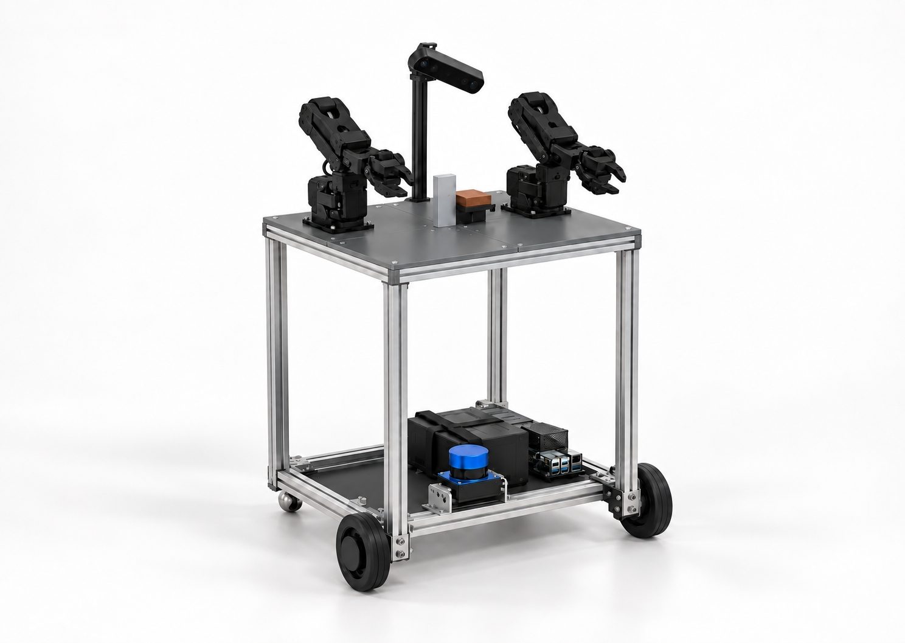
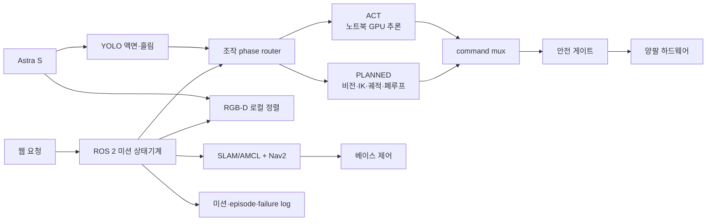

# HOLD THE FLOW · 이동형 양팔 물 서빙 로봇

동국대 DAPIER 부트캠프 최종 팀 프로젝트의 공용 저장소다. 현재 목표는 여러 태스크를 하는
범용 로봇이 아니라, **웹 요청을 받아 물 한 잔을 준비·운반·서빙하고 충전소로 복귀하는
단일 미션**을 재현 가능하게 완성하는 것이다.

- 시작: 2026-08-19
- 현행 태스크 확정: 2026-09-07
- 최종 문서 갱신: 2026-09-10
- 개발 기준: Ubuntu 24.04 · ROS 2 Jazzy · C++17 · Python 3.12 · LeRobot 0.6.1
- 시뮬레이터: Isaac Sim 6.0 · ROS 2 Bridge
- 구현된 모델의 기구 수치: [`design/mechanical/hold_flow_mechanical_v0_3.yaml`](design/mechanical/hold_flow_mechanical_v0_3.yaml)
- 최신 실물 치수 기록: [450×340 mm 하단 프레임 모델링 기록](docs/20260909_하단프레임_실물치수_모델링기록.md)
- 현행 시뮬레이션·제작 기준: [450×340 mm 4분할 상판 모델과 JDAMR 구동계 재사용](docs/20260910_450x340_4분할상판_URDF_IsaacSim_모델.md)
- 태스크·구현 단일 원본: [물 서빙 로봇 회의 결정과 실행 범위](docs/20260907_물서빙로봇_회의결정과_실행범위.md)
- 팀 보고: [무선 운용·SLAM·PLANNED·ACT 비교](docs/20260908_물서빙로봇_무선운용과_SLAM_ACT_팀보고.md)
- 세션 인계: [양팔 로봇 프로젝트 인계](docs/20260904_양팔로봇_프로젝트_인계.md)

## 한 줄 정의

> 충전소에서 대기하던 이동형 양팔 로봇이 웹 요청을 받고 주방으로 자율주행해 왼팔로 컵을,
> 오른팔로 물통을 조작해 물을 따른다. 컵을 로봇 선반에 싣고 손님 테이블로 이동해 내려놓은
> 뒤 충전소로 돌아가 실제 충전 시작을 확인한다.

주행 중에는 컵을 팔로 들지 않는다. 컵은 로봇 선반에 놓고 운반한다. 팔 조작 중에는 베이스를
정지하고, 베이스 이동 중에는 팔을 운반·정지 자세로 유지한다.

## 현행 기구 기준안

<p align="center">
  
</p>

첫 제작 기준은 하부와 같은 **450×340 mm 상부 프레임**, 2020 기둥 4개, 4분할 PETG
상판이다. 둘레 링과 분할선 아래 가로재가 팔 하중을 프로파일로 전달한다. 위 그림은 완성품의
형태와 부품 배치를 설명하는 ImageGen 콘셉트이며 제조 도면이 아니다. 치수·충돌·관성 검증에는
[URDF/STL 축척 렌더](docs/assets/full_size_frame_20260910/model_overview.png)와 기계 사양 YAML을
사용한다. 명목 빈 질량은 7.379 kg이며 접합 강도, 동적 전도, 배선·방적과 실물 질량은 아직
검증 전이다.

## 현재 범위

### 포함

- 웹 버튼으로 물·테이블 요청
- 충전소 이탈, 주방·테이블 자율주행, 장애물 감속·정지·재계획
- 주방·테이블 앞 RGB-D 정밀 정렬
- 왼팔 컵, 오른팔 물통의 양팔 조작과 물 붓기
- YOLO instance segmentation과 컵별 보정표를 이용한 액면·흘림 판정
- 로봇 선반 운반과 손님 테이블 배치
- 도크 staging 이동, 최종 도킹, 충전 시작 신호 확인
- 산업형 `PLANNED`, 전체 `ACT`, phase별 `HYBRID` 조작 비교
- 실패 근거 보존, 원인 분리, 같은 조건 재시험과 회귀 평가

### 제외

- 양팔 커넥터 체결과 와이어 하네스 조립
- 범용 `move / handover / pour` 다중 태스크
- 음성 입력·STT·언어조건 VLA·로컬 LLM 태스크 플래닝
- 병과 컵을 팔로 든 채 주행하는 구형 시나리오
- Nav2와 팔 조작을 하나의 학습 정책으로 합치는 구성
- 미지 공간 자동 탐색을 물 서빙 필수 기능으로 추가하는 것

과거 문서와 사이트는 의사결정 이력으로 보존하지만 현행 구현 범위를 정하지 않는다.

## 미션 흐름

```text
DOCKED / CHARGING
  → 웹 요청 접수
  → 충전소 이탈
  → Nav2로 주방 이동
  → RGB-D로 작업대 정밀 정렬·베이스 정지
  → 왼팔 컵 파지·들기
  → 오른팔 물통 파지·들기
  → 컵 위로 이동·물 붓기·물 양 판정
  → 물통 원위치·컵 선반 적재
  → Nav2로 손님 테이블 이동·정렬
  → 선반의 컵을 손님 테이블에 배치
  → 충전소 staging 이동·도킹
  → 충전 시작 신호 확인
```

요청 성공은 HTTP 200이 아니다. 하나의 `request_id/run_id`로 접수, 이동, 정렬, 조작 전략,
phase별 결과, 물 양, 실패, 도킹과 최종 `CHARGING` 또는 명시적 실패 상태가 연결돼야 한다.

## 시스템 구조



인지 계층은 actuator 명령을 직접 내리지 않는다. `PLANNED`, `ACT`, `TELEOP` 가운데 하나만
팔 command lease를 가지며 모든 명령은 같은 중재기와 안전 게이트를 지난다.

## 조작 전략 세 가지

산업용 피킹 조사 결과, 상용 제품은 AI를 주로 인식·깊이·피킹 순서·그립 후보 계산에 쓰고
모션 계획·정밀 제어·전용 그리퍼·복구 절차를 결합한다. 휴머노이드·범용 로봇은 작업과 환경이
훨씬 넓어 IL·VLA가 행동과 전신 제어까지 맡는 비중이 커진다. 현재 물 서빙 로봇은 이동형
양팔이지만 station·컵·물통을 고정하고 조작 중 베이스를 멈추므로 구조화된 산업용 셀에 더
가깝다. 자세한 근거는 [R33 산업용 피킹과 IL·ACT 적용 경계](research/R33_산업용_피킹과_IL_ACT_적용경계.md)에 있다.

`policy 1`과 `policy 2`는 ACT 모델 이름이 아니라 주방·테이블 조작 구간의 미션 ID다.
실제 실행 방법은 `control_strategy`와 phase별 `backend`로 구분한다.

| 전략 | 구성 | 목적 |
|---|---|---|
| `PLANNED_ALL` | RGB-D·그립 계산·IK·검증 궤적·그리퍼 피드백·액면 폐루프 | 산업형 기준선 |
| `ACT_ALL` | 모든 조작 phase를 ACT checkpoint로 실행 | 전체 IL의 가능성과 한계 측정 |
| `HYBRID` | phase별로 PLANNED 또는 ACT 선택 | 실제 이점이 있는 구간에만 학습 적용 |

주방 조작 phase는 다음처럼 나눈다.

```text
CUP_PICK
  → JUG_PICK
  → MOVE_TO_PREPOUR
  → POUR
  → JUG_RETURN
  → SHELF_PLACE
```

첫 HYBRID 후보는 파지·접근·반환·배치를 PLANNED로, `POUR`를 ACT로 실행한다. ACT 파지가
위치·재질 변화에서 더 낫다는 결과가 나오면 해당 phase만 교체한다.

phase별 순차 전환에는 세 번째 통합 신경망이 필요하지 않다. 다만 현재 backend 종료,
관절 속도 0, 목표 자세 허용오차, 남은 ACT chunk 폐기, lease 해제·획득과 다음 backend reset을
확인해야 한다. IK 명령과 ACT 명령을 동시에 쓰거나 움직이는 중간에 바꾸지 않는다.

`q_command = q_planned + delta_q_learned` 형태의 residual 결합은 출력 의미가 다른 새 정책과
별도 안정성 검증이 필요하므로 첫 구현 범위에서 제외한다.

## 데이터 수집과 비교

전체 시연을 하나의 긴 ACT용 파일로만 만들지 않는다. 모든 episode에 다음 phase의 시작·종료
timestamp와 성공 조건을 기록한다.

- `CUP_PICK`
- `JUG_PICK`
- `MOVE_TO_PREPOUR`
- `POUR`
- `JUG_RETURN`
- `SHELF_PLACE`

같은 원본을 전체 ACT와 phase별 ACT 학습에 재사용한다. PLANNED가 만든 시작 상태와 사람이
만든 시작 상태의 분포가 다르면 HYBRID rollout에서 해당 phase의 성공 시연이나 검토된 사람
개입 복구 구간만 보강한다.

세 전략은 같은 scenario matrix와 holdout에서 비교한다.

- phase별 성공 횟수/전체 횟수
- 목표 물 양 mL 오차와 `UNDER / OVER / SPILL / UNKNOWN`
- 사람 개입·리커버리 횟수
- cycle time
- 위치·조명·초기 잔량 변화 성능
- 관측→명령 적용 지연, p95·p99·최댓값과 제어 지터
- 미학습 범위의 안전 거부
- 물체·station 변경 시 재설정·재수집 비용

ACT가 성공·일반화·복구 또는 변경 비용을 실제로 개선한 phase에만 배포 backend로 채택한다.
차이가 없으면 설명 가능하고 유지보수하기 쉬운 PLANNED를 기본값으로 둔다.

## 물 양 판정

YOLO 바운딩 박스가 곧 mL는 아니다. 첫 POC는 투명하고 옆면이 곧은 컵 한 종류, 물 한 종류,
고정 카메라·배경으로 좁힌다.

```text
cup_inner·liquid_region·spill_region segmentation
  → 컵 원근·기울기 보정
  → 액면 높이 비율
  → cup_id별 실측 보정표
  → 여러 프레임 중앙값·신뢰도
  → UNDER / TARGET / OVER / SPILL / UNKNOWN
```

PLANNED 붓기에서는 액면 추정을 기울임 감속·정지의 폐루프 입력으로 쓴다. ACT에서는 액면
상태를 관측에 포함하는 안과 외부 감독기가 목표 도달 시 종료시키는 안을 비교한다. 어느
전략에서도 `OVER / SPILL / UNKNOWN`은 추가 기울임을 금지한다. 최종 평가는 저울 또는 눈금
계량 ground truth와 대조한다.

## 무선 운용과 컴퓨트 분담

| 위치 | 책임 |
|---|---|
| 로봇의 Raspberry Pi 4B 4GB | 센서·TF·SLAM/AMCL·Nav2·미션 상태기계·PLANNED 조작·명령 중재·watchdog·하드웨어 bridge |
| 외부 노트북 RTX 5050 Laptop 8GB | 웹 UI, ACT 추론, YOLO 제안, 학습·재학습·분석 |
| 모터 제어보드·서보 | 바퀴·관절의 실제 구동 |

카메라·LiDAR·모터는 로봇 내부에 유선으로 연결한다. Pi와 노트북 사이를 실험용 로컬
네트워크로 무선 연결하는 구조다. 노트북은 서보 포트를 직접 열지 않고, Pi는 ACT를 중복
추론하지 않는다. 추론 포트를 인터넷에 공개하지 않는다.

LeRobot 0.6.1의 비동기 `PolicyServer / RobotClient` 경로를 우선 평가하되, 행동에는 관측 ID,
checkpoint·계약 버전, 관절 순서·단위·유효기간을 포함한다. 지연·중복·재연결 후 남은 행동은
Pi에서 폐기하고 안전 hold로 전환한다.

## 지도와 자율주행

두 지도 모드는 launch profile을 분리한다.

| 모드 | 구성 | 현재 판단 |
|---|---|---|
| 지도 작성 | `slam_toolbox`로 이동하며 지도 생성·저장 | 지도 제작 세션 |
| 반복 물 서빙 | 저장 지도 + AMCL + Nav2 | 권장 기준선 |
| 온라인 SLAM 주행 | `slam_toolbox` + Nav2 | 가능한 대안, 채택 미결 |

지도만 저장한다고 운용 준비가 끝나는 것은 아니다. 초기 자세, 충전소·주방·테이블 station
pose, 실제 footprint, LiDAR·오도메트리·TF, costmap, DWB, Collision Monitor와 도착 후 로컬
정렬을 함께 검증한다. 온라인 SLAM은 지도를 갱신하지만 미탐색 영역의 목표 선택이나 “주방”의
의미를 자동으로 만들지 않는다.

## 실패 데이터

실패는 바로 ACT 재학습에 넣지 않는다.

```text
관측된 증상
  → 실행 조건·근거 보존
  → 원인 가설과 기각 근거
  → 확인된 원인
  → 시스템 수정 또는 데이터 보강
  → 같은 조건 재시험
  → 다른 조건 회귀 확인
  → 학습·평가 데이터 사용 결정
```

각 실행에는 `scenario_id`, `control_strategy`, phase별 backend, checkpoint 또는 planner·trajectory·controller
버전, 영상·관절·action window, YOLO 결과, 지연·지터, 안전 상태를 남긴다. Nav2·TF·캘리브레이션·
기구·서보 원인이면 시스템을 고치고 같은 checkpoint 또는 같은 PLANNED 산출물 버전으로
재시험한다. 정책 분포 문제로 확인된 경우에만 새 성공 시연 또는 별도 HIL 파생 데이터셋을
만든다.

- 규약: [`data/failures/README.md`](data/failures/README.md)
- 데이터 인덱스: [`data/README.md`](data/README.md)
- 스키마: [`data/schema/failure_record.schema.json`](data/schema/failure_record.schema.json)
- 근거 보존·해시 검증·집계: [`tools/failure_bank.py`](tools/failure_bank.py)

대용량 영상·rosbag·모델은 Git에 커밋하지 않고 외부 저장 위치와 버전을 데이터 인덱스에 남긴다.

## 구현 상태

기술 이름이 적혀 있어도 구현 완료를 뜻하지 않는다.

| 영역 | 현재 확인된 것 | 아직 필요한 것 |
|---|---|---|
| 기구 | 상·하부 450×340 mm, 4분할 6 mm 상판, 2020 기둥×4·2륜·2볼캐스터 CAD, 명목 질량 7.379 kg | 압출재·체결홀·출력 조건·실제 질량·평탄도 실측, 선반·도크 확정 |
| URDF | 58링크/57관절, SO-101×2, 왼쪽 기본 죠·오른쪽 ggao50 프록시, Astra S·LDS-03 통합·정적 감사 PASS | 실측 좌표·오른쪽 원본 충돌 형상·작업 자세 충돌·접촉 동역학 검증 |
| IK | 구형 역할의 solver와 검증 도구 존재, 결함 기록됨 | 왼팔 컵·오른팔 물통 기준 수정과 회귀검증 |
| ROS 2 실행 | `hold_flow_description` 패키지 존재 | web·navigation·perception·motion·safety·hardware·mission·logging 패키지 |
| Nav2 | 설계·검증 항목 문서화 | 지도·station·반복 접근·장애물·도킹 실측 |
| ACT | 리서치·데이터 계약 | 현행 물 서빙 시연·모델·rollout 없음 |
| PLANNED/ACT/HYBRID | phase·전환·평가 구조 문서화 | router·Action·backend·전환 테스트 구현 |
| YOLO 물 양 | segmentation·보정 방식 결정 | 카메라 POC·라벨·보정표·실시간 판정 |
| 무선 | Pi↔노트북 책임과 프로토콜 후보 문서화 | 실제 지연·드랍·두절·재연결·watchdog 검증 |
| Raspberry Pi 5 | 후순위 전환안: Nav2·센서·베이스·안전은 Pi 5, ACT·고부하 비전은 노트북 GPU | 부하·온도·무선 지연 측정 후 전환 |
| 데이터 도구 | failure bank·스키마·회귀 테스트 존재 | 실제 실행 로그 연결과 담당자 대조 |
| Isaac Sim | 6.0 공식 importer 스크립트와 정적 가져오기 계약 PASS | Isaac 장비에서 USD 생성·4점 접촉·gain·60초 안정성 검증 |

현재 노트북 VRAM은 8GB이고 Isaac Sim 6.0 공식 최소 VRAM은 16GB다. 이 장비에서 ROS 2 코드와
자산을 준비할 수 있지만, Isaac Sim 실행은 Compatibility Checker를 통과한 워크스테이션이나
원격 장비에서 검증한다.

## 현재 우선순위와 미결

### 바로 구현할 순서

1. `policy 1/2` 내부 phase와 `ExecuteManipulationSkill` 계약을 확정한다.
2. PLANNED_ALL mock·dry-run으로 phase·성공 판정·안전 정지를 먼저 연결한다.
3. phase 표시 smoke 시연과 ACT 과적합 기준선을 만든다.
4. ACT_ALL과 로컬 ACT checkpoint를 만든다.
5. 같은 protocol로 PLANNED_ALL·ACT_ALL·HYBRID를 비교한다.
6. 원인이 확인된 실패만 시스템 수정 또는 phase 데이터 보강으로 처리한다.
7. Nav2·정렬·조작을 mock Action부터 실제 backend로 하나씩 교체한다.
8. 현행 v0.3 URDF를 Isaac Sim 장비에서 USD로 변환하고 접촉·gain·충돌을 검증한 뒤, 승인된 환경에서 실물 건식·물 서빙을 검증한다.

### 본수집을 막는 결정

1. 회의 TODO의 `3번 policy`가 정책 ID인지 안건 번호인지
2. policy 2의 사용 팔: 회의 본문은 왼팔, 괄호 주석은 오른팔
3. 컵·물통·선반·테이블의 실측 좌표와 허용 범위
4. 목표 물 양·허용 오차·컵 재질·YOLO 라벨·계량 ground truth
5. phase별 시작·종료 허용오차와 세 전략의 공통 scenario matrix
6. 무선 명령 유효기간·두절·재연결·중단 동작
7. 충전 도크 접점·검출·충전 시작 신호

## 역할

- `@mmporong`: SLAM/Nav2·장애물 회피, station·반복 접근, PLANNED/ACT phase 연결,
  v0.3 URDF의 Isaac Sim USD·접촉 동역학 검증
- 팀 policy lane: phase 표시 시연, ACT_ALL·로컬 ACT 학습·배포, rollout 실패 개선
- 인지 lane: Astra S POC, YOLO segmentation, 컵별 보정과 실측 물 양 검증
- 통합 lane: 웹 요청, 미션 상태기계, 조작 router, 무선 adapter, command mux·안전·logging
- 기구 lane: 컵 선반, 작업 셀 거리, 실측 체결, 도크·전원 인터페이스

세부 담당자는 회의에서 확정한다. GitHub 초대 상태를 역할 확정으로 간주하지 않는다.

## 저장소 구조와 진입점

```text
bimanual-robot/
├── design/        기구 파라미터, CadQuery, STEP·STL
├── docs/          현행 결정·팀 보고·인계·설계 이력
├── research/      외부 근거와 프로젝트 적용 판정
├── data/          episode·failure 계약과 외부 데이터 인덱스
├── src/           ROS 2·IK·ACT·Isaac Sim 구현 경계와 코드
├── tools/         계산·검증·데이터 도구
├── PROGRESS.md    날짜별 완료 증거와 남은 작업
└── CLAUDE.md      저장소 작업 규칙
```

| 하려는 일 | 먼저 볼 문서 |
|---|---|
| 현행 태스크·phase·인터페이스·평가 | [2026-09-07 회의 결정과 실행 범위](docs/20260907_물서빙로봇_회의결정과_실행범위.md) |
| 팀 전체 공유와 무선·SLAM 설명 | [2026-09-08 팀 보고](docs/20260908_물서빙로봇_무선운용과_SLAM_ACT_팀보고.md) |
| 다른 세션 인계 | [프로젝트 인계](docs/20260904_양팔로봇_프로젝트_인계.md) |
| 산업용 피킹과 IL·휴머노이드 차이 | [R33 산업용 피킹과 IL·ACT 적용 경계](research/R33_산업용_피킹과_IL_ACT_적용경계.md) |
| ROS 2 패키지·인터페이스 경계 | [`src/README.md`](src/README.md) |
| 기구 계산 | [`design/mechanical/hold_flow_mechanical_v0_3.yaml`](design/mechanical/hold_flow_mechanical_v0_3.yaml) |
| URDF·Isaac Sim·JDAMR 구동계 | [450×340 mm 4분할 상판 모델](docs/20260910_450x340_4분할상판_URDF_IsaacSim_모델.md) |
| CAD·출력물 | [`design/cad/README.md`](design/cad/README.md) |
| 실패 저장·재시험·학습 사용 | [`data/failures/README.md`](data/failures/README.md) |
| 전체 변경 증거 | [`PROGRESS.md`](PROGRESS.md) |

## 안전과 저장소 운영

- 실물 팔·베이스는 결정적 차단 장치가 있는 환경에서만 움직인다. 이 Codex 환경에서는
  로봇 제어를 dry-run까지만 다룬다.
- 스톨·관절 한계·충돌 위험·통신 timeout·컵 이탈·흘림 위험은 실제 hold/stop으로 연결한다.
- 안전 정지가 항상 토크 OFF인 것은 아니다. 물체를 든 자세와 고장 원인에 맞는 정지 동작을
  검증한다.
- Issue → 기능 브랜치 → Pull Request → 로컬 검증 → `main` 흐름을 사용한다.
- 스테이징은 변경 파일을 경로별로 명시하고 `git add .` 또는 `git add -A`를 사용하지 않는다.
- 데이터셋·모델·rosbag 같은 대용량 파일은 저장소에 직접 커밋하지 않는다.
- 구현 완료 주장은 코드·실행 로그·테스트처럼 재현 가능한 근거가 있을 때만 표시한다.
