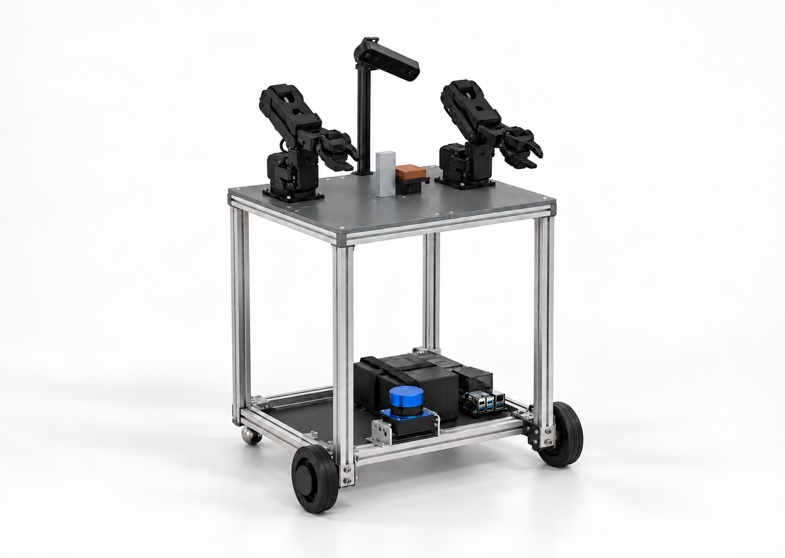
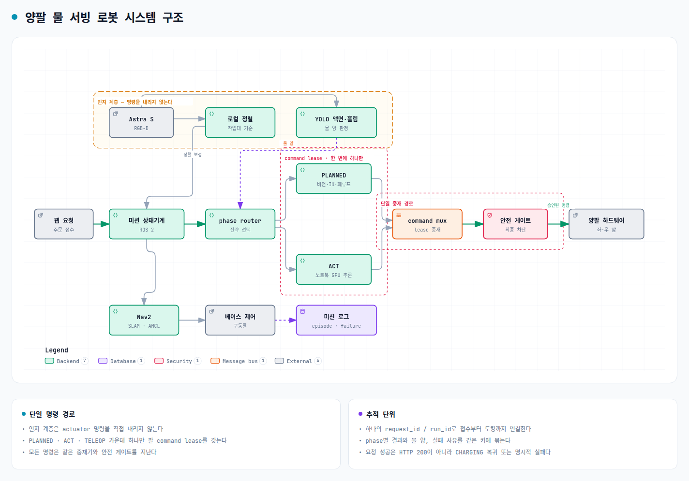

# HOLD THE FLOW · 이동형 양팔 물 서빙 로봇

동국대 DAPIER 부트캠프 최종 팀 프로젝트의 공용 저장소다. 현재 목표는 여러 태스크를 하는
범용 로봇이 아니라, **웹 요청을 받아 물 한 잔을 준비·운반·서빙하고 충전소로 복귀하는
단일 미션**을 재현 가능하게 완성하는 것이다.

- 시작: 2026-08-19
- 현행 태스크 확정: 2026-09-07
- 최종 문서 갱신: 2026-09-22
- 개발 기준: Ubuntu 24.04 · ROS 2 Jazzy · C++17 · Python 3.12 · LeRobot 0.6.1
- 시뮬레이터: Isaac Sim 6.0 목표 계약 · 로컬 5.1 물리 실행·URDF 프리뷰(ROS Bridge 미사용)
- 구현된 모델의 기구 수치: [`design/mechanical/hold_flow_mechanical_v0_3.yaml`](design/mechanical/hold_flow_mechanical_v0_3.yaml)
- 최신 실물 치수 기록: [450×340 mm 하단 프레임 모델링 기록](docs/20260909_하단프레임_실물치수_모델링기록.md)
- 현행 시뮬레이션·제작 기준: [450×340 mm 4분할 상판 모델과 JDAMR 구동계 재사용](docs/20260910_450x340_4분할상판_URDF_IsaacSim_모델.md)
- 태스크·구현 단일 원본: [물 서빙 로봇 회의 결정과 실행 범위](docs/20260907_물서빙로봇_회의결정과_실행범위.md)
- 팀 보고: [무선 운용·SLAM·PLANNED·ACT 비교](docs/20260908_물서빙로봇_무선운용과_SLAM_ACT_팀보고.md)
- IL 실행 인계: [양팔 수집·비공개 Hub 업로드·다른 PC ACT 학습](docs/20260911_양팔_IL_데이터수집_HuggingFace_학습_인계.md)
- 세션 인계: [양팔 로봇 프로젝트 인계](docs/20260904_양팔로봇_프로젝트_인계.md)

<!-- AUTO:PROJECT-STATUS:START -->
## 단일 원본 자동 요약

> 아래 표는 기계 YAML에서 생성한다. 수정하려면 표가 아니라 연결된 원본 파일을 고친다.

| 항목 | 현행 값 |
|---|---|
| 기계 개정 | `2026-09-22_left_stock_so101_gripper_selected` |
| 상·하부 프레임 | 450×340 mm |
| 상판 높이 | 720 mm |
| 왼손 | SO-101 순정 회전식 죠, TPU·오버캡 없음 |
| 오른손 | `ggao50_SO101_Parallel_Gripper` |
| RGB-D | Orbbec_Astra_S, 상판 위 250 mm |
| 베이스 | differential_two_wheel_two_ball_caster, Feetech_STS3215_C018_12V |
| 모델 상태 | `simulation_model_ready_physical_measurements_pending` |

원본: [`hold_flow_mechanical_v0_3.yaml`](design/mechanical/hold_flow_mechanical_v0_3.yaml)
과거 후보: [`finray_80mm_lip3_selection.yaml`](design/gripper/finray_80mm_lip3_selection.yaml)
<!-- AUTO:PROJECT-STATUS:END -->

## 현재 최우선 작업 · 2026-09-22

실물 재개는 보류하고 [4테이블 식당 시뮬레이션](docs/20260921_식당_시뮬레이션_환경.md)을 검증했다.
웹에서 4개 테이블의 냉수·온수 주문을 넣는 CPU 관제 dry-run도 추가했다. 주문 ID 중복 방지,
우선순위 큐, 한 개의 활성 Mission, phase 재시도·실패 종료, 연속 주문 시 충전소 생략,
배터리 부족 시 충전 선행을 검사한다. 현재 backend는 명령을 즉시 성공 처리하며 Nav2·ROS 2·
Isaac Sim·실물에 접속하지 않는다. 식당 지도·현재 경로·미션 phase·주문 이력 화면과 SQLite
영속 저장을 제공하며, 서버 재시작 때 활성 주문과 큐를 복구한다. 실행법과 API는
[웹 주문·Mission Queue·배터리 관제 dry-run](docs/20260922_웹주문_미션관제_dry-run.md)에 정리했다.
조작 backend의 다음 경계인 `ExecuteManipulationSkill` ROS 2 Action도 추가했다. 현재 관제
`manipulate` 명령을 한 phase Goal로 바꾸고, simulation mock에서 성공·취소·timeout을 실제 Action
상태와 Result로 구분한다. `dry_run=false`는 거부하며 아직 웹 runtime이나 팔 실행기에는 연결하지
않았다. 계약·빌드·검증법은
[ExecuteManipulationSkill ROS 2 Action 계약과 mock 검증](docs/20260922_ExecuteManipulationSkill_ROS2_Action.md)에 있다.
높은 중앙 받침 없이 **기존 450×340 mm 상판의 양팔 사이에 컵을 놓고 운반하는 경로**를 검증했다.
가구·팔·컵·바닥 접촉을 검사하고, 테이블 지지와 그리퍼 열림·손 이격까지 확인한다.
주행은 시뮬레이터 좌표를 사용하는 A*·차동구동 추종이며 Nav2·ROS Behavior Tree는 아직 아니다.
목표 서빙 순서는 **물붓기 → 상판에 컵 내려놓기 → 손을 뺀 상태로 주행 → 컵 재파지 →
손님 테이블에 내려놓기**다. 컵을 손에 든 채 주행한 빈 컵 시험은 이 목표의 완료가 아니다.
상판 후보는 중심에서 앞 120 mm·오른쪽 90 mm이며 팔 장착 위치는 바꾸지 않았다.
첫 연결 시험의 병·그리퍼 접촉을 수정해, 오른손을 수직으로 뺀 다음 팔을 세우도록 했다.
`plate_service02`는 **282.9초 조건 1회에서 물붓기·상판 적재·주행·재파지·손님 테이블 배치까지 통과했다.**
최종 물은 컵 684개·병 230개·바깥 4개 입자이며, 운반 중 추가 손실과 검출된 팔·환경 접촉은 0이다.
마지막 테이블 지지와 손 분리도 확인했다. 입구 외곽 기준 상판 앞쪽 여유 5 mm는 실물에서 재검증해야 한다.
이 실행은 과거 80 mm 강체 패드 프록시를 사용했다. 2026-09-22 선정한 왼손 SO-101 순정 죠로는
아직 다시 실행하지 않았으므로 전체 미션 연결 증거로만 보존하고 순정 죠 파지 성공으로 세지 않는다.
이전 `raised_service05`의 273.4초 연속 성공은 200 mm 받침·왼팔 후방 20 mm 변경을 사용한 별도 실험이다.
실물 성공률이나 정량 급수 성능을 뜻하지 않는다. 현재 경로는 IL 학습 없이 IK와 상태기계로 실행한다.
영상은 넓은 고정 시점과 물붓기 확대 시점을 함께 기록한다. 확대 창은 같은 시뮬레이션 시각의
병 주둥이·컵 입구·파란 유체 입자를 보여준다. [카메라 설정과 영상 생성](docs/20260921_식당_시뮬레이션_환경.md#영상-구도와-물붓기-확대)을 참고한다.
소개 영상은 기기 전체가 보이는 넓은 구도를 기본으로 하고, 주행할 때 같은 거리에서 기기를 추적한다.
물붓기만 짧게 확대하며 연속 줌·회전은 사용하지 않는다. 16개 자막 단계와 1080p24 출력,
시뮬레이션·배속 표시를 유지한다. 이전 `cinematic_service02`는 동작을 통과했지만 과도한 확대 때문에 구도를 교체했다.
`cinematic_wide01`은 넓은 구도로 전체 서빙을 다시 촬영했다. 선반·화분이 가리는 이동 일부는 편집에서 제외하므로
주행 경로 전체의 무편집 영상은 아니다. 제외 프레임은 별도 편집 기록에 보존한다.
[제품 시연형 영상 생성 방법](docs/20260921_식당_시뮬레이션_환경.md#제품-시연형-촬영편집)에서 재현 명령과 검증 범위를 확인할 수 있다.
충전소 복귀도 남아 있다.
물붓기 컵은 중간 파지 지름 70 mm를 유지하고 입구를 90 mm로 넓혔다. 조기 접촉을 막도록
접근 거리를 조정한 `flared03` 1회에서 파지·붓기·복귀·손 분리를 통과했다. 최종 유출은
3/918개 입자이며 실물 성능은 아니다. [컵 변경과 실패 수정 근거](docs/20260921_양팔_PBD_물붓기_시뮬레이션.md#입구가-넓은-컵)를 참고한다.

현재 조작 lane은 **상단 RGB 컵 검출 → 작업대 평면 좌표 → 왼팔 DLS IK → 충돌·보간 경로 검토** 순서다.
투명 컵 검출과 비동작 IK 도구는 구현됐고, 다음 게이트는 `base_footprint` 기준 작업대 대응점·높이와
컵 높이를 실측해 평면 보정 파일을 만드는 것이다. 보정 전에는 픽셀을 임의의 로봇 좌표로 바꾸지 않는다.
실제 팔 이동은 보정·FK·충돌 검사를 통과한 개별 자세를 보여준 뒤 별도 실행 요청 범위에서만 한다.

9월 17일 컵 파지는 성공하지 못했다. **TCP 오차를 확정 원인으로 적었던 기록은 정정한다.**
컵·병 위치 변경 뒤 같은 목표 좌표를 재사용했고, 저장 관절값과 계획 자세에도 차이가 있었다.
실물 없이 저장 자료 재생·TCP 후보 비교·시간 동기 경로 생성을 진행한다.
[오프라인 검증·실패 원인 분리와 재개 조건](docs/20260918_컵파지_오프라인검증과_재개조건.md)을 먼저 읽는다.

전체 로봇·책상·컵·병을 띄우는 [Isaac Sim 5.1 프리뷰](docs/20260918_URDF_Isaac51_작업환경_프리뷰.md)를 추가했다.
초기 화면의 컵 관통·기울어진 접근 문제 때문에 자동 자세 갤러리를 기본 동작에서 제외했다.
[컵 중간 높이·양팔 측면 파지 재설계](docs/20260918_컵중간_양팔_측면파지_재설계.md)에 따라
수평 IK와 물체·책상·반대 팔 외곽 겹침을 따로 검사하고, 실패 후보는 표시하지 않는다.
이 구형 프리뷰 실행기는 베이스 고정·중력/물리 접촉 제외 상태다. 파지·물붓기·주행의 물리 검증은
위에 연결한 별도 실행기를 사용한다. 구형 원본의 바퀴 320 mm·
앞뒤 중앙 캐스터는 프리뷰 사본에서 510 mm·후방 좌우 프록시로 구분해 보정한다.
원본 URDF의 정식 동역학 갱신과 실제 RGB 배치 일치는 아직 남아 있다. 왼손은 2026-09-22
결정에 따라 SO-101 순정 회전식 죠를 사용하며, 현행 URDF 형상도 이 구성과 일치한다.

9월 19일에는 별도 **컵 접촉 실험** 실행기를 추가했다. 회전식 왼손 관절과 가정 강체 패드로
중간 접근·닫기·양측 접촉·상승을 검사하며, IL 데이터나 컵 강제 부착은 사용하지 않는다.
이 실험의 80 mm 강체 패드는 과거 FinRay 후보를 검토하기 위한 프록시다. 현행 순정 죠의
실물 파지·RGB 인식·물 붓기 성공을 뜻하지 않는다.
가정 질량 5·10·20 g의 조건별 1회 시험에서 파지·상승을 확인했고, 5 mm 위치 오차 주입은
닫기 전 접촉 실패로 분류했다. 후속 `--recover` 실험은 접촉 실패 뒤 열린 손으로 후퇴하고,
시뮬레이터 정답 좌표를 재관측해 IK 재접근을 시험한다. 실제 카메라 재인식·컵 변형 검증은 남아 있다.
5 g·y=−5 mm 조건 3회는 각 1회 복구 후 상승을 통과했고, x=±5 mm·y=+5 mm·오차 없음은
각 1회 첫 접근에서 통과했다. 동일 강체 장면의 제한된 시험이며 실물 성공률이 아니다.
과거 후보 FinRay STL은 해시·외곽 치수를 확인했으나 2026-09-22 현행 구성에서 제외했다.
현재 접촉 결과는 강체 패드 모델에 한정하며, 순정 죠 결과로 재해석하지 않는다.
[접촉 실험의 실행법·가정·판정](docs/20260918_URDF_Isaac51_작업환경_프리뷰.md#강체-패드-컵-접촉-실험--2026-09-19)을 참고한다.

`--place`로 **파지·상승 → 같은 책상에 내려놓기 → 손 열기 → 손 빼기**를 연결했다.
책상 지지를 확인한 뒤 손을 열며, 손 분리 뒤 재접촉은 실패로 기록한다. 위치 제어 기반 강체 실험으로,
힘 제어·실제 컵 변형·선반 운반·양팔 물붓기 완료를 뜻하지 않는다.

오른손은 **ggao50 순정 평면 죠**로 진행한다. 패드·홈·인서트·테이프를 모델에 추가하지 않는다.
기존 조립 모델은 병 접근 중 손목 쪽 링크가 먼저 닿아 실패한다. 후퇴 경로와 충돌 근사를 바꿔도
실패했고, 목표 파지 자세에서 기존 SO101 메쉬가 병 내부를 침범하는 것을 확인했다.
별도 **교체 조립 가정 모델**은 기존 집게 조립체를 명목 서보 충돌체와 ggao 평면 죠로 바꾸고,
35 g·235 g 조건별 시험에서 잡기·들기·원위치 복귀·손 분리를 통과했다.
장착 좌표와 서보 외곽은 실측값이 아니므로 실물 ggao 검증으로 해석하지 않는다.
원본 URDF와 실패를 재현하는 기본 설정은 보존하고, 가정 모델은 별도 설정으로만 실행한다.
같은 코드의 왼손 5 g 컵·위치 오차 −5 mm 시험은 재접근 1회 후 내려놓기까지 통과했다.
[오른손 병 실험·경로 대조와 교체 조립 가정](docs/20260918_URDF_Isaac51_작업환경_프리뷰.md#경로충돌-근사-대조와-교체-조립-가정)을 참고한다.

양손 실험을 연결한 [PBD 물붓기 실행기](docs/20260921_양팔_PBD_물붓기_시뮬레이션.md)는
컵·병을 잡아 물을 붓고 내려놓는 전 과정을 검사한다. 물체 강제 부착이나 물 입자 순간이동은
사용하지 않는다. 왼손의 과거 80 mm 강체 패드 프록시와 오른손의 추가 8 mm 장착 간격은
미보정 가정이므로 실물 물붓기 성공과 구분한다.
이전 105°·20초 시험은 물 전달과 복귀 수치를 통과했지만 병 몸통이 왼팔 쪽으로 넘어가는
방향이어서 채택하지 않았다. 오른쪽에 병 몸통을 유지하고 입구를 왼쪽 컵으로 옮기는 경로로
수정한 시험 1회는 컵 잔류 68.2%, 양손 복귀·손 분리까지 통과했다.
붓기·복귀 중 실제 방향도 확인했으며 실물 물붓기 검증은 아직 아니다.

베이스 lane의 순서는 **같은 모델의 다른 바퀴 모터 이식 → 기본 주행 검증 → SLAM → LiDAR·RGB-D 역할 분담 통합**으로 유지한다.
기본 주행 게이트를 통과하기 전에는 RGB-D/LiDAR SLAM을 시작하지 않는다.

- [모터 이식·기본 주행 → SLAM·RGB-D 통합 순서](docs/20260913_RGBD_SLAM_우선순위와_다음세션.md)
- [기존 JD-AMR 이식 기준선과 하드웨어 확인 사항](docs/20260912_JDAMR_SLAM_실기체이식.md)
- [차체 완성 전 지도 생성·박스 station·충전소 왕복 검증](docs/20260922_차체완성전_지도기반_왕복검증.md)
- [시뮬레이션·Mimic·매니퓰레이션 평가와 AMMR 통합 방향](docs/20260913_시뮬레이션_매니퓰레이션_AMMR_고도화.md)


## 한 줄 정의

> 충전소에서 대기하던 이동형 양팔 로봇이 웹 요청을 받고 주방으로 자율주행해 왼팔로 컵을,
> 오른팔로 물통을 조작해 물을 따른다. 컵을 로봇 선반에 싣고 손님 테이블로 이동해 내려놓은
> 뒤 충전소로 돌아가 실제 충전 시작을 확인한다.

주행 중에는 컵을 팔로 들지 않는다. 컵은 로봇 선반에 놓고 운반한다. 팔 조작 중에는 베이스를
정지하고, 베이스 이동 중에는 팔을 운반·정지 자세로 유지한다.

## 현행 기구 기준안

<p align="center">
  
</p>

첫 제작 기준은 하부와 같은 **450×340 mm 상부 프레임**, 2020 기둥 4개, 4분할 PETG
상판이다. 둘레 링과 분할선 아래 가로재가 팔 하중을 프로파일로 전달한다. 위 그림은 완성품의
형태와 부품 배치를 설명하는 ImageGen 콘셉트이며 제조 도면이 아니다. 치수·충돌·관성 검증에는
[URDF/STL 축척 렌더](docs/assets/full_size_frame_20260910/model_overview.png)와 기계 사양 YAML을
사용한다. URDF의 명목 빈 질량은 7.379 kg이며 왼손 SO-101 순정 죠 형상과 명목 관성을
포함한다. 접합 강도, 동적 전도, 배선·방적과 실물 질량은 검증 전이다.

현재 조립된 하단 차체는 340×450 mm, 바퀴 포함 폭 540 mm, 바퀴 반경 32.9 mm, 기하 중심거리
510 mm다. 2026-09-16에 5 kg을 추가 적재한 수동 평지 주행에서 눈에 띄는 속도 저하는 없었지만,
총질량·전류·온도·전압 강하를 계측하지 않았으므로 정격 적재량이 아닌 예비 통과로 기록한다.
RGB-D 후보인 Astra S는 단독 POC 때 개발 노트북 USB에, 이동 탑재 때 Pi 4B USB-A에 연결한다.
현재 베이스 제어보드는 `/dev/ttyS0` 헤더 UART, G4 LiDAR는 `/dev/ttyUSB0` USB를 사용하므로
Pi에서 ROS 하드웨어가 점유한 USB-A는 1개이고 3개가 남아 있다.

왼손은 **SO-101 순정 회전식 죠를 TPU 손가락·오버캡 없이 사용**한다. URDF도
`so101_stock_gripper.xacro`의 순정 형상·관절·TCP를 사용한다. 80 mm FinRay는 2026-09-22
선정에서 제외했으며 출력 기준과 해시는 의사결정 이력으로만 보존한다. 현재
`calibration/bi_follower/arms_left.json`의 ID 6 범위 `1454~2831`은 FinRay 장착 당시 값이므로
순정 죠의 유효 캘리브레이션으로 사용하지 않는다. 순정 죠를 장착한 상태에서 완전 개폐의 기구
간섭을 확인하고 ID 6 범위를 다시 기록한 뒤 컵 파지와 젖은 표면 미끄럼 시험을 진행한다.

오른손은 **ggao50 순정 평면 죠를 홈·교체형 인서트 없이 사용**한다. 과거의 V홈·사다리꼴·평면 TPU 인서트는 선정안에서 제외했으며, 현행 출력 준비 도구는 죠에 인서트 볼트 구멍을 뚫지 않는다. 물병 파지는 순정 평면 죠 상태에서 먼저 검증한다.

## 현재 범위

### 포함

- 웹 버튼으로 물·테이블 요청
- 충전소 이탈, 주방·테이블 자율주행, 장애물 감속·정지·재계획
- 주방·테이블 앞 RGB-D 정밀 정렬
- 왼팔 컵, 오른팔 물통의 양팔 조작과 물 붓기
- YOLO instance segmentation과 컵별 보정표를 이용한 액면·흘림 판정
- 로봇 선반 운반과 손님 테이블 배치
- 도크 staging 이동, 최종 도킹, 충전 시작 신호 확인
- 산업형 `PLANNED`, 전체 `ACT`, phase별 `HYBRID` 조작 비교
- 실패 근거 보존, 원인 분리, 같은 조건 재시험과 회귀 평가

### 제외

- 양팔 커넥터 체결과 와이어 하네스 조립
- 범용 `move / handover / pour` 다중 태스크
- 음성 입력·STT·언어조건 VLA·로컬 LLM 태스크 플래닝
- 병과 컵을 팔로 든 채 주행하는 구형 시나리오
- Nav2와 팔 조작을 하나의 학습 정책으로 합치는 구성
- 미지 공간 자동 탐색을 물 서빙 필수 기능으로 추가하는 것

과거 문서와 사이트는 의사결정 이력으로 보존하지만 현행 구현 범위를 정하지 않는다.

## 미션 흐름

```text
DOCKED / CHARGING
  → 웹 요청 접수
  → 충전소 이탈
  → Nav2로 주방 이동
  → RGB-D로 작업대 정밀 정렬·베이스 정지
  → 왼팔 컵 파지·들기
  → 오른팔 물통 파지·들기
  → 컵 위로 이동·물 붓기·물 양 판정
  → 물통 원위치·컵 선반 적재
  → Nav2로 손님 테이블 이동·정렬
  → 선반의 컵을 손님 테이블에 배치
  → 충전소 staging 이동·도킹
  → 충전 시작 신호 확인
```

요청 성공은 HTTP 200이 아니다. 하나의 `request_id/run_id`로 접수, 이동, 정렬, 조작 전략,
phase별 결과, 물 양, 실패, 도킹과 최종 `CHARGING` 또는 명시적 실패 상태가 연결돼야 한다.

## 시스템 구조

<p align="center">
  <a href="https://raw.githack.com/mmporong/bimanual-robot/main/docs/assets/system-architecture.html">
    
  </a>
  <br>
  <sub>그림을 누르면 <a href="https://raw.githack.com/mmporong/bimanual-robot/main/docs/assets/system-architecture.html">조작 가능한 도식</a>이 열린다 — 노드를 누르면 연결된 경로만 남고, 상단 세 갈래로 명령 경로·인지 입력·주행 계통을 따로 볼 수 있다.</sub>
</p>

인지 계층은 actuator 명령을 직접 내리지 않는다. `PLANNED`, `ACT`, `TELEOP` 가운데 하나만
팔 command lease를 가지며 모든 명령은 같은 중재기와 안전 게이트를 지난다.

## 조작 전략 세 가지

산업용 피킹 조사 결과, 상용 제품은 AI를 주로 인식·깊이·피킹 순서·그립 후보 계산에 쓰고
모션 계획·정밀 제어·전용 그리퍼·복구 절차를 결합한다. 휴머노이드·범용 로봇은 작업과 환경이
훨씬 넓어 IL·VLA가 행동과 전신 제어까지 맡는 비중이 커진다. 현재 물 서빙 로봇은 이동형
양팔이지만 station·컵·물통을 고정하고 조작 중 베이스를 멈추므로 구조화된 산업용 셀에 더
가깝다. 자세한 근거는 [R33 산업용 피킹과 IL·ACT 적용 경계](research/R33_산업용_피킹과_IL_ACT_적용경계.md)에 있다.

`policy 1`과 `policy 2`는 ACT 모델 이름이 아니라 주방·테이블 조작 구간의 미션 ID다.
실제 실행 방법은 `control_strategy`와 phase별 `backend`로 구분한다.

| 전략 | 구성 | 목적 |
|---|---|---|
| `PLANNED_ALL` | RGB-D·그립 계산·IK·검증 궤적·그리퍼 피드백·액면 폐루프 | 산업형 기준선 |
| `ACT_ALL` | 모든 조작 phase를 ACT checkpoint로 실행 | 전체 IL의 가능성과 한계 측정 |
| `HYBRID` | phase별로 PLANNED 또는 ACT 선택 | 실제 이점이 있는 구간에만 학습 적용 |

주방 조작 phase는 다음처럼 나눈다.

```text
CUP_PICK
  → JUG_PICK
  → MOVE_TO_PREPOUR
  → POUR
  → JUG_RETURN
  → SHELF_PLACE
```

첫 HYBRID 후보는 파지·접근·반환·배치를 PLANNED로, `POUR`를 ACT로 실행한다. ACT 파지가
위치·재질 변화에서 더 낫다는 결과가 나오면 해당 phase만 교체한다.

phase별 순차 전환에는 세 번째 통합 신경망이 필요하지 않다. 다만 현재 backend 종료,
관절 속도 0, 목표 자세 허용오차, 남은 ACT chunk 폐기, lease 해제·획득과 다음 backend reset을
확인해야 한다. IK 명령과 ACT 명령을 동시에 쓰거나 움직이는 중간에 바꾸지 않는다.

`q_command = q_planned + delta_q_learned` 형태의 residual 결합은 출력 의미가 다른 새 정책과
별도 안정성 검증이 필요하므로 첫 구현 범위에서 제외한다.

## 데이터 수집과 비교

전체 시연을 하나의 긴 ACT용 파일로만 만들지 않는다. 모든 episode에 다음 phase의 시작·종료
timestamp와 성공 조건을 기록한다.

- `CUP_PICK`
- `JUG_PICK`
- `MOVE_TO_PREPOUR`
- `POUR`
- `JUG_RETURN`
- `SHELF_PLACE`

같은 원본을 전체 ACT와 phase별 ACT 학습에 재사용한다. PLANNED가 만든 시작 상태와 사람이
만든 시작 상태의 분포가 다르면 HYBRID rollout에서 해당 phase의 성공 시연이나 검토된 사람
개입 복구 구간만 보강한다.

세 전략은 같은 scenario matrix와 holdout에서 비교한다.

- phase별 성공 횟수/전체 횟수
- 목표 물 양 mL 오차와 `UNDER / OVER / SPILL / UNKNOWN`
- 사람 개입·리커버리 횟수
- cycle time
- 위치·조명·초기 잔량 변화 성능
- 관측→명령 적용 지연, p95·p99·최댓값과 제어 지터
- 미학습 범위의 안전 거부
- 물체·station 변경 시 재설정·재수집 비용

ACT가 성공·일반화·복구 또는 변경 비용을 실제로 개선한 phase에만 배포 backend로 채택한다.
차이가 없으면 설명 가능하고 유지보수하기 쉬운 PLANNED를 기본값으로 둔다.

## 물 양 판정

YOLO 바운딩 박스가 곧 mL는 아니다. 첫 POC는 투명하고 옆면이 곧은 컵 한 종류, 물 한 종류,
고정 카메라·배경으로 좁힌다.

```text
cup_inner·liquid_region·spill_region segmentation
  → 컵 원근·기울기 보정
  → 액면 높이 비율
  → cup_id별 실측 보정표
  → 여러 프레임 중앙값·신뢰도
  → UNDER / TARGET / OVER / SPILL / UNKNOWN
```

PLANNED 붓기에서는 액면 추정을 기울임 감속·정지의 폐루프 입력으로 쓴다. ACT에서는 액면
상태를 관측에 포함하는 안과 외부 감독기가 목표 도달 시 종료시키는 안을 비교한다. 어느
전략에서도 `OVER / SPILL / UNKNOWN`은 추가 기울임을 금지한다. 최종 평가는 저울 또는 눈금
계량 ground truth와 대조한다.

## 무선 운용과 컴퓨트 분담

| 위치 | 책임 |
|---|---|
| 로봇의 Raspberry Pi 4B 4GB | 센서·TF·SLAM/AMCL·Nav2·미션 상태기계·PLANNED 조작·명령 중재·watchdog·하드웨어 bridge |
| 외부 노트북 RTX 5050 Laptop 8GB | 웹 UI, ACT 추론, YOLO 제안, 학습·재학습·분석 |
| 모터 제어보드·서보 | 바퀴·관절의 실제 구동 |

카메라·LiDAR·모터는 로봇 내부에 유선으로 연결한다. Pi와 노트북 사이를 실험용 로컬
네트워크로 무선 연결하는 구조다. 노트북은 서보 포트를 직접 열지 않고, Pi는 ACT를 중복
추론하지 않는다. 추론 포트를 인터넷에 공개하지 않는다.

LeRobot 0.6.1의 비동기 `PolicyServer / RobotClient` 경로를 우선 평가하되, 행동에는 관측 ID,
checkpoint·계약 버전, 관절 순서·단위·유효기간을 포함한다. 지연·중복·재연결 후 남은 행동은
Pi에서 폐기하고 안전 hold로 전환한다.

## 지도와 자율주행

두 지도 모드는 launch profile을 분리한다.

| 모드 | 구성 | 현재 판단 |
|---|---|---|
| 지도 작성 | `slam_toolbox`로 이동하며 지도 생성·저장 | 지도 제작 세션 |
| 반복 물 서빙 | 저장 지도 + AMCL + Nav2 | 권장 기준선 |
| 온라인 SLAM 주행 | `slam_toolbox` + Nav2 | 가능한 대안, 채택 미결 |

지도만 저장한다고 운용 준비가 끝나는 것은 아니다. 초기 자세, 충전소·주방·테이블 station
pose, 실제 footprint, LiDAR·오도메트리·TF, costmap, DWB, Collision Monitor와 도착 후 로컬
정렬을 함께 검증한다. 온라인 SLAM은 지도를 갱신하지만 미탐색 영역의 목표 선택이나 “주방”의
의미를 자동으로 만들지 않는다.

## 실패 데이터

실패는 바로 ACT 재학습에 넣지 않는다.

```text
관측된 증상
  → 실행 조건·근거 보존
  → 원인 가설과 기각 근거
  → 확인된 원인
  → 시스템 수정 또는 데이터 보강
  → 같은 조건 재시험
  → 다른 조건 회귀 확인
  → 학습·평가 데이터 사용 결정
```

각 실행에는 `scenario_id`, `control_strategy`, phase별 backend, checkpoint 또는 planner·trajectory·controller
버전, 영상·관절·action window, YOLO 결과, 지연·지터, 안전 상태를 남긴다. Nav2·TF·캘리브레이션·
기구·서보 원인이면 시스템을 고치고 같은 checkpoint 또는 같은 PLANNED 산출물 버전으로
재시험한다. 정책 분포 문제로 확인된 경우에만 새 성공 시연 또는 별도 HIL 파생 데이터셋을
만든다.

- 규약: [`data/failures/README.md`](data/failures/README.md)
- 데이터 인덱스: [`data/README.md`](data/README.md)
- 스키마: [`data/schema/failure_record.schema.json`](data/schema/failure_record.schema.json)
- 근거 보존·해시 검증·집계: [`tools/failure_bank.py`](tools/failure_bank.py)

대용량 영상·rosbag·모델은 Git에 커밋하지 않고 외부 저장 위치와 버전을 데이터 인덱스에 남긴다.

## 상단 RGB 컵 파지 IK 드라이런

현재 연결은 `상단 RGB → YOLO cup → 작업대 평면 좌표 → left_cup_tcp DLS IK`까지다.
`tools/cup_pick_dry_run.py`에는 서보 쓰기 경로가 없으며, 작업대 보정 파일이 없으면
픽셀을 임의 좌표로 바꾸지 않고 `plan_blocked`로 종료한다.

먼저 `base_footprint` 기준으로 실측한 작업대 점을 최소 네 개 준비한다. 아래 숫자는
형식 예시가 아니라 실제 로봇에서 측정한 값으로 바꿔야 한다. 명령에 적은 순서와 영상에서
클릭하는 순서가 같아야 한다.

```bash
cd "$HOME/bimanual-robot"
python3 tools/workspace_plane_calibration.py \
  --base-point X1_M,Y1_M \
  --base-point X2_M,Y2_M \
  --base-point X3_M,Y3_M \
  --base-point X4_M,Y4_M \
  --surface-z-m TABLE_Z_M \
  --cup-height-m CUP_HEIGHT_M
```

그다음 COCO `cup` 클래스가 있는 Ultralytics 모델을 명시해 검출과 IK를 실행한다.
왼팔 베이스에서 컵 몸통으로 향하는 수평 접근을 사용한다. 출력은 pre-grasp·grasp 목표,
관절각, FK 오차, 관절 한계 여유이며 실제 팔은 움직이지 않는다.

```bash
python3 tools/cup_pick_dry_run.py \
  --model /absolute/path/to/yolo11n.pt \
  --plan \
  --annotated /tmp/holdflow_cup_pick.jpg \
  --output /tmp/holdflow_cup_pick.json
```

컵 중심을 왼팔 장착축에서 직접 잰 단일 시험에서는 homography 없이 그 좌표를 넣을 수 있다.
아래 예시는 전방 300 mm, 좌우 0, 책상 위 파지 중심 70 mm, 아래로 55도 접근이다. 이 값은
해당 위치 한 번에만 유효하며 컵을 옮긴 뒤 자동 좌표로 재사용할 수 없다.

```bash
python3 tools/cup_pick_dry_run.py \
  --image /tmp/holdflow_top_visible_latest.jpg \
  --model /absolute/path/to/yolo11n.pt \
  --plan \
  --measured-forward-m 0.300 \
  --measured-lateral-m 0.0 \
  --table-surface-z-m 0.6931 \
  --grasp-height-above-table-m 0.070 \
  --approach-pitch-deg -55 \
  --output /tmp/holdflow_measured_cup_plan.json
```

이 결과가 `ready_for_collision_review: true`여도 실행 승인이 아니다. 다음 게이트는
URDF 충돌 검사, 현재 관절에서 pre-grasp까지의 보간 경로 검사, 실물 관절값 읽기 대조다.
2026-09-17 실물 시험에서는 허용오차 내 관절 도달을 파지 성공과 혼동했다. 컵 위치가 바뀐 뒤에도
같은 단일 좌표가 사용됐으며, `0.300/0.0`의 측정 기준과 재배치 후 좌표는 확정되지 않았다.
이 값을 성공 좌표로 재사용하지 않는다. 컵의 작업대 좌표 보정과 `left_cup_tcp`에서 실제 파지
중심까지의 변환을 각각 확인해야 한다. RGB 사진만으로 미터 단위 오프셋을 확정하지 않는다.

현재 왼팔 시작 자세는 엔코더를 읽어 LeRobot `degrees` 규약으로 변환하고 URDF hard limit와
대조한다. 아래 도구는 현재 위치·토크 상태·전압·온도만 읽고 어떤 레지스터도 쓰지 않는다.

```bash
python3 tools/servo/export_current_joint_state.py \
  --port /dev/serial/by-id/usb-1a86_USB_Single_Serial_5B3E088747-if00 \
  --output /tmp/holdflow_left_state.json \
  --strict
```

IK 계획과 시작 상태가 모두 준비되면 최대 관절 간격 2도로 시작→pre-grasp→grasp를 보간한다.
각 샘플에서 hard limit 여유, 좌우 팔 충돌, 왼팔 비인접 링크 자가충돌, 상판·카메라 마스트·
LiDAR 구조물 충돌을 검사한다. 이 단계도 실제 팔을 움직이지 않는다.

```bash
python3 tools/audit_pick_trajectory.py \
  --plan /tmp/holdflow_cup_pick.json \
  --start-state /tmp/holdflow_left_state.json \
  --output /tmp/holdflow_cup_pick_trajectory_audit.json \
  --strict
```

현재 상태가 이미 상판 접촉이나 hard limit 밖에 있으면 일반 파지 경로를 바로 실행하지 않는다.
중립 자세 방향을 2도 간격으로 탐색해, 기존 접촉 쌍은 줄고 새 충돌은 생기지 않으며 관절 한계
여유 5도를 확보하는 첫 복귀 목표를 별도로 계산한다.

```bash
python3 tools/plan_safe_recovery.py \
  --state /tmp/holdflow_left_state.json \
  --output /tmp/holdflow_left_recovery_plan.json \
  --strict
```

복귀 실행기는 기본적으로 실물 상태만 읽는 dry-run이다. 계획 생성 뒤 자세 차이·전체 이동량은
각 명령의 상한으로 제한하고, 시작 토크는 기본적으로 모두 꺼진 상태만 허용한다. 충돌 감사의
`--strict`는 처음부터 무위반인 경로뿐 아니라 기존 접촉이 새 충돌 없이 단조롭게 해소되는
`continuous_path_ready_for_preview`도 통과시킨다. 이는 **충돌 쌍 수 기반 후보 판정**이며 관통 깊이·
실물 무접촉·연속 경로 안전을 보증하지 않는다. 기존 실행기는 같은 속도값을 순차 전송하므로
감사한 관절 직선 경로와 동기화되지 않는다. 도달·시작 허용치를 넓히는 방식으로 이 차이를
해결하지 않는다. 새 시간 동기 스케줄은 오프라인 검토용이며 실물 실행기에는 연결하지 않았다.
기본 실행은 부하·온도·스톨을 감시하고 성공·실패 뒤 토크를
해제한다. 사용자가 부하·온도 판독을 제외하도록 지정한 시험은 `--position-only`를 명시하며,
이때도 위치 발산과 0.5초 스톨은 중단 조건이다. 승인된 연속 단계는
`--hold-torque-on-success --allow-torque-enabled`로 성공 사이에만 토크를 이어 갈 수 있다.
SIGINT·SIGTERM이나 실패 시에는 토크 해제 경로를 실행한다. `--execute`는 해당 팔 동작을
명시적으로 승인한 경우에만 붙인다.

중력으로 토크 해제 뒤 목표에서 15 tick 이상 처지면 복귀 완료로 판정하지 않는다. 이 경우
복귀를 독립 동작으로 반복하지 않고, 승인된 실제 접근 궤적의 첫 구간으로 합쳐 토크를 연속
유지해야 한다. 실물 왼팔은 현재 이 경우에 해당하므로 컵 좌표·전체 경로 확정 전 반복 복귀하지 않는다.

```bash
# 읽기 전용 실물 대조
python3 tools/servo/execute_safe_recovery.py \
  --plan /tmp/holdflow_left_recovery_plan.json \
  --port /dev/serial/by-id/usb-1a86_USB_Single_Serial_5B3E088747-if00

# 모의 버스 전체 실행
python3 tools/servo/execute_safe_recovery.py \
  --plan /tmp/holdflow_left_recovery_plan.json \
  --mock --execute
```

## 구현 상태

기술 이름이 적혀 있어도 구현 완료를 뜻하지 않는다.

| 영역 | 현재 확인된 것 | 아직 필요한 것 |
|---|---|---|
| 기구 | 상·하부 450×340 mm, 바퀴 포함 폭 540 mm, 실차 기하 중심거리 510 mm, 추가 적재 5 kg 수동 평지 주행 예비 통과, 완성 모델 명목 빈 질량 7.379 kg | 실제 차체·총질량, 전류·온도·전압 강하·연속 운전, 압출재·체결홀·평탄도 실측 |
| URDF | 58링크/57관절, SO-101×2, 왼쪽 기본 죠·오른쪽 ggao50 프록시, Astra S·LDS-03 통합·정적 감사 PASS | 실측 좌표·오른쪽 원본 충돌 형상·작업 자세 충돌·접촉 동역학 검증 |
| IK | 투명 컵 검출, 평면 보정 도구, 왼팔 DLS·FK 시험, 충돌 감사, 저장 자세 비교·시간 동기 오프라인 스케줄 | 실측 평면/TCP, 실제 구동 경로의 시간 동기·추종 검증. 기존 실행기는 동기 추종 보증 없음 |
| 웹·Mission 관제 | 4테이블 냉수·온수 주문, 운영 화면, 멱등 ID, 우선순위 큐, 단일 활성 Mission, 배터리 분기, SQLite 재시작 복구 | 인증·무선 fault-injection·다중 로봇 배차·실제 backend |
| ROS 2 실행 | `hold_flow_description`, `hold_flow_interfaces`, `hold_flow_mission` 패키지와 조작 Action mock | web·navigation·perception·motion·safety·hardware·logging 패키지, mission의 실제 backend |
| Nav2 | JD-AMR 선행 기체에 지도 종속 station·박스 대기·home 자세 복귀 구현, 로컬 시험 통과 | 새 지도 생성, station 교시, 실차 왕복·장애물·실제 도킹 실측 |
| ACT | 리서치·데이터 계약 | 현행 물 서빙 시연·모델·rollout 없음 |
| PLANNED/ACT/HYBRID | 주문 관제 phase, `ExecuteManipulationSkill` Action, PLANNED_ALL mock 성공·취소·timeout | 웹 runtime 연결·실제 PLANNED/ACT backend·lease 전환 테스트 |
| YOLO 물 양 | segmentation·보정 방식 결정 | 카메라 POC·라벨·보정표·실시간 판정 |
| 무선 | Pi↔노트북 책임과 프로토콜 후보 문서화 | 실제 지연·드랍·두절·재연결·watchdog 검증 |
| Raspberry Pi 5 | 후순위 전환안: Nav2·센서·베이스·안전은 Pi 5, ACT·고부하 비전은 노트북 GPU | 부하·온도·무선 지연 측정 후 전환 |
| 데이터 도구 | failure bank·스키마·회귀 테스트 존재 | 실제 실행 로그 연결과 담당자 대조 |
| Isaac Sim | 6.0 정적 계약, 로컬 5.1 전체 URDF·작업환경 표시 및 저장 자세 프리뷰 | 원본 하단 배치·RGB/FinRay 모델 갱신, 중력·4점 접촉·gain·안정성 검증 |

현재 노트북 VRAM은 8GB다. 설치된 Isaac Sim 5.1에서 단일 로봇 프리뷰를 실행했지만 공식
요구사양 충족·다중 환경·센서 렌더·동역학 검증을 뜻하지 않는다. 6.0 목표 환경 검증과 구분한다.

## 현재 우선순위와 미결

### 바로 구현할 순서

1. 완료: 웹 주문·큐·배터리 분기와 PLANNED_ALL 명령의 CPU dry-run을 연결했다.
2. 완료: `ExecuteManipulationSkill` 요청·결과·취소·timeout 계약과 simulation mock을 ROS 2 Action으로 검증했다.
3. 웹 관제의 `manipulate` 즉시 성공 경로를 Action client로 교체하고, 기존 검증 phase를 PLANNED backend에 연결한다.
4. phase 표시 smoke 시연과 ACT 과적합 기준선을 만든다.
5. ACT_ALL과 로컬 ACT checkpoint를 만든다.
6. 같은 protocol로 PLANNED_ALL·ACT_ALL·HYBRID를 비교한다.
7. 원인이 확인된 실패만 시스템 수정 또는 phase 데이터 보강으로 처리한다.
8. 현행 v0.3 URDF를 Isaac Sim 장비에서 USD로 변환하고 접촉·gain·충돌을 검증한 뒤, 승인된 환경에서 실물 건식·물 서빙을 검증한다.

### 본수집을 막는 결정

1. 회의 TODO의 `3번 policy`가 정책 ID인지 안건 번호인지
2. policy 2의 사용 팔: 회의 본문은 왼팔, 괄호 주석은 오른팔
3. 컵·물통·선반·테이블의 실측 좌표와 허용 범위
4. 목표 물 양·허용 오차·컵 재질·YOLO 라벨·계량 ground truth
5. phase별 시작·종료 허용오차와 세 전략의 공통 scenario matrix
6. 무선 명령 유효기간·두절·재연결·중단 동작
7. 충전 도크 접점·검출·충전 시작 신호

## 역할

- `@mmporong`: SLAM/Nav2·장애물 회피, station·반복 접근, PLANNED/ACT phase 연결,
  v0.3 URDF의 Isaac Sim USD·접촉 동역학 검증
- 팀 policy lane: phase 표시 시연, ACT_ALL·로컬 ACT 학습·배포, rollout 실패 개선
- 인지 lane: Astra S POC, YOLO segmentation, 컵별 보정과 실측 물 양 검증
- 통합 lane: 웹 요청, 미션 상태기계, 조작 router, 무선 adapter, command mux·안전·logging
- 기구 lane: 컵 선반, 작업 셀 거리, 실측 체결, 도크·전원 인터페이스

세부 담당자는 회의에서 확정한다. GitHub 초대 상태를 역할 확정으로 간주하지 않는다.

## 저장소 구조와 진입점

```text
bimanual-robot/
├── design/        기구 파라미터, CadQuery, STEP·STL
├── docs/          현행 결정·팀 보고·인계·설계 이력
├── research/      외부 근거와 프로젝트 적용 판정
├── data/          episode·failure 계약과 외부 데이터 인덱스
├── src/           ROS 2·IK·ACT·Isaac Sim 구현 경계와 코드
├── tools/         계산·검증·데이터 도구
├── PROGRESS.md    날짜별 완료 증거와 남은 작업
└── CLAUDE.md      저장소 작업 규칙
```

| 하려는 일 | 먼저 볼 문서 |
|---|---|
| 현행 태스크·phase·인터페이스·평가 | [2026-09-07 회의 결정과 실행 범위](docs/20260907_물서빙로봇_회의결정과_실행범위.md) |
| 팀 전체 공유와 무선·SLAM 설명 | [2026-09-08 팀 보고](docs/20260908_물서빙로봇_무선운용과_SLAM_ACT_팀보고.md) |
| 다른 팀원의 양팔 IL 수집·Hub 공유·다른 PC 학습 | [2026-09-11 IL 실행 인계](docs/20260911_양팔_IL_데이터수집_HuggingFace_학습_인계.md) |
| 다른 세션 인계 | [프로젝트 인계](docs/20260904_양팔로봇_프로젝트_인계.md) |
| 산업용 피킹과 IL·휴머노이드 차이 | [R33 산업용 피킹과 IL·ACT 적용 경계](research/R33_산업용_피킹과_IL_ACT_적용경계.md) |
| ROS 2 패키지·인터페이스 경계 | [`src/README.md`](src/README.md) |
| 기구 계산 | [`design/mechanical/hold_flow_mechanical_v0_3.yaml`](design/mechanical/hold_flow_mechanical_v0_3.yaml) |
| URDF·Isaac Sim·JDAMR 구동계 | [450×340 mm 4분할 상판 모델](docs/20260910_450x340_4분할상판_URDF_IsaacSim_모델.md) |
| 차체 완성 전 지도·station·충전소 왕복 검증 | [2026-09-22 선행 왕복 검증](docs/20260922_차체완성전_지도기반_왕복검증.md) |
| CAD·출력물 | [`design/cad/README.md`](design/cad/README.md) |
| 실패 저장·재시험·학습 사용 | [`data/failures/README.md`](data/failures/README.md) |
| 전체 변경 증거 | [`PROGRESS.md`](PROGRESS.md) |

## 안전과 저장소 운영

- 실물 팔·베이스는 결정적 차단 장치가 있는 환경에서만 움직인다. 이 Codex 환경에서는
  로봇 제어를 dry-run까지만 다룬다.
- 스톨·관절 한계·충돌 위험·통신 timeout·컵 이탈·흘림 위험은 실제 hold/stop으로 연결한다.
- 안전 정지가 항상 토크 OFF인 것은 아니다. 물체를 든 자세와 고장 원인에 맞는 정지 동작을
  검증한다.
- Issue → 기능 브랜치 → Pull Request → 로컬 검증 → `main` 흐름을 사용한다.
- 스테이징은 변경 파일을 경로별로 명시하고 `git add .` 또는 `git add -A`를 사용하지 않는다.
- 데이터셋·모델·rosbag 같은 대용량 파일은 저장소에 직접 커밋하지 않는다.
- 구현 완료 주장은 코드·실행 로그·테스트처럼 재현 가능한 근거가 있을 때만 표시한다.
