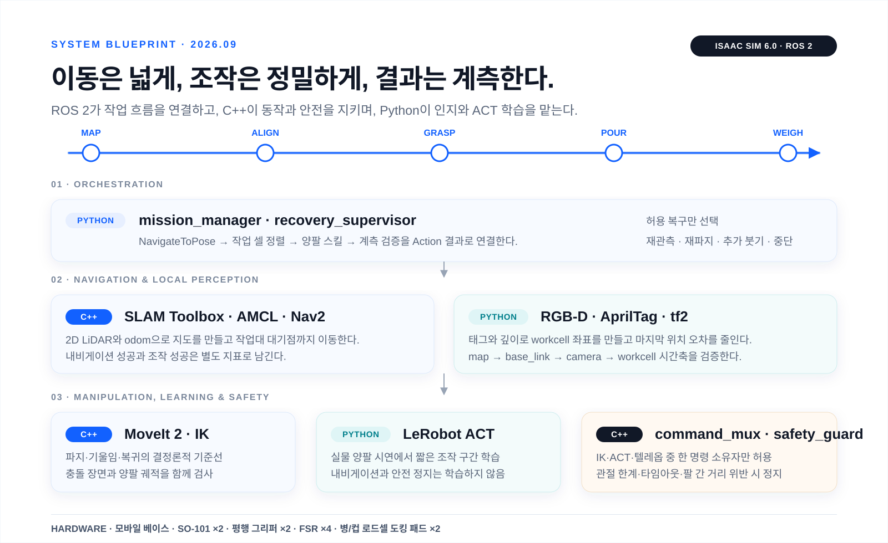

# HOLD THE FLOW · 이동형 양팔 로봇 프로젝트

동국대 DAPIER 부트캠프 최종 팀 프로젝트의 **팀 공용 저장소**다. 팀원이 설계·코드·실험 데이터 규격·회의 결정·검증 증거를 이곳에서 함께 관리한다. 한 팔이 경량 병을 기울이고 다른 팔이 컵을 안정화하는 동안, 이동·인지·양팔 조작·계측 검증·실패 복구를 하나의 ROS 2 시스템으로 연결한다.



- 프로젝트 사이트: [HOLD THE FLOW · Team Project](https://hold-the-flow-bimanual.mmporong.chatgpt.site) — ChatGPT Sites 소유자 전용 배포
- 시작: 2026-08-19 (킥오프 회의)
- 기간: 약 3개월
- 개발 기준: Ubuntu 24.04 · ROS 2 Jazzy · C++17 · Python 3.12 · LeRobot 0.6.1
- 시뮬레이터: Isaac Sim 6.0 · ROS 2 Bridge
- 운영 방식: Issue → 작업 브랜치 → Pull Request → 로컬 검증 → `main`
- 단일 원본: 팀 프로젝트의 최신 결정과 산출물은 이 저장소의 `docs/`, `research/`, `data/`, `src/`에서 관리

## 프로젝트 한 줄 정의

### 이동은 넓게, 조작은 정밀하게, 결과는 계측한다

**SLAM/Nav2로 작업대까지 이동한 뒤, 한 팔은 경량 병을 기울이고 다른 팔은 받는 컵을 든다. 접촉 센서로 파지를 판정하고 붓기 뒤 병·컵 도킹 저울로 실제 유입량과 흘림을 검증하며, 실패하면 검증된 복구 스킬을 실행한다.**

현재 개발과 실물 검증은 이동형 비정형 용기 붓기 1안에 집중한다. Nav2는 작업대 근처까지 이동시키고, RGB-D/AprilTag는 마지막 정렬을 맡는다. MoveIt 2/IK가 결정론적 기준선을 만들고, ACT는 기준선 통과 뒤 양팔 조작 구간에만 적용한다.

- 기준 문서: [docs/20260828_1안_확정_이동형_양팔_붓기.md](docs/20260828_1안_확정_이동형_양팔_붓기.md)
- 구현 아키텍처: [docs/20260901_구현아키텍처_ROS2_CPP_Python_ACT_IsaacSim.md](docs/20260901_구현아키텍처_ROS2_CPP_Python_ACT_IsaacSim.md)
- 기구설계 명세: [docs/20260901_기구설계_제작명세_v0.1.md](docs/20260901_기구설계_제작명세_v0.1.md)
- 기구 검증표: [docs/20260901_기구설계_검증체크리스트_v0.1.md](docs/20260901_기구설계_검증체크리스트_v0.1.md)
- CAD·URDF 파라미터: [design/mechanical/hold_flow_mechanical_v0_1.yaml](design/mechanical/hold_flow_mechanical_v0_1.yaml)
- 논문 적용 설계: [research/R31_1안_이동형_양팔_붓기_논문적용.md](research/R31_1안_이동형_양팔_붓기_논문적용.md)
- 팀 작업 방식: [docs/TEAM_WORKFLOW.md](docs/TEAM_WORKFLOW.md)
- 회의 기록: [docs/20260828_회의결과_주제후보_역할분담.md](docs/20260828_회의결과_주제후보_역할분담.md)
- 5쪽 발표자료: [docs/20260828_HANDOVER_양팔로봇_5페이지_발표자료.pptx](docs/20260828_HANDOVER_양팔로봇_5페이지_발표자료.pptx)
- 발표자료 디자인 리포트: [docs/20260828_HOLD_THE_FLOW_발표자료_디자인_리포트.docx](docs/20260828_HOLD_THE_FLOW_발표자료_디자인_리포트.docx)

## 현재 구현 스택

| 파트 | 채택 기술 | 직접 구현할 부분 |
|---|---|---|
| 시뮬레이션 | Isaac Sim 6.0, USD, ROS 2 Bridge | SO-101·모바일 베이스 자산, 센서, TF, sim/real gap |
| 지도·이동 | SLAM Toolbox, AMCL, Nav2 | 작업대 staging pose, Action 결과, 반복 접근 평가 |
| 로컬 정렬 | RGB-D, AprilTag, OpenCV, tf2 | `base_link→workcell` pose와 시간축 검증 |
| 양팔 조작 | MoveIt 2, IK, Planning Scene | 파지·기울임·복귀 궤적과 양팔 충돌 검사 |
| 실행·안전 | C++17, FollowJointTrajectory, command mux | 관절 한계, 타임아웃, 팔 간 거리, 안전 정지 |
| 실물 연결 | LeRobot `bi_so_follower` Python bridge | 좌우 SO-101 포트 단독 소유, 상태·명령 변환 |
| 모방학습 | LeRobot ACT, PyTorch | 실물 양팔 시연 수집, 학습, rollout, IK 대조 |
| 계측 | FSR 4채널, 병·컵 로드셀 도킹 패드 | 파지 안전, 유입량, 흘림 추정 |
| 실패 복구 | Python 상태기계, 선택형 로컬 LLM | 허용된 복구 스킬만 선택, 직접 모터 제어 금지 |

Isaac Sim 6.0의 공식 최소 VRAM은 16GB이며 현재 확인한 개발 노트북은 8GB다. ROS 2 코드와 자산은 이 장비에서 준비하되, Isaac Sim 실행은 Compatibility Checker를 통과한 GPU 워크스테이션이나 원격 장비에서 검증한다.

## 팀 저장소 운영

- 이 저장소는 특정 팀원의 개인 작업 기록이 아니라 **팀 공용 단일 원본**이다.
- 담당 작업은 GitHub Issue에 목표·범위·통과 조건·증거를 적고 기능별 브랜치에서 진행한다.
- `main`에는 직접 푸시하지 않는다. 작업자가 Pull Request에 변경 내용과 로컬 검증 결과를 남기면 팀원 승인 없이 직접 병합할 수 있다.
- 팀원 리뷰는 필수 승인이 아니라, 공용 인터페이스·안전·실기체 변경처럼 교차 확인이 필요한 작업에서 선택적으로 요청한다.
- 개인 실험도 재현 가능한 코드·설정·결과 요약을 남겨 팀원이 이어서 실행할 수 있게 한다.
- 데이터셋·모델·rosbag 같은 대용량 파일은 저장소에 직접 올리지 않고 `data/README.md`의 인덱스로 위치와 버전을 기록한다.
- 세부 절차는 [팀 협업과 작업 관리](docs/TEAM_WORKFLOW.md)를 따른다.

## 현재 역할

- 강사/멘토: 로컬 LLM·감독 에이전트, 교육·리뷰
- [@mmporong](https://github.com/mmporong): **SLAM/Nav2 우선**, 모바일 베이스·작업대 접근, 전체 통합
- 협업자 [@Minsuk-ji](https://github.com/Minsuk-ji): write 권한 수락, 세부 담당 확정 대기
- 팀원 [@jangjunseo05](https://github.com/jangjunseo05): write 초대 수락 대기, 세부 담당 확정 대기
- 공통: ACT, IK, Depth, 그리퍼·접촉 센서, 실물 데이터 수집·평가

파트별 언어·ROS 인터페이스·구현 순서는 [구현 아키텍처](docs/20260901_구현아키텍처_ROS2_CPP_Python_ACT_IsaacSim.md)를 기준으로 한다.

## 폴더 구조

```
bimanual-robot/
├── design/        CAD·URDF가 함께 읽는 기구 파라미터와 설계 원본
├── docs/          회의록·결정사항·담당 파트·설계 문서 (파일명 YYYYMMDD_ 접두)
├── research/      리서치 산출물 (양팔 텔레옵 선례, 적용 사례, GPU 비용 등)
├── data/          데이터셋 규격·인덱스·스키마 (실데이터는 커밋하지 않음)
│   └── schema/    에피소드 메타데이터 스키마, dataset card 템플릿
├── src/           ROS 2·MoveIt·ACT·Isaac Sim 구현 코드
├── site/          팀 프로젝트 HTML 사이트 소스·배포 설정
├── tools/         수집·검증·변환 스크립트
├── PROGRESS.md    세션별 진행 로그 (최상단 append)
└── CLAUDE.md      팀 저장소 작업 규칙
```

## 현재 상태

- [x] 킥오프 회의 기록·결정사항 정리
- [x] 데이터 저장 규격 초안 (스키마·dataset card·포함/제외 기준)
- [x] 3인 회의 결과·두 시나리오·잠정 역할 문서화
- [x] 물 따르기·접촉 센서·실패 복구·모바일 양팔 논문 재검증
- [x] 논문 근거를 제어 상태기계·센서 책임·평가표·실패 데이터 규격으로 변환
- [x] 물 따르기를 Plan A와 메인 시나리오로 확정
- [x] 물 따르기 전용 5쪽 발표자료와 디자인 리포트 제작
- [x] ROS 2·C++·Python·Nav2·MoveIt 2·ACT·Isaac Sim 구현 경계 문서화
- [x] 250 mm 정사각 차체·SO-101×2·단일 Astra S 기둥의 기구 명세와 검증표 작성
- [x] 팀 공용 구현 아키텍처 HTML 사이트 제작·ChatGPT Sites 배포
- [ ] M0 부품 실측: SO-101 체결홀·Astra S·평행그리퍼·구동부 외피와 질량
- [ ] M1 출력 공차 시험편과 4분할 정사각 판 이음 검증
- [ ] M2~M4 차체 건식조립·정적하중·3점 지지 안정성 검증
- [ ] Isaac Sim 6.0 실행 장비 Compatibility Checker와 ROS 2 Bridge smoke test
- [ ] 물병 총중량·파지·미끄럼 POC
- [ ] 컵 파지·건식 내용물 붓기·병/컵 도킹 저울 사후 판정 POC
- [ ] 선택 확장: 로드셀 수신 모듈의 실시간 질량 판정 POC
- [ ] SLAM/Nav2 작업대 반복 접근 기준선
- [ ] Depth/표식 기반 작업 셀 로컬 정렬 기준선
- [ ] 이동 → 정렬 → 양팔 파지 → 붓기 → 검증 상태기계 통합
- [ ] MoveIt 2 양팔 URDF/SRDF·Planning Scene·무수 기울임 기준선
- [ ] LeRobot 양팔 5 episode smoke dataset
- [ ] ACT 20 episode 과적합 기준선과 IK 대조 평가
