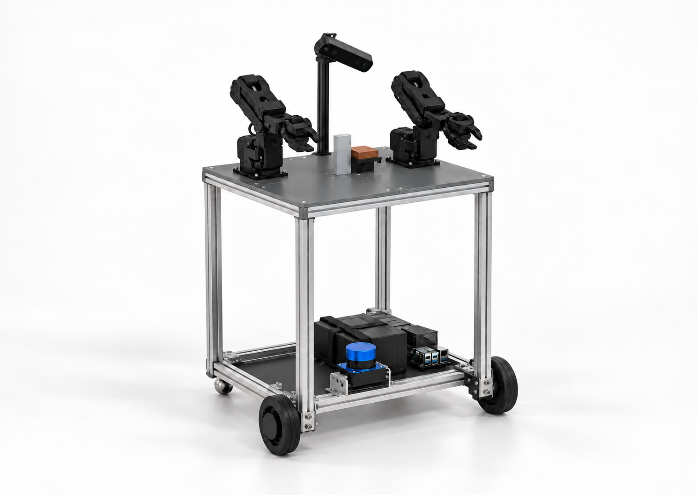

# HOLD THE FLOW · 이동형 양팔 물 서빙 로봇

웹에서 테이블의 물 주문을 받아 주방에서 물을 따르고, 컵을 상판에 싣고 이동해
테이블에 놓은 뒤 도크로 복귀하는 로봇이다. 동국대 DAPIER 피지컬 AI 부트캠프
MS Team의 공용 저장소이며, 이동·양팔 조작·관제를 하나의 주문으로 연결한다.

시뮬레이션의 전체 미션, 실차의 서비스 이동, 양팔 조작을 각각 시험했다.
실물에서 주문부터 물 서빙·충전까지 이어지는 전체 미션의 반복 검증은 남아 있다.

<p align="center">
  
</p>

그림은 부품 배치를 설명하는 콘셉트다. 제작·충돌·관성 검토에는
[축척 모델](docs/assets/full_size_frame_20260910/model_overview.png)과 기구 사양을 사용한다.
실제 조립·센서 배치와 모델의 차이는 아래 하드웨어 항목에서 구분한다.

## 현재 구현과 검증 범위

| 영역 | 확인된 상태 | 남은 검증 |
|---|---|---|
| 웹 주문·관제 | 4테이블·냉수/온수 선택, 주문 큐, 배터리 분기, SQLite 복구, Action 결과 대기 | 물리 미션의 반복 주문·재시작 복구, 실제 배터리·충전 신호 연결 |
| Isaac 전체 미션 | 도크 출발·양팔 물붓기·상판 운반·재파지·테이블 배치·도크 복귀 1회 통과 | 현행 순정 왼손으로 전체 미션 재시험, 물체 인식 입력, 충전 물리 |
| 순정 왼손 접촉 | 10 g·등가 질량 210 g 강체 컵의 파지·상승·놓기·손 분리 시험 통과 | 컵 변형·물 유동·이동 중 운반·실물 파지 |
| JD-AMR 실차 이동 | 물 받는 곳·table_01/table_02 접근과 도크 복귀 기록 확보 | 팔 작업 완료 신호 연결, 현행 양팔 차체·하중의 통합 평가 |
| 실물 왼팔 IK | 상대 DLS IK·엔코더 피드백으로 컵 동반 상승을 관찰한 기록 | 현행 양팔 보정으로 계획 재생성, 책상 완전 분리·TCP 정밀도·운반·놓기 |
| SmolVLA 조작 | 정책 파트에서 40개 에피소드 학습 정책의 주방 조작 1회 완주 보고 | checkpoint·영상·보정·데이터 원본 연결, 공통 조건 반복 평가 |
| 물체·물 양 인식 | 컵 검출·평면 변환·IK 도구, 액면·흘림 판정 설계 | 실물 카메라 보정, 컵별 mL 보정표, 붓기 정지 연동 |
| 모델 | 58링크·57관절의 URDF/Xacro와 CAD, 정적 계약 검사 | 실측 장착 좌표·접촉·관성·구동 추종의 일치 |

시뮬 성공, 팀 보고, 실물 관측을 같은 성과로 합산하지 않는다. 전체 미션 시뮬은
구형 강체 패드와 정답 물체 좌표를 사용했고, 실차 이동에서는 팔 작업을 대기로 대체했다.
실물 IK의 컵 동반 상승도 전체 픽앤플레이스 완료를 뜻하지 않는다.
실험 조건·원본 위치·변경 이력은 [진행 로그](PROGRESS.md)에 기록한다.

<!-- AUTO:PROJECT-STATUS:START -->
## 단일 원본 자동 요약

> 아래 표는 기계 YAML에서 생성한다. 수정하려면 표가 아니라 연결된 원본 파일을 고친다.

| 항목 | 현행 값 |
|---|---|
| 기계 개정 | `2026-09-22_left_stock_so101_gripper_selected` |
| 상·하부 프레임 | 450×340 mm |
| 상판 높이 | 720 mm |
| 왼손 | SO-101 순정 회전식 죠, TPU·오버캡 없음 |
| 오른손 | `ggao50_SO101_Parallel_Gripper` |
| RGB-D | Orbbec_Astra_S, 상판 위 250 mm |
| 베이스 | differential_two_wheel_two_ball_caster, Feetech_STS3215_C018_12V |
| 모델 상태 | `simulation_model_ready_physical_measurements_pending` |

원본: [`hold_flow_mechanical_v0_3.yaml`](design/mechanical/hold_flow_mechanical_v0_3.yaml)
과거 후보: [`finray_80mm_lip3_selection.yaml`](design/gripper/finray_80mm_lip3_selection.yaml)
<!-- AUTO:PROJECT-STATUS:END -->

## 미션과 MVP 범위

```text
도크 대기 → 테이블 물 주문 → 주방 이동·정렬·정차
  → 왼팔 컵 파지 + 오른팔 물통 파지 → 물붓기·물 양 확인
  → 물통 반환 → 컵 상판 적재·손 분리 → 테이블 이동·정차
  → 컵 재파지·테이블 배치·손 분리 → 도크 복귀
```

컵은 양팔 사이 상판에 놓고 운반한다. 주행 중 팔로 컵을 들지 않으며,
파지·붓기·놓기 전에 베이스를 정지한다. 도크 도착과 실제 충전 시작은 별도로 판정한다.

초기 실물 통합 범위는 등록한 작업대·한 종류의 컵과 물통·상온의 물·한 테이블이다.
웹의 4테이블·냉수/온수 선택 기능이 모든 조합의 물리 검증 완료를 뜻하지 않는다.
온수 조작, 다중 로봇 배차, 사람과 함께 쓰는 매장 상시 운용, 범용 조립·음성 태스크는
MVP에서 제외한다. 태스크 결정 원본은 [회의 결정과 실행 범위](docs/20260907_물서빙로봇_회의결정과_실행범위.md)다.

## 하드웨어와 모델

- 프레임: 상·하부 450×340 mm, 프로파일 기둥 4개, 4분할 프린팅 상판.
  상판 높이 720 mm, 바퀴 포함 폭 540 mm가 제작 기준이다.
- 양팔: SO-101 두 대. 왼손은 순정 회전식 죠를 사용하며 TPU·오버캡을 붙이지 않는다.
  오른손은 ggao50 순정 평면 죠이며 홈·교체형 인서트를 사용하지 않는다.
- 실물 조작 관제: 상단 RGB 1대와 손목 RGB 2대. 설계의 Astra S RGB-D와 구분한다.
  카메라 연결 확인은 영상 좌표와 팔 좌표의 보정 완료가 아니다.
- 실차 주행: Raspberry Pi 4B 4GB, ESP32, Astra S와 YDLIDAR G4.
  URDF의 LDS-03·원본 바퀴 배치와 실차 구성의 차이는 통합 전에 맞춰야 한다.
- 질량·하중: URDF 명목 빈 질량은 7.379 kg. 추가 적재 5 kg의 수동 평지 주행은
  예비 시험이며 정격 적재량·실측 총질량·연속 운전 성능으로 사용하지 않는다.

캘리브레이션은 [양팔 JSON과 보정 상태](calibration/README.md)로 관리한다.
현행 양팔 follower와 오른쪽 leader는 팀원의 그리퍼 재조립 후 새 보정을 반영한다.
양팔 실행은 `calibration/bi_follower`·`bi_leader`를 사용하며 단일팔 과거 사본을 섞지 않는다.
이전 IK 관측은 교체 전 보정의 시험 기록이다. 이전 정책의 수집 보정과 호환은 별도
확인하며, 보정 변경 뒤 이전 raw 목표·IK mapping·계획 packet을 그대로 재사용하지 않는다.
영점·TCP·개구 대응과 실물 정밀도는 캘리브레이션 파일 저장 여부와 구분한다.

기구·CAD·모델 생성과 검증은 [450×340 모델 설명](docs/20260910_450x340_4분할상판_URDF_IsaacSim_모델.md),
[CAD 출력물](design/cad/README.md), [URDF 설명](src/hold_flow_description/README.md)을 따른다.

## 이동·관제·조작의 연결

```text
웹 주문 → 주문 큐·미션 상태기계 → ExecuteManipulationSkill ROS 2 Action
  → Unix socket JSON → Isaac phase executor → 물리 결과·진행 feedback
```

주문·미션·요청 ID와 phase, backend, checkpoint를 결과에 연결한다.
Action의 성공·실패·취소·timeout을 확인한 뒤 다음 phase로 진행하고,
취소된 주문의 늦은 결과가 상태를 다시 전진시키지 않도록 한다.
ROS 2 Jazzy의 Python 3.12와 Isaac Sim 5.1의 Python 3.11은 프로세스로 분리한다.
현재 Isaac 실행은 Articulation 제어와 로컬 IPC를 사용하며 ROS Bridge 관절 Topic 실행과 다르다.

### 웹 주문과 실행 모드

주문 ID 중복 방지, 우선순위 큐, 활성 미션 한 건, 재시도·실패 종료를 구현했다.
연속 주문의 도크 복귀 생략과 저배터리 충전 선행은 관제 로직으로 시험했다.
SQLite는 주문·큐·명령 이력을 보존하지만, DB 복구만으로 Isaac 물리 world까지 복원되지는 않는다.

| backend | 실행하는 범위 |
|---|---|
| `immediate` | CPU 관제 dry-run. 명령을 즉시 성공 처리 |
| `ros2-mock` | ROS 2 Action의 feedback·result·취소·timeout 계약 |
| `ros2-planned-artifact` | 저장된 시뮬 산출물의 해시·phase 증거 대조. 새 물리 실행 아님 |
| `ros2-planned-session` | 상태를 보존하는 executor 세션. 연결한 mock/물리 실행기의 provenance 확인 필요 |
| `ros2-planned-roundtrip` | 한 Isaac world의 도크 출발·조작·바퀴 주행·서빙·도크 복귀 |

왕복 물리 검증은 1번 테이블 냉수 한 건에 한정한다. 충전 접점·충전 물리,
반복 주문의 world reset, 다른 테이블·물통 조합은 별도 검증 대상이다.
HTTP 응답 성공과 주문의 물리 성공을 구분한다.
실행법은 [웹 관제](docs/20260922_웹주문_미션관제_dry-run.md)와
[Action·IPC·왕복 executor](docs/20260922_ExecuteManipulationSkill_ROS2_Action.md)에 있다.

### 실차 주행과 시뮬 주행

| 환경 | 지도·경로·추종 | 근거와 한계 |
|---|---|---|
| JD-AMR 실차 | Cartographer 지도 생성, 저장 지도 AMCL, NavFn·RPP, Collision Monitor, RGB-D 면 정렬·접근 | 물 받는 곳·테이블·도크 시험. 팔 동작·충전 시작 미포함 |
| Isaac 식당 | 알려진 배치의 점유격자·A*, lookahead 차동구동 추종·최종 pose 정렬 | 시뮬 좌표·정적 배치 조건. Nav2·실물 SLAM 실행 아님 |

실차 기록의 대표 예시는 table_02 왕복 186.5초, table_01 왕복 175.0초이며
각 실행의 Nav2 목표 10개가 완료됐다. 위치 오차는 AMCL·odom·센서 TF의 내부 추정이다.
같은 날 한 명령으로 table_02 → 도크 → table_01 → 도크를 연속 완료한 기록도 있다.
팔 작업은 각 5초 대기로 대체했고 충전 시작은 포함하지 않았다. 통제구역 시험에서는 RPP 예측 충돌 검사를 끄고
Collision Monitor를 유지했다. 사람 주변 운용 성능이나 전체 물 서빙 성공으로 확대하지 않는다.

실차 코드와 최신 이동 기록은 [JD-AMR 저장소](https://github.com/mmporong/jdamr_cube_ros)가 관리한다.
이 저장소의 [선행 이식 문서](docs/20260912_JDAMR_SLAM_실기체이식.md)는 준비 절차이며,
이후 이동 시험의 미완 상태를 판단하는 최신 근거로 사용하지 않는다.
지도만 저장하지 않고 station·footprint·TF·센서·도착 정렬을 함께 맞춰야 한다.

## 계획 기반 조작과 모방학습

계획 기반 조작은 FK로 파지점·병 입구의 위치와 자세를 계산하고 DLS IK로 관절 목표를 구한다.
컵은 몸통 중간에 수평 접근하며, 물붓기에서는 오른쪽 병 입구를 왼쪽 컵 위로 옮기고
입구 위치·기울기·붓는 방향·관절 연속성을 함께 제한한다. IK는 시연 학습이 필요하지 않다.

| 방식 | 현재 상태 | 비교할 내용 |
|---|---|---|
| 계획 기반 `PLANNED_ALL` | Isaac 접촉·붓기·운반 기준선, 실물 상대 IK 시험 | 좌표·보정 오차, 형상·마찰, 재설정 비용 |
| 모방학습 | SmolVLA 주방 실물 완주의 팀 보고. ACT 데이터 계약·인계 도구 | 같은 물체·시작 조건의 성공 횟수, 개입, 시간, 물 양 |
| `HYBRID` | phase별 backend 선택 계약 | 공통 평가 뒤 학습이 도움이 되는 phase만 교체 |

`ACT_ALL`은 저장소의 ACT 전략 계약명이다. SmolVLA를 자동으로 실행하는 adapter나
현행 통합 rollout이 완료됐다는 뜻은 아니다. SmolVLA·ACT 연결 시 모델별 관측·행동 키,
관절 순서·단위·보정·checkpoint를 맞춰야 한다. 학습 loss와 물리 과업 성공률도 구분한다.

HYBRID 구현 시 기존 backend 종료, 관절 속도 0·허용 자세 확인, 잔여 action chunk 폐기,
lease 해제 후 제어권 전환을 요구한다. 이 전환의 실물 통합 검증은 아직 남아 있다.
IK와 정책 명령을 동시에 쓰지 않으며, 어느 phase를 IL로 바꿀지는 동일 평가 조건에서 결정한다.
학습과 수집은 [양팔 IL·Hub·다른 PC 학습 인계](docs/20260911_양팔_IL_데이터수집_HuggingFace_학습_인계.md)를,
실물 IK 계획·mock과 제한 사항은 [픽앤플레이스 준비](docs/20260929_IK_픽앤플레이스_실행전_준비.md)를 따른다.

## 시뮬레이션과 실물 전환

Isaac Sim 5.1에서 URDF를 가져와 독립 강체 컵·병과 그리퍼의 접촉으로 파지한다.
물체를 손목에 강제로 붙이지 않으며, 물은 PhysX GPU PBD 입자로 모델링한다.
파지 유지·미끄럼·용기 자세·입자 분포·상판/테이블 지지·손 분리·도착을 검사한다.

전체 왕복 `dock_roundtrip02`는 한 실행에서 12개 phase와 물리 판정을 통과했다.
시뮬 시간은 473.892초, 최종 입자는 컵 687개·병 227개·외부 4개다.
운반 중 추가 입자 손실은 없었지만 전체 무유출·실측 mL 정확도를 뜻하지 않는다.
구형 80 mm 강체 패드·정답 좌표 조건이며 Nav2와 충전 물리는 실행하지 않았다.

현행 순정 왼손은 별도 강체 컵 접촉 시험을 통과했다. 이를 구형 패드의 전체 미션이나
실물 물붓기 결과로 대체하지 않는다. 실물 상대 IK는 잠정 손목 대응·엔코더 피드백으로
컵 동반 상승을 관찰한 단계이며, 절대 좌표 정밀도·안정 운반·놓기는 아직 검증 전이다.

실물 전환은 관절·TCP·카메라/작업셀 대응 → 건식 파지·놓기 → 계량 물붓기 →
상판 운반 → 이동·조작 통합 순서로 확인한다. Isaac 6.0은 목표 계약이며 5.1 실행 근거와 구분한다.
고정 베이스의 정적 프리뷰도 물리 접촉 시험과 다르다.

- [URDF 프리뷰·순정 죠 접촉 시험](docs/20260918_URDF_Isaac51_작업환경_프리뷰.md)
- [양팔 PBD 물붓기](docs/20260921_양팔_PBD_물붓기_시뮬레이션.md)
- [4테이블 식당·상판 운반·영상 생성](docs/20260921_식당_시뮬레이션_환경.md)

## 물 양 판정

시뮬레이션은 컵·병·외부 영역의 입자 수로 물 전달과 손실을 평가한다.
실물의 목표량 정지는 아직 연결 전이며 다음 흐름으로 개발한다.

```text
컵·액체·흘림 영역 분리 → 원근·기울기 보정 → 액면/충전율
  → 컵별 실측 mL 보정표 → UNDER / TARGET / OVER / SPILL / UNKNOWN
```

YOLO 검출 박스나 액면 높이 비율이 곧 부피는 아니다. 한 종류의 컵과 물부터
저울·눈금 계량값으로 대조한다. 목표량·허용오차·불확실 관측 처리와 감속·정지 연동을
정한 뒤 실제 붓기 시험으로 확인한다.

## 데이터·실패 기록·평가

에피소드·영상·가중치·rosbag은 Git 밖의 비공개 Hub 또는 외부 저장소에 보존한다.
[데이터 인덱스](data/README.md)에는 수집 조건·버전·해시·split·checkpoint 연결을 남긴다.
정책 파트의 팀 보고를 공용 인덱스·원본 평가 기록에 연결하는 작업은 남아 있다.

원본 시연은 한 번 보존하고 phase 시작·종료와 성공 기준을 표시해 전체·phase 학습에 재사용한다.
실물과 시뮬 데이터는 구분하고, 실패 원본을 성공 BC 데이터에 무조건 섞지 않는다.

```text
증상·실행 조건·근거 보존 → 원인 가설/기각 → 확인된 원인
  → 시스템 수정 또는 시연 보강 → 같은 조건 재시험 → 다른 조건 회귀 평가
```

하드웨어·연결, 좌표·보정, 로직, 데이터 분포, 측정 문제를 분리한다.
[failure bank](tools/failure_bank.py)는 근거 보존·해시 검증·집계를 담당하며,
[실패 규약](data/failures/README.md)에 가설·조치·재시험을 연결한다.

공통 평가에는 전체/phase별 성공 횟수와 전체 시도 수, 개입·재시도, cycle time,
실측 물 양·흘림, 위치·조명·초기 잔량 변화, 관측 지연을 기록한다.
한 실행의 12개 phase 통과를 12회 반복 성공으로 쓰지 않으며,
정책 loss·주행 도착·물체 파지·물 양 정확도를 각각 평가한다.

## 연산·무선 분담

| 위치 | 목표 책임 |
|---|---|
| GPU 노트북 | 정책 학습·추론, 고부하 비전, 웹 UI·기록 분석 |
| Raspberry Pi 4B | 센서·TF·Nav2·미션·정렬, 명령 중재·하드웨어 연결 |
| ESP32·서보 | 바퀴·관절 구동과 상태 전달 |

카메라·LiDAR·구동계는 로봇 안에서 유선 연결하고 Pi↔노트북을 로컬 네트워크로 연결한다.
모든 모델의 원격 추론·실행이 통합 검증된 상태는 아니다. 관측/명령 시각·유효기간,
중복·두절·재연결과 실제 정지 동작을 확인해야 한다.
Pi 5 전환은 후순위이며 주행·센서·통신 부하를 측정한 뒤 결정한다.
팀원의 GPU 서버도 모델·학습 조건을 별도 기록하며 장비 확보만으로 성능을 확정하지 않는다.

## 시작하기

개발 기준은 Ubuntu 24.04, ROS 2 Jazzy, C++17, Python 3.12, LeRobot 0.6.1이다.
시뮬 물리 실행에는 Isaac Sim 5.1의 별도 Python 환경을 사용한다.
구성 요소별 설치·빌드는 [ROS 패키지 설명](src/README.md)과 각 실행 문서를 따른다.

CPU 웹 관제만 확인할 때:

```bash
cd "$HOME/bimanual-robot"
python3 tools/service_order_server.py \
  --backend immediate --port 8765 \
  --state-dir "$HOME/.local/state/hold-flow/service"
```

`http://127.0.0.1:8765/`에서 주문·큐·phase·이력을 확인한다. 이 모드는 물리 실행이 아니다.
종료는 실행한 터미널에서 `Ctrl+C`를 사용한다. Isaac 연동에는
[Action 실행 문서](docs/20260922_ExecuteManipulationSkill_ROS2_Action.md)의 서버·socket·backend 설정이 추가로 필요하다.

문서·자동 요약과 모델을 검사할 때:

```bash
cd "$HOME/bimanual-robot"
python3 tools/ci/check_local_markdown_links.py
python3 tools/ci/sync_readme_status.py
python3 src/hold_flow_description/scripts/validate_description.py
```

## 다음 통합 작업

1. 현행 보정·그리퍼·카메라·작업셀과 정책 데이터/checkpoint의 대응을 고정한다.
2. 같은 조건에서 계획 기반/학습 조작의 건식 파지·놓기와 물붓기를 반복 평가한다.
3. 컵별 물 양 계량·판정·정지 연동, 상판 적재와 테이블 전달을 확인한다.
4. 실차의 작업 대기를 조작 Action 완료 신호로 바꾸고 주문별 전체 미션을 연결한다.
5. 반복 주문·실패·취소·재시작·무선 두절을 평가하고 도크 복귀와 충전 시작을 구분한다.

## 역할과 저장소 진입점

| 담당 | 범위 |
|---|---|
| 임주영 | SLAM·Nav2·station·도크 복귀, 미션 연결, URDF·Isaac Sim 검증 |
| 장준서 | 양팔 텔레옵·모방학습·정책 비교·실물 rollout |
| 지민석 | 컵·물통·액체 인식, 물 양·흘림 판정 |
| 공통 | 차체·그리퍼·전원·배선, 통합 시험 |

| 경로 | 용도 |
|---|---|
| [design](design/cad/README.md) | 기구 사양·CAD·출력물 |
| [src](src/README.md) | description·interfaces·mission 등 ROS 2 코드 경계 |
| [data](data/README.md) | 에피소드·평가·실패 계약과 외부 데이터 인덱스 |
| [docs](docs/20260904_양팔로봇_프로젝트_인계.md) | 설계·실행법·팀 인계 |
| [research](research/R33_산업용_피킹과_IL_ACT_적용경계.md) | 외부 연구의 적용 판단 |
| [PROGRESS.md](PROGRESS.md) | 날짜별 실험·실패 수정·검증 근거·변경 이력 |

## 저장소 운영

제품 상태는 README, 상세 실행 기록은 PROGRESS와 분야별 문서에 둔다.
변경은 작업 브랜치에서 검증하고 PR로 main에 반영한다. 위험도 라벨은 검토 안내이며,
Draft가 아닌 PR은 필수 검사 통과 후 자동 병합한다. CODEOWNERS·추가 승인 인원은 요구하지 않는다.
자동화 안내는 Actions 요약에 남기고 봇 댓글은 만들지 않는다. GitHub 기본 알림은 수신자 설정을 따른다.

실물 동작은 요청된 실행 범위에서 수행하고, 물체를 든 상태의 hold와 토크 해제를 구분한다.
동시 제어권·관절 한계·충돌·스톨·timeout·흘림의 처리도 실행 환경에서 확인한다.
파일 단위로 스테이징하며 데이터·모델·대용량 로그는 커밋하지 않는다.
