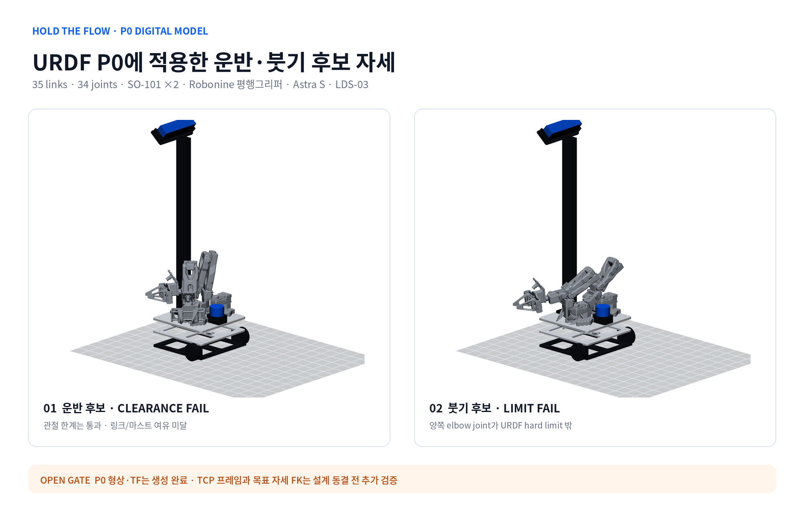
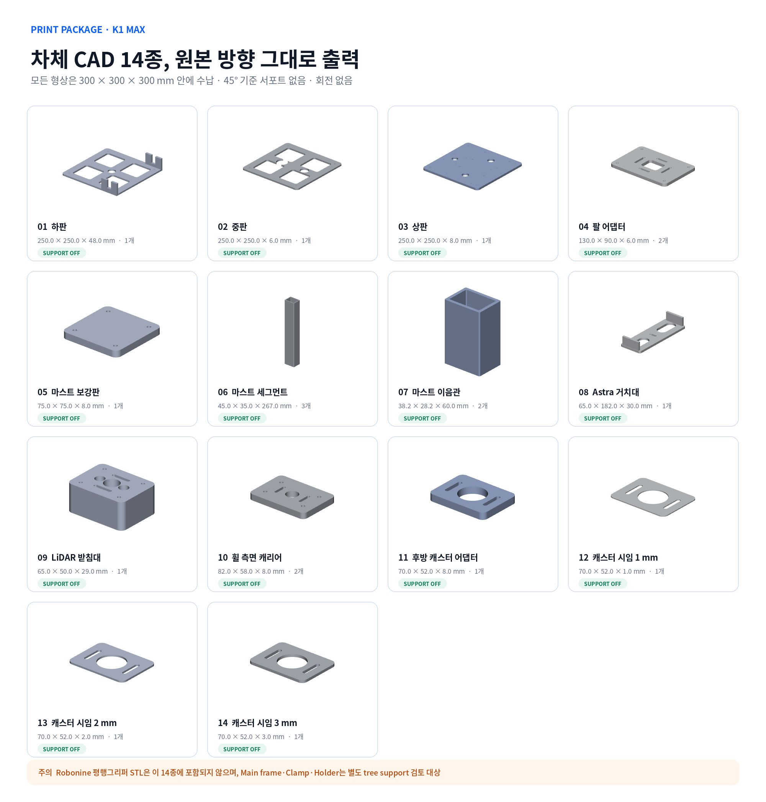
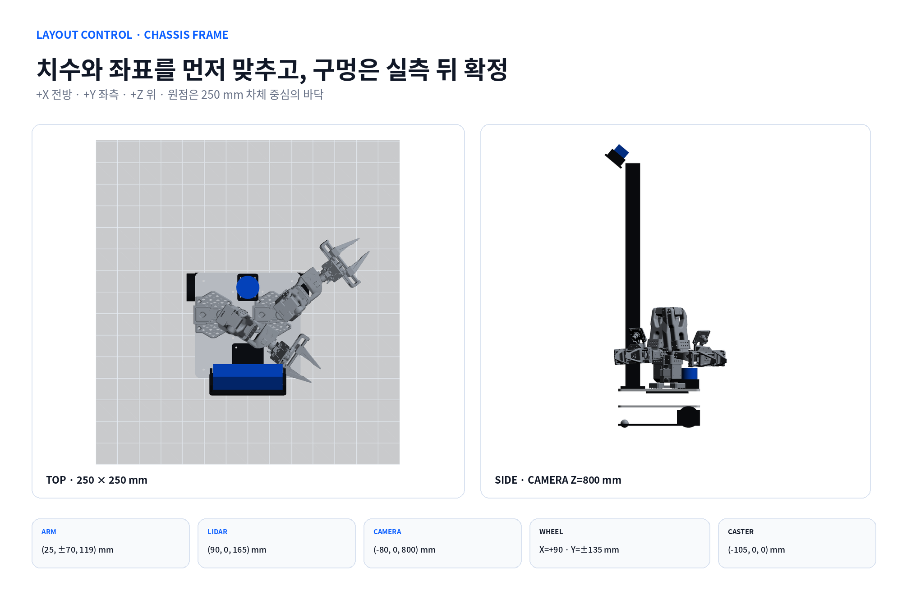

# HOLD THE FLOW 설계팀 제작 인계 패키지 P0

> 목적: 설계팀이 현재 모델의 확정 범위와 미확정 범위를 구분하고, 실측 → CAD 수정 → 시험 출력 → 조립 → URDF 보정 순서로 제작을 이어가도록 하는 단일 인계 문서
>
> 기준일: 2026-09-01
>
> 적용 대상: `250 × 250 mm` 이동형 양팔 물 따르기 로봇, SO-101 2대, 수평 평행그리퍼 2대, Astra S, LDS-03, JD-AMR 계열 바퀴 2개와 후방 볼 캐스터 1개
> 현재 판정: **P0 디지털 형상과 고정 TF 생성 완료 / 실물 치수·TCP/FK·관성·연속 간섭·출력 프로파일 미확정**

> **2026-09-03 개정**: Ø6 로드 조달 불가로 선정 그리퍼를 [ggao50 SO101-Parallel-Gripper](https://github.com/ggao50/SO101-Parallel-Gripper)(완전 출력형)로 바꾸고, 붓기 물체를 물 50 mL 기준 **60 g**으로 낮췄다. 물체를 낮추면 컵 유지 토크가 정격의 96.6%에서 **78.4%**로 내려가 165 g 그리퍼가 정격 안에 들어온다. 130 g 경량 게이트는 필수 조건에서 해제한다. 아래 본문의 `120 g / 140 g` 하중 서술과 `130 g` 그리퍼 서술은 이 개정으로 대체된다. 근거와 재계산은 `design/mechanical/hold_flow_mechanical_v0_2.yaml`과 `calculate_250mm_design.py`에 있다.


이 문서는 콘셉트 렌더가 아니라 현재 저장소의 STEP, STL, URDF와 계산 파일을 기준으로 한다. 설계팀은 이 문서의 `OPEN GATE`를 닫기 전까지 체결공과 G-code를 양산 기준으로 동결하지 않는다.



## 1. 인계 결론

### 지금 확정해도 되는 항목

- 차체 외곽은 `250 × 250 mm`, 3층 판 구조로 유지한다.
- K1 Max 기준 하판·중판·상판은 4분할하지 않고 한 장으로 출력한다.
- SO-101 두 대는 **차체 중심 바닥 기준** `(25, ±70, 119) mm`에 배치한다. 같은 점은 URDF의 `base_footprint` 기준 `(-65, ±70, 119) mm`다.
- Astra S는 후방 중앙 단일 기둥에 설치하고 광학 중심은 `Z=800 ±30 mm`를 목표로 한다.
- LDS-03은 Astra 위가 아니라 **차체 중심 바닥 기준** 전방 중앙 `(90, 0, 165) mm`의 독립 받침대에 둔다. URDF `base_footprint` 기준 X는 `0 mm`다.
- 바퀴축은 차체 중심 기준 `X=+90 mm`, 좌우 접지 중심은 `Y=±135 mm`, 후방 볼 캐스터는 `X=-105 mm`로 둔다.
- 이동 중에는 두 팔을 운반 자세에 고정하고, 붓기 중에는 베이스를 정지한다.
- 차체 CAD 14종은 현재 STL 방향에서 K1 Max 수납과 45° 기준 무서포트 판정을 통과했다.

### 설계 동결 전 반드시 닫아야 하는 OPEN GATE

| Gate | 현재 문제 | 설계팀이 만들어야 할 증거 | 닫힘 조건 |
|---|---|---|---|
| G-01 SO-101 체결 | 베이스 홀 중심거리와 나사 규격이 실측 전 | 캘리퍼 측정표, 하부 사진, CAD 투영 비교 | 좌우 두 대 모두 홀 중심 오차 `≤0.5 mm` |
| G-02 주행 허브 | C018 혼–JD-AMR 휠–625 베어링 축 조합 미확정 | 축방향 스택 도면, 간섭 단면, 유격 측정 | 휠 런아웃·축 유격·판 간섭 기준 통과 |
| G-03 후방 캐스터 | 플랜지 홀과 접촉 높이 미확정 | 바닥-장착면 높이, 홀 패턴, 시임 선택 기록 | 세 접지점 흔들림 없음, 높이 차 `≤0.5 mm` |
| G-04 Astra S | 하단 M6 위치와 케이블 굽힘 여유 미확정 | 실물 외곽·M6·커넥터 측정 사진 | 거치대 조립, 35~45° 조절, 케이블 비간섭 |
| G-05 LDS-03 | 하부 홀과 실제 스캔면 높이 미확정 | 하부 사진, 홀 중심, 광학면 높이 | 상판·팔 운반 자세의 스캔 가림 시험 통과 |
| G-06 평행그리퍼 | ggao50 165 g 선정. 반복도 미공개, 파지면이 완전 평면이라 인서트 필요 | 완성 질량, 손목축 기준 COM, 죠 평행도, 파지 반복시험 | 질량 `≤170 g`, COM `≤65 mm`, 112.3° 기울임에서 병 미끄러짐·회전 없음 |
| G-07 TCP/FK | URDF에 명시적 `tool0/TCP` 프레임이 없고 목표 자세와 대조되지 않음 | 좌우 TCP fixed frame, FK 단위시험, 목표 오차표 | 운반·붓기·배치 자세의 TCP 오차 기준 합의·통과 |
| G-08 관성·충돌 | URDF 관성은 P0 근사, 연속 양팔 충돌시험 전 | 최종 CAD 질량특성, MoveIt/Isaac 충돌 로그 | 100회 trajectory 충돌 0, 실물 저속 대조 |
| G-09 슬라이서 | 시작 프로파일과 M1 쿠폰 모델은 생성 완료, 실물 노즐 지름과 판 휨은 미확정 | 3MF, preview 캡처, 쿠폰·판 실측 | M1 공차와 250 mm 판 휨 통과 뒤 G-code 승인 |

## 2. 파일 원본과 수정 책임

| 구분 | 단일 원본 | 생성물 또는 소비자 | 수정 규칙 |
|---|---|---|---|
| 기계 치수·질량·상태 | [`design/mechanical/hold_flow_mechanical_v0_2.yaml`](../design/mechanical/hold_flow_mechanical_v0_2.yaml) | CAD, 문서, URDF 보정 | 실측값은 먼저 YAML에 반영 |
| CAD 형상 | [`design/cad/generate_hold_flow_cad.py`](../design/cad/generate_hold_flow_cad.py) | STEP/STL/manifest | STEP나 STL을 직접 손수정하지 않음 |
| 출력 목록·체적 | [`design/cad/exports/manifest.json`](../design/cad/exports/manifest.json) | 출력 BOM, 질량 상한 | CAD 재생성 때 함께 갱신 |
| M1 공차 쿠폰 | [`design/cad/generate_m1_coupons.py`](../design/cad/generate_m1_coupons.py) | 쿠폰 STEP/STL, `manifest_m1_coupons.json` | 6절 M1 표를 고치면 이 생성기도 같이 고침 |
| 슬라이싱 | [`design/cad/slice_k1max_petg.py`](../design/cad/slice_k1max_petg.py) | K1 Max·PETG G-code | 5.2절 시작 프로파일을 바꾸면 `PROCESS_SPEC`도 같이 바꿈 |
| 로봇 설명 | [`src/hold_flow_description/urdf/hold_flow.urdf.xacro`](../src/hold_flow_description/urdf/hold_flow.urdf.xacro) | 확장 URDF | 커밋된 `.urdf` 직접 편집 금지 |
| 실물 보정 | [`src/hold_flow_description/config/mechanical_calibration.yaml`](../src/hold_flow_description/config/mechanical_calibration.yaml) | Nav2·TF·드라이버 | 명목 CAD와 실측 보정값을 분리 |
| 계산 | [`design/mechanical/calculate_250mm_design.py`](../design/mechanical/calculate_250mm_design.py) | 질량·전도·토크 보고 | 입력 상수의 근거 파일을 함께 기록 |
| 상태 이미지 | [`design/cad/render_design_handoff.py`](../design/cad/render_design_handoff.py) | 이 문서의 PNG 3종 | 콘셉트 이미지 대신 실제 STL/URDF에서 재생성 |

재생성 명령:

```bash
cd "$HOME/bimanual-robot"
"$HOME/.cache/bimanual-cad-venv/bin/python" design/cad/generate_hold_flow_cad.py
xvfb-run -a "$HOME/.cache/bimanual-cad-venv/bin/python" design/cad/render_design_handoff.py
source /opt/ros/jazzy/setup.bash
colcon build --packages-select hold_flow_description --symlink-install \
  --cmake-args -DPython3_EXECUTABLE=/usr/bin/python3
source install/setup.bash
python3 src/hold_flow_description/scripts/validate_description.py
python3 src/hold_flow_description/scripts/audit_urdf_quality.py --strict
python3 src/hold_flow_description/scripts/audit_task_pose.py
"$HOME/.cache/bimanual-cad-venv/bin/python" design/cad/audit_urdf_clearance.py
```

## 3. 현재 모델 상태

### 형상과 URDF

| 항목 | 현재 결과 | 해석 |
|---|---:|---|
| 출력 CAD | 14종, B-Rep 전부 유효 | P0 형상 생성 성공 |
| K1 Max 수납 | 14종 전부 통과 | 공칭 `300 × 300 × 300 mm` 기준 |
| 차체 CAD 서포트 | 14종 전부 불필요 | 45° 분석, 원본 방향 유지 |
| URDF | 35 links / 34 joints | Xacro 확장과 `check_urdf` 통과 |
| 질량·관성·축·limit | 문제 0건 | `audit_urdf_quality.py --strict` 통과 |
| 메시 참조 | 51개 | 모든 `package://` 경로 존재 |
| 카메라 optical frame | `(-170, 0, 800) mm` from `base_footprint` | 고정 TF 수치 통과 |
| LiDAR | `(0, 0, 165) mm` from `base_footprint` | 고정 TF 수치 통과 |
| 운반 후보 joint limit | 통과 | TCP 목표좌표는 불일치 |
| 붓기 후보 joint limit | **실패** | 좌우 elbow 값이 현재 URDF hard limit 밖 |
| 운반 후보 collision 여유 | **실패** | 링크 간 18.78 mm, 마스트 중심 반경 31.36 mm |
| TCP/FK task pose | **실패/차단** | 명시적 TCP 추가와 자세 재산출 필요 |
| 최종 관성 | **미확정** | 실물 질량·최종 CAD로 교체 필요 |

### 발견된 TCP/FK 인계 위험

현재 `design/mechanical/calculate_250mm_design.py`의 팔 COM과 그리퍼 위치는 `POUR_COMPONENTS`, `TRANSPORT_COMPONENTS`에 숫자로 고정되어 있다. 이 스크립트 안에는 현재 URDF를 읽어 관절값으로 FK를 다시 계산하는 과정이 없다. 반면 `validate_description.py`는 카메라·LiDAR·팔 베이스 같은 fixed frame만 확인하며 운반·붓기 관절값의 TCP 위치는 검사하지 않는다. URDF에도 좌우 `tool0` 또는 병·컵 기준 TCP가 없다.

`audit_task_pose.py`로 다시 계산한 결과는 다음과 같다.

| 검사 | 결과 |
|---|---|
| 운반 후보 관절값 | 모든 URDF hard limit 안쪽 |
| 붓기 왼팔 elbow | `-0.396190 rad`, URDF 범위 `0~3.316126 rad` — **범위 밖** |
| 붓기 오른팔 elbow | `-0.122173 rad`, URDF 범위 `0~3.316126 rad` — **범위 밖** |
| transport jaw visual 중심 proxy ↔ 문서 목표 | 왼쪽 약 `415.4 mm`, 오른쪽 약 `244.8 mm` 차이 |
| pour jaw visual 중심 proxy ↔ 문서 목표 | 왼쪽 약 `528.8 mm`, 오른쪽 약 `529.5 mm` 차이 |

여기서 jaw visual 중심은 공식 TCP가 없어서 메시 bounding-box 중심으로 만든 진단용 proxy다. 이 숫자를 제어 목표로 사용하면 안 된다. 다만 차이가 수백 mm이고 붓기 자세가 hard limit도 위반하므로, 현재 관절값과 목표좌표가 같은 URDF 기준으로 만들어지지 않았다는 결론은 명확하다.

collision mesh를 VTK triangle 교차와 양방향 surface distance로 다시 검사한 결과도 task-ready가 아니다.

| 자세 | 검사 결과 |
|---|---|
| zero joint pose | 좌우 팔 triangle 충돌 18쌍 — 시작·홈 자세로 사용 금지 |
| 운반 후보 triangle 교차 | 0쌍 |
| 운반 후보 링크-반대팔 최소여유 | `18.78 mm` — 요구 `25 mm` 미달 |
| 운반 후보 그리퍼-반대팔 최소여유 | `61.67 mm` — 요구 `40 mm` 통과 |
| 운반 후보 마스트 중심선 최소반경 | `31.36 mm` — 금지반경 `55 mm` 침범 |
| 팔 베이스-LiDAR 최소 표면여유 | `4.33 mm` — 조립공차·진동·실측 게이트 필요 |

즉 현재 운반 후보는 겉으로 삼각형이 관통하지 않더라도 프로젝트가 정한 안전여유를 만족하지 않는다. `transport_joint_degrees`도 task pose 재계산 대상이다.

#### 근본 원인과 권고 수정 방향

문서의 관절 후보와 그리퍼 목표좌표는 로컬 기준 파일 `$HOME/jdamr_cube_ws/src/jdamr_cube_ros/capstone_pick/capstone_pick/kinematics.py`가 사용하는 JD-AMR의 SO-101 체인에서 나왔다. 이 체인은 `arm_shoulder_pan/lift/elbow_flex/wrist_flex/wrist_roll`, 자체 TCP, 대칭에 가까운 관절 한계를 사용한다. 2026-09-03 개정 전까지 `hold_flow.urdf`는 이전 그리퍼 후보의 전체 팔 Xacro를 벤더링해 다른 joint origin·axis·zero·limit를 썼다. 현재는 검증된 SO-101 체인으로 되돌려 두 기준이 일치한다.

권고안은 다음과 같다.

1. **적용 완료:** 실기체에서 검증한 JD-AMR/SO-101 arm chain을 좌우 prefix 매크로로 가져오고, 엔드이펙터는 ggao50 평행 죠의 형상 프록시를 붙였다.
2. 각 팔에 `tool0`를 두고 병·컵 패드마다 별도 TCP를 둔다.
3. 서보 raw position ↔ URDF rad의 zero·sign·offset을 좌우 팔마다 YAML에 기록한다.
4. 동일 URDF에서 IK를 다시 풀어 운반·붓기 관절값과 COM을 재산출한다.
5. 이전 상수 좌표는 새 FK 결과로 교체한 뒤 전도·토크 계산을 다시 실행한다.

관절값의 부호만 임시로 뒤집어 통과 처리하지 않는다.

따라서 다음 순서로 보완한다.

1. 좌우 평행그리퍼의 두 죠 중앙과 파지 높이를 기준으로 `left_tool0`, `right_tool0` fixed frame을 추가한다.
2. 병 팔에는 `bottle_tcp`, 컵 팔에는 `cup_tcp`를 교체형 패드 좌표에 맞춰 둔다.
3. YAML의 운반·붓기 관절값을 URDF FK에 넣어 TCP 좌표를 계산하는 테스트를 만든다.
4. 계산 목표와 FK 결과의 위치·방향 오차를 표로 출력한다.
5. MoveIt/Isaac Sim에서 같은 joint state를 재생하고 이미지와 수치가 일치하는지 확인한다.
6. 이 검증 전에는 “물병을 잡고 컵에 따를 수 있음”을 완료 판정으로 쓰지 않는다.

## 4. 출력 부품 BOM과 상태



| 번호 | 부품 / 수량 | STL 외곽 mm | 지금 할 일 | 후가공·게이트 |
|---:|---|---:|---|---|
| 01 | 하판 / 1 | `250.0 × 250.0 × 48.0` | M1 통과 뒤 한 장 출력 | 측면 캐리어를 지그로 M4 동시 천공 |
| 02 | 중판 / 1 | `250.0 × 250.0 × 6.0` | 하판 평탄도 확인 뒤 출력 | 배터리·SBC 실제 외피와 케이블홀 대조 |
| 03 | 상판 / 1 | `250.0 × 250.0 × 8.0` | 팔 어댑터·마스트 건식 배치 뒤 출력 | 팔·마스트 하부 보강판과 관통 체결 |
| 04 | 팔 어댑터 / 2 | `130.0 × 90.0 × 6.0` | 우선 1개 시험 출력 | SO-101 홀 실측 뒤 장공/원형공 동결 |
| 05 | 마스트 보강판 / 1 | `75.0 × 75.0 × 8.0` | 상판과 함께 건식 조립 | 4×M4 관통, 출력 나사산 사용 금지 |
| 06 | 마스트 세그먼트 / 3 | `45.0 × 35.0 × 267.0` | 세워서 원본 방향 출력 | 양 끝 20 mm 위치를 조립 상태로 Ø4.2 천공 |
| 07 | 마스트 이음관 / 2 | `38.2 × 28.2 × 60.0` | M1 끼움 쿠폰 뒤 출력 | 내부 `39 × 29 mm`에 면당 0.4 mm 시작 유격 |
| 08 | Astra 거치대 / 1 | `65.0 × 182.0 × 30.0` | 실물 측정 뒤 시험 출력 | 하단 M6·커넥터·35~45° 피치 확인 |
| 09 | LiDAR 받침대 / 1 | `65.0 × 50.0 × 29.0` | 실물 측정 뒤 시험 출력 | 하부 홀과 스캔면 `Z≈165 mm` 확인 |
| 10 | 휠 측면 캐리어 / 2 | `82.0 × 58.0 × 8.0` | 1개 시험 출력 | C018 혼·625 베어링·축 스택 실측 |
| 11 | 후방 캐스터 어댑터 / 1 | `70.0 × 52.0 × 8.0` | 캐스터 실측 뒤 시험 출력 | 홀 패턴과 바닥 접촉높이 대조 |
| 12~14 | 캐스터 시임 / 각 1 | `70.0 × 52.0 × 1/2/3` | 세 장을 선택용으로 출력 가능 | 전부 적층이 기본값이 아님. 필요한 조합만 사용 |

차체 CAD STL 위치: [`design/cad/exports/stl/`](../design/cad/exports/stl/)

### 평행그리퍼는 별도 출력 패키지다

ggao50 평행그리퍼는 위 14종에 포함되지 않는다. 공개 원본의 STEP/STL·BOM·조립 구조를 기준으로 P0를 만들고, 이후 130 g 이하 경량 파생형을 설계한다.

| 부품군 | 권고 방향 | 45° 판정 | 현재 조치 |
|---|---|---|---|
| Main frame | `X+90` 후보 | tree support 필요 | 회전·서포트 preview 승인 뒤 출력 |
| Clamp | 뒤집기 후보 | tree support 필요 | 죠 기준면의 서포트 자국 최소화 |
| Gear rack | `Y-90` | 회전 후 support 불필요 | 치면을 베드·서포트에 묻지 않음 |
| Pinion | `Y-90` | 회전 후 support 불필요 | 축공과 치형 치수 확인 |
| Wrist holder | 뒤집기 후보 | tree support 필요 | 손목 체결면 평탄도 우선 |

원본 회전 STL과 G-code는 아직 생성하지 않았다. 조립 정밀도와 층 방향 강도가 바뀌므로 출력 담당자가 슬라이서 preview와 체결면 방향을 확인한 뒤 회전을 승인한다.

## 5. K1 Max 출력 절차

### 5.1 출력 전 준비

1. K1 Max의 실제 노즐 지름, 사용 PETG, 플레이트 종류, 최근 정상 출력한 OrcaSlicer 프로파일 이름을 기록한다.
2. 베드 실사용 영역과 프라임 라인·제외영역을 확인한다. 250 mm 판과 최대 8 mm 브림이 충돌하면 브림을 줄이거나 프라임 위치를 조정한다.
3. M1 공차 쿠폰으로 M3/M4 홀, 인서트, 끼움, 6 mm 로드 구멍을 먼저 결정한다.
4. STL을 열었을 때 자동 방향 변경을 끈다. 차체 14종은 원본 방향을 유지한다.
5. 모든 부품의 단위가 mm인지, 예상 외곽이 manifest와 같은지 확인한다.

### 5.2 시작 프로파일 — G-code 승인값이 아님

| 항목 | 차체·브래킷 시작값 | 확인 이유 |
|---|---:|---|
| 재료 | PETG | 충격과 반복 조립 우선 |
| 노즐 | `0.4 mm` 가정 | 실제 장착 노즐 확인 필요 |
| 레이어 | `0.20 mm` | 치수와 시간의 시작점 |
| 벽 | 6줄 | 팔·마스트·체결부 하중 경로 확보 |
| 상·하부 | 각 6층 | 판과 홀 주변 밀폐 |
| 인필 | gyroid `40~50%` | 최종 질량은 슬라이서로 다시 산출 |
| 서포트 | 차체 14종 OFF | `/3d` 45° 분석 결과 |
| 브림 | 큰 판 `6~8 mm` 후보 | K1 Max 제외영역과 휨 시험 뒤 확정 |
| 배치 | 부품 1개씩 | 판 휨·치수 실패 원인을 분리 |

베어링 자리, 축 중심, 팔 체결부에는 전체 인필을 무작정 올리기보다 벽 수와 국부 modifier를 사용한다. 실제 필라멘트 질량은 manifest의 `2,243.6 g` 완전 고체 상한을 사용하지 않고 슬라이서 예상값과 출력 후 저울값으로 교체한다.

### 5.3 슬라이서 preview 체크

- [ ] 250 mm 판과 브림이 베드·프라임 라인·제외영역 안에 있음
- [ ] 첫 레이어에 끊긴 섬이 없음
- [ ] 체결공 주변에 최소 3개 이상의 연속 perimeter가 있음
- [ ] 얇은 벽이 누락되지 않음
- [ ] 마스트와 이음관의 내부 통로가 막히지 않음
- [ ] 상부 개방 U 슬롯에 불필요한 서포트가 생기지 않음
- [ ] seam이 베어링·슬라이딩·기준면에 집중되지 않음
- [ ] 예상 출력시간·필라멘트 질량·레이어 수를 작업지에 기록함
- [ ] 3MF와 preview 캡처를 증거 폴더에 저장함

### 5.4 권장 출력 순서

1. M1 공차 쿠폰
2. 캐스터 시임과 작은 어댑터
3. 팔 어댑터 1개, 휠 캐리어 1개, Astra·LiDAR 시험 거치대
4. 마스트 이음관 1개 + 짧은 마스트 결합 시험편
5. 하판
6. 중판
7. 상판
8. 마스트 세그먼트 3개와 나머지 이음관
9. ggao50 그리퍼 부품 (별도 출력 파이프라인)

하판이 `250 ±0.5 mm`, 두 대각선 차 `≤1 mm`, 판 뒤틀림 `≤1 mm`를 통과하지 못하면 중·상판을 연속 출력하지 않는다.

### 5.5 슬라이싱 실행과 실측 예상값

5.2절의 시작 프로파일을 [`design/cad/slice_k1max_petg.py`](../design/cad/slice_k1max_petg.py)가 OrcaSlicer 시스템 프리셋 위에 얹는다. 시스템 프리셋을 평탄화하지 않고 `inherits`를 남긴 사본에 키만 덮어써서 CLI 호환 실패를 피한다.

```bash
cd "$HOME/bimanual-robot"
python3 design/cad/slice_k1max_petg.py --out "$HOME/gcode" --all
python3 design/cad/slice_k1max_petg.py --out "$HOME/gcode" --infill 20% design/cad/exports/stl/coupon_m1_*.stl
python3 design/cad/slice_k1max_petg.py --emit-presets   # GUI 임포트용 프리셋
```

OrcaSlicer CLI는 필라멘트 프리셋의 상속 체인을 스스로 풀지 못한다. `Creality Generic PETG`를 그대로 넘기면 G-code가 `filament_type = PLA`, 노즐 `200 °C`로 나온다. 스크립트가 상속을 먼저 해석해 실제 값을 사본에 명시하므로 이 경로로 만든 G-code만 사용한다.

`Creality K1 Max (0.4 nozzle)` + `0.20mm Standard @Creality K1Max` 기준 전량 슬라이싱 결과다. 부품 하나씩 한 판에 올린 값이다.

| 부품 | 수량 | 개당 필라멘트 | 개당 시간 |
|---|---:|---:|---:|
| 상판 | 1 | `297.3 cm³` | `12h 38m` |
| 하판 | 1 | `184.2 cm³` | `7h 25m` |
| 중판 | 1 | `148.1 cm³` | `5h 54m` |
| 마스트 세그먼트 | 3 | `112.1 cm³` | `4h 19m` |
| LiDAR 받침대 | 1 | `55.2 cm³` | `2h 23m` |
| Astra 거치대 | 1 | `53.5 cm³` | `2h 08m` |
| 팔 어댑터 | 2 | `44.2 cm³` | `1h 48m` |
| 마스트 보강판 | 1 | `28.6 cm³` | `1h 14m` |
| 휠 측면 캐리어 | 2 | `24.3 cm³` | `1h 03m` |
| 마스트 이음관 | 2 | `20.8 cm³` | `53m` |
| 후방 캐스터 어댑터 | 1 | `16.1 cm³` | `41m` |
| 캐스터 시임 3종 | 각 1 | `2.7 / 5.3 / 7.5 cm³` | `9m / 14m / 19m` |

차체 19개 합계는 `1,313 cm³`, PETG `1.27 g/cm³` 기준 약 `1,668 g`, 누적 `53h 29m`이다. manifest의 완전 고체 상한 `2,243.6 g`을 이 값으로 대체한다. 250 mm 판은 브림 `8 mm`를 포함해 베드 위 `약 282 mm`를 점유하므로 `300 mm` 베드 안에서 양쪽 `약 18 mm`가 남는다.


## 6. 공차 쿠폰과 실측 방법

### M0 부품 실측

측정자는 캘리퍼 원시값을 반올림하지 않고 기록하고, 같은 치수를 최소 3회 측정한다. 사진에는 부품 라벨과 측정 기준점을 함께 보이게 한다.

필수 기록:

- SO-101 두 대의 외곽, 바닥면, 체결 홀 중심, 나사 규격, 서보 라벨
- Astra S 외곽, 하단 M6, 커넥터 돌출과 케이블 최소 굽힘 반경
- LDS-03 외곽, 하부 홀, 바닥에서 실제 레이저 스캔면까지 높이
- JD-AMR 바퀴 지름·폭·허브·축방향 오프셋
- 볼 캐스터 볼 외경·장착면 높이·홀 패턴·회전 외피
- C018 혼, 625 베어링, 축, 와셔, 스페이서의 축방향 스택
- 배터리, SBC, TTL 허브, 퓨즈박스, DC-DC의 외피와 커넥터 방향
- ggao50 조립체 질량과 손목축 기준 COM
- 실제 병·컵의 외경, 높이, 파지 높이, 빈/목표 충전 질량

### M1 출력 공차 쿠폰

| 시험 | 후보 | 선택 기준 |
|---|---|---|
| M3 여유홀 | `3.2 / 3.4 / 3.6 mm` | 손상 없이 통과, 흔들림 최소 |
| M4 여유홀 | `4.2 / 4.4 / 4.6 mm` | 관통볼트가 층을 깨지 않음 |
| 끼움 여유 | `0.20 / 0.25 / 0.30 / 0.35 mm` | 손 조립 가능, 횡유격 `≤0.5 mm` |
| 마스트 이음 | 현재 면당 `0.4 mm` | 30 mm씩 삽입, 비틀림·미끄럼 확인 |
| 6 mm 로드 | `6.0 / 6.1 / 6.2 / 6.3 mm` | 랙 이동 원활, 좌우 죠 평행 |
| 인서트 홀 | 제조사 기준 전후 3종 | 회전·빠짐·층 균열 없음 |

쿠폰 모델은 [`design/cad/generate_m1_coupons.py`](../design/cad/generate_m1_coupons.py)가 생성하고 목록은 [`design/cad/exports/manifest_m1_coupons.json`](../design/cad/exports/manifest_m1_coupons.json)에 있다. 차체 14종과 같은 원칙으로 전부 수직 프리즘이라 서포트가 필요 없고, 각인은 윗면을 파 내려간다.

| 쿠폰 | 치수 | 시험 대상 |
|---|---|---|
| `coupon_m1_holes` | `140 × 95 × 8` | M3·M4 여유홀, 6 mm 로드, M3 인서트 블라인드홀 |
| `coupon_m1_fit_socket` | `100 × 34 × 12` | 면당 유격 `0.20 / 0.25 / 0.30 / 0.35` 관통 포켓 |
| `coupon_m1_fit_plug` | `34 × 26 × 23` | 소켓에 넣는 `12 mm` 기준 각기둥 |
| `coupon_m1_mast_stub` | `45 × 35 × 40` | 마스트 단면 시험편 |
| `coupon_m1_coupler_stub` | `38.2 × 28.2 × 40` | 면당 `0.4 mm` 이음관 시험편, 30 mm 삽입 |

인필 `20%`로 슬라이싱하면 5종 합계는 `111.6 cm³`, PETG 약 `142 g`, `4h 35m`이다. 쿠폰은 하중을 받지 않으므로 차체용 `45%`를 쓰지 않는다.


## 7. 조립 순서와 체결 원칙



### 조립 순서

1. 하판 평탄도와 외곽 치수를 검사한다.
2. 휠 캐리어를 드릴 지그로 고정하고 좌우 축 중심을 동시 기준으로 후가공한다.
3. 외부 베어링 허브, C018, JD-AMR 휠을 조립하고 휠-판 간격 `≥3 mm`를 확인한다.
4. 후방 볼 캐스터 어댑터와 필요한 시임만 설치해 세 점 접지를 맞춘다.
5. 배터리를 후방 `X≈-45 mm`에 두고 퓨즈·메인 스위치·E-stop 전원 분기를 먼저 배치한다.
6. 중판을 설치하고 SBC, DC-DC, 좌우 팔 TTL, 주행 TTL을 분리 배치한다.
7. 상판, 팔 어댑터 2개, 마스트 보강판을 M4 관통 구조로 체결한다.
8. SO-101 두 대를 장착하고 베이스 높이 차 `≤0.5 mm`를 확인한다.
9. 마스트 3개를 이음관에 각 30 mm 삽입하고, 조립 상태로 양 끝 20 mm 위치를 Ø4.2 mm 동시 천공한다.
10. Astra S와 LDS-03을 장착하고 케이블을 팔 사이가 아닌 후방·외측으로 라우팅한다.
11. 무전원 상태에서 모든 운반·접근·붓기 후보 자세를 손으로 천천히 통과시킨다.
12. E-stop과 저전압 전원부터 검증한 뒤 주행, 단팔, 양팔 순으로 전원을 인가한다.

### 체결 원칙

- 반복 분해 부위는 출력 나사산이나 자가탭에 의존하지 않는다. 관통볼트+평와셔+나일론 락너트 또는 검증된 열압입 인서트를 쓴다.
- 팔 하중은 상판만이 아니라 `130 × 90 × 6 mm` 어댑터까지 관통시킨다.
- 마스트 하단은 `75 × 75 × 8 mm` 보강판과 함께 4점 체결한다.
- 전동드라이버로 PETG를 최종 조임하지 않는다. 플라스틱 압궤·크리프를 보면서 손 공구로 체결한다.
- 나사 고정제는 금속-금속 체결에만 사용하고 PETG에 직접 닿지 않게 한다.
- M4 층간 볼트 길이는 `판 두께 + 실측 스페이서 + 와셔 + 락너트 유효 체결`로 산정한다. 스페이서가 41~43 mm이면 M4×55와 M4×60을 건식조립해 나사 돌출 1~3산 조건으로 최종 선택한다.
- arm/Astra/LiDAR/Caster 체결 길이는 실물 플랜지 두께가 들어오지 않았으므로 지금 숫자로 동결하지 않는다.

## 8. 배치·질량·모멘트 판정

| 항목 | P0 계산 | 인계 판정 |
|---|---:|---|
| 로봇 질량, 물체 제외 | `5.022 kg` | 실물로 교체 필요 |
| 120 g 병+120 g 컵 운용 질량 | `5.262 kg` | 초기 시험 상한 |

| 붓기 동적 전방 여유 | `28.3 mm` | 설계 하한 20 mm 통과 |
| 선정 그리퍼 붓기 여유 | `24.1 mm` | 통과하나 여유 감소 |
| C018 바퀴당 필요토크, SF2 | `0.234~0.237 N·m` | 그리퍼 가정별 값, 정격 0.981 N·m의 23.8~24.2% |
| 선정 그리퍼+120 g 컵 팔 | `0.948 N·m` | 정격 여유 약 3.4%, P0만 허용 |
| 선정 그리퍼+140 g 컵 팔 | `1.003 N·m` | **정격 초과, 금지** |
| Astra+거치대 | `395.3 g` | 400 g 게이트 통과 |
| 마스트 3개+이음관 2개 | `504.3 g` | 1 N 변위 실물시험 필요 |

P0 계산은 250 mm 차체가 가능함을 보여 주지만 실물 통과를 대신하지 않는다. 최초 물체는 각각 **60 g** 이하로 시작한다. 물병은 `200~330 mL` 용기에 물 `50 mL` 이하를 담아 충전율을 `40%` 이상으로 유지한다. 허용 하중만 보면 500 mL 병에 물 95 mL도 들어가지만 충전율이 19%라 임계각 근처에서 급격히 쏟아져 붓기 제어가 어렵다. `120 g`은 전류·온도·안정성 시험을 통과한 뒤에만 허용한다. `140 g` 이상과 가득 찬 500 mL 병은 현재 자세에서 금지한다.

## 9. 검증 단계와 저장할 증거

| 단계 | 확인 내용 | 필수 증거 | 다음 단계 진입 조건 |
|---|---|---|---|
| M0 | 실물 치수·서보 라벨 | CSV, 기준점 사진 | 모든 미확정 체결부 측정 완료 |
| M1 | 홀·인서트·끼움·로드 공차 | 쿠폰 사진, 선택값, 3MF | 볼트·이음·로드 기준 선택 |
| M2 | 차체 건식조립 | 상·측·하 사진, 대각선·뒤틀림 | 정사각도·평탄도·3점 지지 통과 |
| M3 | 팔·마스트 정적하중 | 1 N 변위 영상, 10분 유지 기록 | 균열·영구변형·이음 미끄럼 없음 |
| M4 | 전도·접지 하중 | 3점 저울표, 5° 경사 영상 | 각 접지 5% 이상, 여유 20 mm 이상 |
| M5 | 전원·E-stop | 전압·전류 로그, E-stop 영상 | 모터 차단·SBC 로그 유지 |
| M6 | 단팔 하중·그리퍼 | 온도·전류·미끄럼·FSR 로그 | 120 g 통과 뒤 다음 하중 진행 |
| M6D | C018 주행 | 5 m 직진, 회전 10회, 20분 로그 | 55°C 미만, 허브 풀림 없음 |
| M7 | 양팔 연속 간섭 | 100회 trajectory 결과, 실물 저속영상 | 충돌 0, 중앙영역 lease 동작 |
| M8 | Astra·LiDAR | 유효 depth, 가림각, costmap | task 시야와 주행 스캔 통과 |
| M9 | URDF·MoveIt·Isaac 대조 | TF/FK 오차표, 충돌·관절축 로그 | CAD·실물·시뮬 기준 일치 |

권장 증거 구조:

```text
docs/evidence/mechanical/
├── M0_component_measurements.csv
├── M0_component_photos/
├── M1_tolerance_coupon/
├── M2_dry_assembly/
├── M3_static_load/
├── M4_support_reaction/
├── M5_power_estop/
├── M6_arm_gripper/
├── M6D_drive/
├── M7_bimanual_collision/
├── M8_camera_lidar/
└── M9_cad_urdf_sim/
```

## 10. 중단 조건

다음 중 하나가 발생하면 해당 단계에서 멈추고 원인을 수정한다.

- 판 대각선 차 `>1 mm`, 상판 뒤틀림 `>1 mm`, 층간 흔들림
- 휠-판 간격 `<3 mm`, 허브 방사 유격, 캐스터 접촉 불균형
- 팔 베이스나 마스트를 손으로 흔들었을 때 체결부 미끄럼
- 카메라 1 N 횡하중 변위 `>1 mm` 또는 정지 후 흔들림 `>0.5 s`
- 어느 접지점이 전체 하중의 5% 미만
- 5° 경사+0.3 m/s² 조건의 전방 여유 `<20 mm`
- 서보 55°C 경고, 60°C 정지, 연속 과전류, 진동 증가
- 그리퍼 기어 점프, FSR 과압, 병·컵 미끄럼이나 낙하
- 베이스 이동 중 팔 명령이 실행됨
- LiDAR가 자기 차체를 장애물로 누적하거나 팔 가림각이 미기록 상태
- FK 결과가 목표 TCP와 다르지만 계산 상수만 수정해 통과 처리함

## 11. 최종 인계 체크

- [ ] YAML·CAD·URDF·문서가 같은 revision을 가리킨다.
- [ ] 수정한 모든 구멍에 실측 근거 사진과 수치가 있다.
- [ ] CAD 재생성 뒤 14종 B-Rep·K1 Max 수납·STL 분석을 다시 수행했다.
- [ ] OrcaSlicer 3MF와 preview를 저장했고 G-code 승인자가 확인했다.
- [ ] 출력물 질량과 세 접지점 하중을 기록했다.
- [ ] 좌우 TCP frame과 FK 테스트가 추가되었다.
- [ ] MoveIt/Isaac Sim과 실물의 관절 양의 방향이 일치한다.
- [ ] 운반·붓기·컵 배치 전체 시퀀스를 무부하 → 120 g 순서로 통과했다.
- [ ] 실패 결과도 증거 폴더에 남기고 뒤 단계 성공으로 덮지 않았다.

## 12. 관련 문서

- [기구설계·제작 명세 v0.2](20260901_기구설계_제작명세_v0.2.md)
- [기구설계 검증 체크리스트 v0.2](20260901_기구설계_검증체크리스트_v0.2.md)
- [250 mm 차체 계산 검증 v0.2](20260901_250mm_차체_계산검증_v0.2.md)
- [JD-AMR·K1 Max·평행그리퍼 설계 반영](20260901_JDAMR_K1Max_평행그리퍼_설계반영.md)
- [ROS 2 구현 아키텍처](20260901_구현아키텍처_ROS2_CPP_Python_ACT_IsaacSim.md)
