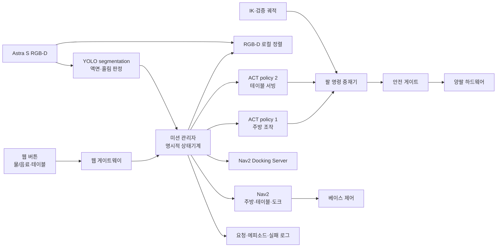

# 물 서빙 로봇 — 회의 결정, 구현 상세, 실패 데이터 규약

작성: 2026-09-07

상태: **현행 태스크·정책·구현 우선순위의 단일 원본**. 이전의 커넥터 체결,
범용 3태스크, 이동 중 병·컵 운반 시나리오는 결정 이력으로만 남긴다.

이 문서는 내용을 두 종류로 구분한다.

- **확정**: 회의에서 정했거나 현재 저장소에서 확인한 사실
- **권장 기준선**: 첫 구현에 사용할 구체적인 방법. 아직 구현 완료를 뜻하지 않음

## 1. 최종 태스크와 완료 조건

충전소에서 대기하던 이동형 양팔 로봇이 웹 요청을 받고 주방으로 자율주행한다.
주방에서 왼팔로 컵을, 오른팔로 물통을 들어 물을 따른 뒤 컵을 로봇 선반에 싣는다.
손님 테이블로 이동해 컵을 테이블에 내려놓고 충전소로 복귀해 충전한다.

현재 프로젝트는 이 **물 서빙 태스크 하나**만 구현·학습·평가한다.

완료는 “각 기능이 따로 한 번 동작함”이 아니라 다음 기록이 한 요청 ID로 연결될 때다.

1. 웹 요청이 접수된다.
2. 주방·테이블·충전소 이동 결과가 남는다.
3. 주방 policy와 테이블 policy의 체크포인트·입력·결과가 남는다.
4. 목표 물 양 판정과 실제 기준 계측값이 남는다.
5. 실패 시 실패 단계·원인·사람 개입 구간이 남는다.
6. 최종적으로 `CHARGING` 또는 명시적인 실패 상태로 끝난다.

## 2. 시스템 구성



### 2.1 구성 원칙

- Nav2는 이동만, ACT는 정지 상태의 조작만 담당한다.
- 미션 관리자는 LLM이 아니라 명시적인 상태기계로 만든다.
- 긴 작업은 ROS 2 Action 결과로 전이하며, 고정 시간 `sleep`으로 성공을 가정하지 않는다.
- YOLO는 액면·액체 영역을 찾고, 실제 mL 변환은 컵별 보정표가 담당한다.
- IK는 시작·복귀·안전 자세와 도달성 검증에 사용하고, 접촉이 많은 파지·붓기는 ACT가 담당한다.
- 실물과 Isaac Sim은 같은 Action·Topic·TF 계약을 쓰고 launch profile만 나눈다.

### 2.2 현재 있는 것과 새로 필요한 것

| 구분 | 현재 저장소 상태 | 다음 구현 |
|---|---|---|
| URDF·xacro | `hold_flow_description`에 양팔·Astra S·LDS-03 존재 | 최종 모델 URDF 수신 후 교체·검증 |
| 기구 수치 | YAML과 계산 스크립트 존재 | 선반·충전 도크 치수 추가 |
| IK 도구 | 구형 왼팔 물통·오른팔 컵 전제, solver 결함 확인 | 새 팔 역할로 수정하고 회귀검증 |
| Nav2 | 설계 문서만 있고 현행 패키지는 없음 | 충전소·주방·테이블 station registry부터 구현 |
| 웹 요청 | 없음 | 얇은 HTTP 게이트웨이와 미션 Action client 구현 |
| ACT | 리서치·데이터 규격 존재, 현행 태스크 데이터 없음 | policy 계약 확정 후 smoke dataset 수집 |
| YOLO 물 양 | 회의 결정만 있음 | 카메라 POC→라벨→보정표→실시간 판정 순으로 구현 |
| 충전 | 목표만 정해짐 | staging pose, 도크 검출, 접촉·충전 판정 구현 |

## 3. 전체 상태기계

```text
DOCKED / CHARGING
  → REQUEST_ACCEPTED
  → UNDOCKING
  → NAV_TO_KITCHEN
  → ALIGN_AT_KITCHEN
  → KITCHEN_POLICY_1
  → VERIFY_FILL_AND_SHELF
  → NAV_TO_TABLE
  → ALIGN_AT_TABLE
  → TABLE_POLICY_2
  → VERIFY_SERVE
  → NAV_TO_DOCK_STAGING
  → DOCKING
  → CHARGING
```

| 상태 | 입력 | 성공 조건 | 실패 처리 |
|---|---|---|---|
| `REQUEST_ACCEPTED` | 웹 요청 JSON | 유효한 request ID·음료·table ID 생성 | 중복·잘못된 요청 거절 |
| `UNDOCKING` | 도크 ID | 베이스가 도크에서 안전 거리만큼 이탈 | 정지 후 재시도 또는 작업 중단 |
| `NAV_TO_KITCHEN` | 주방 station pose | Nav2 성공 + 도착 오차 게이트 통과 | costmap 정리·재계획, 횟수 초과 시 중단 |
| `ALIGN_AT_KITCHEN` | RGB-D·작업 셀 기준물 | `base_link→kitchen_workcell` 품질 통과 | 재관측 또는 베이스 미세 재정렬 |
| `KITCHEN_POLICY_1` | 영상·양팔 상태 | 물통 원위치, 컵 선반 위, 양팔 정지 | 즉시 정지 후 실패 단계 기록 |
| `VERIFY_FILL_AND_SHELF` | YOLO·선반 관측 | 목표 물 양 구간 + 컵 선반 안착 | 부족·과다·흘림을 기록하고 안전 종료·수동 처리 |
| `NAV_TO_TABLE` | table station pose | Nav2 성공 + 도착 오차 게이트 통과 | 재계획 후 중단 여부 판정 |
| `ALIGN_AT_TABLE` | RGB-D·테이블 기준물 | 선반과 테이블의 상대 자세 품질 통과 | 재관측·재정렬 |
| `TABLE_POLICY_2` | 영상·사용 팔 상태 | 컵이 테이블 위, 그리퍼가 컵에서 이탈 | 정지 후 컵 상태 확인 |
| `VERIFY_SERVE` | 테이블 관측 | 컵이 목표 영역 안에서 안정 | 재배치 허용 여부에 따라 재시도 또는 중단 |
| `DOCKING` | 도크 ID·센서 | 접촉뿐 아니라 충전 시작 신호 확인 | 도크 재검출·재시도, 초과 시 안전 대기 |

베이스가 이동할 때 팔은 운반·정지 자세를 유지하고, 팔이 조작할 때 베이스는 정지한다.

## 4. 단계별 구현 상세

### 4.1 충전소 대기와 웹 요청

**확정**

- 로봇은 충전소에서 시작한다.
- 실제 키오스크 대신 웹 버튼으로 물 또는 음료 요청을 만든다.

**권장 기준선**

- 정적 HTML/JavaScript 화면과 Python FastAPI 게이트웨이를 분리한다.
- 화면에는 `음료 종류`, `테이블 번호`, `요청` 버튼과 현재 미션 상태만 둔다.
- 게이트웨이는 요청을 검증한 뒤 ROS 2 `ServeDrink` Action client로 전달한다.
- 한 번 누른 요청에는 UUID를 붙이고 같은 UUID가 재전송되면 새 미션을 만들지 않는다.
- 첫 버전은 실험실 LAN 안에서만 열고 외부 로그인·결제·실제 키오스크 연동은 하지 않는다.

요청 예시는 다음과 같다.

```json
{
  "request_id": "uuid",
  "drink_type": "water",
  "table_id": "table_01",
  "requested_at": "2026-09-07T14:00:00+09:00"
}
```

게이트웨이는 `water`처럼 교정이 끝난 음료와 station registry에 존재하는 테이블만 받는다.
요청 성공은 HTTP 200이 아니라 미션 Action이 `REQUEST_ACCEPTED`를 반환했을 때다.

### 4.2 충전소 이탈과 주방 자율주행

**권장 기준선**

1. `slam_toolbox`는 지도 작성 세션에서만 사용한다.
2. 반복 실험은 저장 지도를 `map_server`로 열고 AMCL로 위치를 추정한다.
3. 충전소·주방·테이블은 코드에 숫자를 흩뿌리지 않고 `stations.yaml` 한 곳에 둔다.
4. 이동 명령은 Nav2 `NavigateToPose` Action으로 보낸다.
5. Nav2 성공 뒤에도 최종 위치·방향 오차를 별도 계산해 조작 가능 범위인지 확인한다.

**장애물 회피 권장 기준선**

- 차동구동 베이스의 첫 controller는 Nav2 기본 계열인 DWB로 시작한다. DWB는 여러 속도
  궤적을 만들어 장애물·경로·목표 critic으로 채점하므로 실내 동적 장애물 기준선을 만들기
  쉽다.
- `max_vel_x`, `max_vel_theta`, 가감속 한계는 예제값을 복사하지 않고 완성 차체 실측으로
  정한다.
- costmap footprint는 250 mm 판 크기가 아니라 운반 자세의 팔·선반·돌출물을 포함한 실제
  평면 외곽으로 만든다.
- LDS-03 `/scan`을 obstacle layer에 연결하고, planner 아래에는 Collision Monitor의
  감속 영역과 정지 영역을 둔다. 이는 CPU 기반 추가 보호층이지 안전 인증 장치가 아니다.
- DWB가 좁은 통로에서 진동하거나 목표 yaw에 반복 실패하면 critic·goal checker부터
  조정한다. RPP·MPPI 비교는 같은 경로·장애물 조건의 기준선 데이터가 생긴 뒤 한다.
- `NavigateToPose` feedback의 남은 거리·이동시간·복구 횟수와 최종 pose 오차를 station별로
  기록한다.

권장 station registry 형태:

```yaml
frame_id: map
stations:
  kitchen:
    staging_pose: {x: null, y: null, yaw: null}
    max_xy_error_m: null
    max_yaw_error_rad: null
  table_01:
    staging_pose: {x: null, y: null, yaw: null}
    max_xy_error_m: null
    max_yaw_error_rad: null
  home_dock:
    dock_id: home_dock
    staging_pose: {x: null, y: null, yaw: null}
```

`null`은 아직 실측값이 없다는 뜻이다. 실제 값을 정하기 전까지 예시 숫자를 넣지 않는다.

장애물 회피는 Nav2의 global/local costmap과 controller가 담당한다. 실패 시 무한 재시도하지
않고 `NO_PATH`, `CONTROLLER_TIMEOUT`, `GOAL_TOLERANCE`처럼 원인을 분리해 기록한다.

### 4.3 주방 정밀 정렬

Nav2의 도착 오차를 ACT가 떠안게 하면 학습 데이터가 불필요하게 넓어진다. 먼저 베이스를
staging pose까지 보내고, 마지막 수 cm·수 도는 RGB-D 기준으로 정렬한다.

**권장 기준선**

- 초기 POC는 주방에 AprilTag 같은 고정 기준물을 두어 `camera→kitchen_workcell`을 얻는다.
- Astra S depth와 TF로 `base_link→kitchen_workcell`을 계산한다.
- 태그 검출 신뢰도, depth 유효 픽셀 비율, TF timestamp 차이가 게이트를 통과해야 한다.
- 물체의 최종 위치는 YOLO 또는 색·형상 기반 검출과 depth를 합쳐 구한다.
- 첫 구현은 반복 위치를 검증할 수 있는 기준물 기반 정렬로 고정한다.

정렬 결과는 단순 `success=true`가 아니라 자세, 공분산 또는 품질 점수, timestamp를 함께
남긴다. 오래된 자세를 최신 관측처럼 재사용하지 않는다.

### 4.4 주방 양팔 ACT policy 1

**회의에서 확정된 동작**

1. 왼팔이 컵을 잡아 들어 올린다.
2. 오른팔이 물통을 잡아 들어 올린다.
3. 오른팔이 물통을 컵 위 붓기 위치로 이동한다.
4. 오른팔이 컵에 물을 따른다.
5. 오른팔이 물통을 원래 위치에 내려놓고 정지한다.
6. 왼팔이 물이 담긴 컵을 로봇 선반 위에 내려놓는다.

이 전체 조작 묶음이 **ACT policy 1**이다.

**시작 게이트**

- 베이스 정지와 base controller 명령 lease 해제
- 컵·물통·선반 위치 관측 성공
- 양팔이 policy 1 시작 자세 허용 범위 안
- 컵·물통 질량이 현재 페이로드 게이트 안
- 안전 게이트·카메라·정책 서버 heartbeat 정상

**권장 관측**

- Astra S 고정 RGB 영상
- 왼쪽·오른쪽 팔의 5개 관절 위치와 그리퍼 상태
- 컵·물통·선반의 검출 결과 또는 상대 자세
- policy 실행 단계와 물 양 판정값은 로깅하되, 첫 기준선에서 ACT 입력에 넣을지는
  ablation으로 결정한다.

**권장 행동 공간**

- LeRobot의 `left_*`·`right_*` 키 규약을 그대로 사용한다.
- 첫 기준선은 각 팔 관절과 그리퍼의 **절대 목표 위치**로 고정한다.
- 매 제어 틱에서 safety guard가 현재값 대비 최대 변화량, 관절 한계, timeout을 검사한다.
- 다른 좌표계 표현을 비교하려면 별도 dataset ID로 만들며 한 데이터셋 안에서 섞지 않는다.

**ACT가 맡는 것과 외부 감독기가 맡는 것**

| ACT | 외부 감독기 |
|---|---|
| 접근·파지·들기·붓기 자세·반환·선반 놓기 | 베이스 정지, 관절 한계, 충돌 거리, timeout |
| 영상과 관절 상태에 따른 연속 동작 | 물 양·흘림 감시, 안전 중단, 실패 코드 기록 |

ACT는 action chunk를 만들지만 실행기는 매 틱 안전 정지 조건을 검사한다. `OVER`, `SPILL`,
충돌 위험처럼 계속 실행하면 안 되는 조건에서는 남은 chunk를 끝까지 보내지 않고
hold/stop으로 전환한다.

policy 1을 중간에 끊으면 오른팔이 물통을 든 상태에서 멈춰 물통 반환과 컵 선반 적재가
사라질 수 있다. 첫 기준선은 다음 두 단계로 제한한다.

1. **건식 P0**: 물 없이 policy 1 전체 순서와 종료 자세를 학습·검증한다.
2. **고정량 P1**: 한 컵·한 목표량으로 전체 시연을 수집하고 YOLO는 실시간 감시와 사후
   결과 판정에 사용한다. 위험 조건만 즉시 중단한다.

실시간 YOLO는 `OVER`, `SPILL`, `UNKNOWN` 같은 위험·판정 불가 상태에서 정지시키고 결과를
기록한다. 목표량 판정에 따라 붓기 action을 실시간 전환하는 기능은 현행 구현 범위에 넣지
않는다.

**종료 조건**

- 물통이 지정 원위치 영역 안에 놓임
- 컵이 로봇 선반의 목표 영역 안에 놓임
- 양쪽 그리퍼가 물체와 분리됨
- 양팔이 정지 상태
- 물 양 판정이 `TARGET`이거나 허용된 후속 처리 상태로 분류됨

### 4.5 YOLO로 물 양을 판정하는 방법

회의 결정은 YOLO 계열 비전을 사용한다는 것이다. **권장 기준선은 object detection이
아니라 instance segmentation**이다. 바운딩 박스보다 컵 내부 액체의 실제 윤곽이 필요하기
때문이다.

첫 POC 조건은 다음처럼 의도적으로 좁힌다.

- 투명하고 옆면이 곧은 컵 한 종류
- 물 한 종류
- 고정된 카메라와 배경
- 컵 전체와 액면이 가려지지 않는 시야
- 학습 라벨: `cup_inner`, `liquid_region`, `spill_region`

처리 순서:

```text
YOLO segmentation으로 컵 내부와 액체 mask 추출
  → 컵 기울기·원근을 보정한 세로축 계산
  → 액면 높이 비율 r 계산
  → cup_id별 보정표 V=f(r) 적용
  → 여러 프레임 중앙값과 신뢰도 계산
  → UNDER / TARGET / OVER / SPILL / UNKNOWN 판정
```

고정량 기준선에서는 이 결과를 독립 평가와 위험 중단에 사용한다. `UNKNOWN`을 목표 도달로
간주하지 않으며, 판정 결과로 policy의 붓기 행동을 실시간 변경하지 않는다.

컵 보정은 실제 계량으로 만든다.

1. 빈 컵의 질량을 잰다.
2. 일정 단계로 물을 추가하며 증가 질량과 영상을 함께 기록한다.
3. 증가 질량을 물 부피의 기준값으로 사용해 `r→mL` 보정 곡선을 만든다.
4. 교정에 쓰지 않은 중간 물 양으로 오차를 검증한다.
5. 컵 형상이 바뀌면 같은 보정표를 재사용하지 않는다.

실시간 판정은 한 프레임만 믿지 않는다. 연속 프레임의 중앙값, mask confidence, 액면의
시간적 연속성을 사용한다. 다음이면 `UNKNOWN`으로 보내고 추가 붓기를 금지한다.

- 컵이나 액체 mask가 사라짐
- 팔·물통이 액면을 오래 가림
- 액면 높이가 물리적으로 불가능하게 급변함
- 영상 신뢰도가 임계값 아래임

YOLO는 측정 센서의 대체물이 아니라 **영상 기반 추정기**다. 학습·평가 때는 별도 저울
또는 눈금 계량을 ground truth로 남겨 추정 오차를 계산한다. 음료 종류가 바뀌면 색·거품·
투명도와 밀도 차이를 별도 데이터로 검증한다.

### 4.6 컵을 로봇 선반에 싣는 방법

선반은 단순 평판보다 컵 위치를 반복 가능하게 만드는 기구여야 한다.

**권장 기준선**

- 낮은 턱 또는 컵 받침 홈으로 주행 중 미끄러짐을 제한한다.
- 물이 묻어도 마찰이 급격히 줄지 않는 교체형 미끄럼 방지 패드를 사용한다.
- 선반 중심을 양팔 도달 범위 안에 두고, 팔·라이다·카메라 시야를 가리지 않게 한다.
- 컵 목표 영역을 URDF frame 또는 기구 캘리브레이션 YAML로 정의한다.
- 선반 카메라 관측으로 컵 중심이 목표 영역 안인지 확인한다.

선반 위치·치수는 아직 미정이다. CAD·URDF·IK·policy 데이터를 동시에 바꾸는 값이므로
실측 없이 문서에 숫자를 만들지 않는다.

### 4.7 손님 테이블 이동과 정렬

- 컵은 팔로 들지 않고 선반에 놓은 상태로 운반한다.
- `table_id`를 station registry의 Nav2 pose로 변환한다.
- 이동 중 선반의 컵 존재 여부를 저주기 영상으로 감시한다.
- 컵 이탈이나 큰 기울기 감지 시 베이스를 정지하고 `CUP_TILT_UNSAFE`로 종료한다.
- 테이블 도착 후 주방과 같은 방식으로 로컬 정렬 품질을 확인한다.

테이블 높이와 가장자리 위치는 조작 경로를 결정한다. 테이블이 여러 종류면 처음부터 모두
학습하지 않고 기준 테이블 하나로 성공률을 만든 뒤 높이·재질을 하나씩 늘린다.

### 4.8 테이블 ACT policy 2

**확정된 범위**는 컵을 로봇 선반에서 들어 손님 테이블에 놓는 것이다.

회의 본문에는 왼팔, 괄호에는 오른팔이라고 적혀 있어 담당 팔은 미확정이다. 기구학적으로
둘 다 가능하다면 **왼팔 유지가 권장 기준선**이다. policy 1에서 컵을 들고 선반에 놓은 팔과
같아 팔 간 인계가 없고, 행동 공간과 충돌 경우의 수가 줄기 때문이다. 이는 회의 확정이
아니며 본수집 전에 팀이 결정해야 한다.

**권장 관측**

- 선반과 테이블이 함께 보이는 고정 RGB 영상
- 사용할 팔의 관절·그리퍼 상태
- 반대 팔의 관절 상태도 같은 키로 기록하되 운반·정지 자세를 유지

**시작 조건**

- 베이스 정지
- 컵이 선반 목표 영역에 존재
- 테이블 목표 영역이 관측됨
- 사용 팔이 시작 자세 허용 범위 안

**성공 조건**

- 컵 바닥이 테이블 목표 영역 안에 있음
- 컵 기울기가 허용 범위 안
- 그리퍼가 컵에서 이탈
- 사용 팔이 안전 복귀 자세에 도달

### 4.9 충전소 복귀와 실제 충전

충전소 복귀는 `NavigateToPose(home_dock.staging_pose)`만으로 끝나지 않는다.

**권장 기준선**

1. Nav2로 도크 staging pose까지 이동한다.
2. `opennav_docking`의 `DockRobot` Action에 `dock_id=home_dock`을 보낸다.
3. 도크 플러그인이 카메라·접촉·거리 센서 중 실제 하드웨어에 맞는 방식으로 상대 자세를
   보정한다.
4. 접촉 감지와 충전 전류·전압 또는 충전기 상태 신호를 분리해 확인한다.
5. 둘 다 통과해야 `CHARGING`으로 전이한다.

Nav2 Docking Server는 staging pose 이동과 마지막 도킹을 분리하고, 플랫폼별 검출·접촉·
충전 판정을 plugin으로 구현할 수 있다. 현재 프로젝트는 접점·충전기·센서가 미정이므로
`ChargingDock` 구현은 하드웨어 결정 뒤에 한다.

## 5. ROS 2 인터페이스 권장안

긴 작업은 Action, 즉시 조회·설정은 Service, 지속 상태는 Topic으로 나눈다.

| 이름 | 형식 | 핵심 필드 | 담당 |
|---|---|---|---|
| `ServeDrink` | Action | request ID, drink type, table ID / stage feedback / final result | 미션 전체 |
| Nav2 `NavigateToPose` | 기존 Action | station pose | 이동 |
| Nav2 `DockRobot` | 기존 Action | dock ID, staging option | 충전 도킹 |
| `AlignToStation` | Action | station ID / pose·quality / error code | 로컬 정렬 |
| `ExecuteManipulationPolicy` | Action | policy ID, checkpoint, timeout / current phase / result | ACT 실행 |
| `EstimateFillLevel` | Action 또는 Service | cup ID, target / mL·class·confidence | 물 양 인지 |
| `SafetyState` | Topic | stop reason, active lease, timestamp | 전 계층 |
| `MissionEvent` | Topic | request ID, stage, event, error code | 로깅 |

`ExecuteManipulationPolicy` 결과에는 최소한 다음이 필요하다.

```text
success
policy_id
checkpoint_id
started_at / ended_at
failure_stage
failure_code
human_intervention_count
```

Action 취소는 실제 실행기까지 전달돼야 한다. 미션 관리자에서 취소됐는데 하드웨어 bridge가
이전 chunk를 계속 보내는 상태를 허용하지 않는다.

## 6. ACT 데이터 수집·학습·배포·실패 개선

### 6.1 정책 데이터셋을 나누는 기준

| dataset ID 예시 | 포함 | 제외 |
|---|---|---|
| `water_kitchen_policy1_v1` | 주방 시작 상태부터 물통 반환·컵 선반 적재 | Nav2 이동, 테이블 서빙 |
| `water_table_policy2_v1` | 선반 컵 파지부터 테이블 놓기·팔 복귀 | 주방 붓기, Nav2 이동 |
| `water_kitchen_policy1_hil_v1` | 배포 중 사람 개입과 복구 구간 | 원본 성공 시연과 무표시 혼합 |

`policy 3`은 경계가 정의되기 전에는 dataset ID를 만들지 않는다.

### 6.2 관측·행동 키

- 관절 상태·행동은 LeRobot의 `left_*`·`right_*` 접두어를 유지한다.
- 한 팔만 쓰는 policy 2도 반대 팔 키를 제거하지 않는다.
- 카메라 키, 해상도, fps, crop은 데이터셋 버전 동안 고정한다.
- RGB, 관절 상태, action의 timestamp와 실제 제어 주기 지터를 기록한다.
- policy ID, checkpoint ID, 캘리브레이션 해시, 컵·물통·선반 버전을 sidecar에 남긴다.

### 6.3 학습 순서

1. 시작 장면을 수동으로 맞춘 소수 smoke episode로 전체 로더·카메라·action key를 검증한다.
2. 같은 에피소드에 과적합해 policy가 재생 가능한지 확인한다.
3. 시작 위치·조명·물체 자세를 계획된 범위 안에서 나눠 수집한다.
4. ACT 기본 설정으로 기준선을 만들고 dataset·code·config·seed를 기록한다.
5. holdout 조건에서 rollout하고 단계별 성공률과 실패 분포를 기록한다.
6. 실패가 많은 조건만 데이터를 보강한다.

에피소드 수나 학습 step을 먼저 목표로 삼지 않는다. 같은 조건을 반복해도 실패 원인을
설명할 수 있는 데이터가 더 중요하다.

### 6.4 실패 케이스 수집

실패는 삭제 대상이 아니라 원인 분리와 다음 조치를 정하는 근거다. 에피소드 sidecar에는 빠른
집계를 위한 관측 단계·코드와 `failure_record_id`를 남기고, 상세 원인은 별도 실패 레코드에
기록한다. 최소 관측 분류는 다음과 같다.

| 단계 | 실패 코드 예시 |
|---|---|
| 장면 | `OBJECT_NOT_FOUND`, `SCENE_OUT_OF_RANGE`, `LOW_VISION_CONFIDENCE` |
| 컵 파지 | `CUP_GRASP_MISS`, `CUP_SLIP` |
| 물통 파지 | `JUG_GRASP_MISS`, `JUG_SLIP` |
| 붓기 | `UNDER_FILL`, `OVER_FILL`, `SPILL`, `FILL_UNKNOWN` |
| 반환 | `JUG_RETURN_FAILED`, `SHELF_PLACE_FAILED` |
| 테이블 | `TABLE_PLACE_FAILED`, `CUP_TILT_UNSAFE` |
| 실행 | `SERVO_STALL`, `COLLISION_RISK`, `TIMEOUT`, `OPERATOR_ABORT` |

실패마다 직전 영상, 관절·action window, policy phase, YOLO 결과, 안전 게이트 상태를 묶는다.
“실패했다”는 메모만 남기지 않는다.

`CUP_GRASP_MISS`, `UNDER_FILL`, `TIMEOUT`은 관측된 증상 또는 결과이지 확인된 원인이 아니다.
원인은 실패 레코드의 가설·근거·재시험을 통해 별도로 확정한다.

### 6.5 사람 개입·복구 데이터

기준 policy가 생긴 뒤 사람 개입 수집을 검토할 수 있다. 공식 LeRobot 0.6.1 소스는 정책
실행 중 개입과 복구 데이터를 남기는 HIL 절차를 제공한다. 실패 직전 문맥과 성공 복구 구간은
함께 보존하되, 성공 시연과 다른 dataset ID·`control_source`·구간 경계를 사용한다.

공식 main 문서의 HIL 흐름과 이 저장소의 `bi_so` 양팔 ROS mux 어댑터 사이 연결은 아직
smoke test하지 않았다. 따라서 현재 단계에서 LeRobot CLI에 바로 연결된다고 간주하지 않는다.

실물 적용은 정책이 움직이기 전에 실제 정지·토크 전환·리더암 동기화 절차가 검증돼야 한다.
Codex처럼 결정적 동작 차단 장치가 없는 환경에서는 명령 생성과 dry-run까지만 다룬다.

## 7. 평가 지표

팀이 목표 수치를 정하기 전에는 임의의 합격 숫자를 만들지 않는다. 대신 모든 rollout에서
아래 원시값을 남겨 기준선 분포를 만든다.

| 계층 | 필수 지표 |
|---|---|
| 웹·미션 | 요청 중복률, 요청→시작 지연, 상태별 체류시간, 최종 상태 |
| Nav2 | station별 성공/실패, 최종 XY·yaw 오차, 재계획 횟수, 이동시간 |
| policy 1 | 컵 파지, 물통 파지, 붓기, 물통 반환, 선반 적재의 단계별 성공 |
| 물 양 | 목표 대비 mL 오차, `UNDER/OVER/SPILL/UNKNOWN`, YOLO confidence |
| policy 2 | 선반 파지, 테이블 놓기, 컵 기울기, 팔 복귀 성공 |
| 충전 | staging 도착, 도킹 성공, 재시도 횟수, 충전 시작 확인 |
| 전체 | end-to-end 성공, 사람 개입 횟수, 총 소요시간, 안전 정지 횟수 |

성공률만 보지 않고 실패 코드 분포와 조건별 성능을 같이 본다. 반복 횟수가 작을 때는
단일 백분율을 과신하지 않고 성공 횟수/전체 횟수를 함께 표기한다.

## 8. Isaac Sim 사용 범위

사용자 담당은 최종 모델 URDF가 나온 뒤 Isaac Sim 시뮬레이션을 진행하는 것이다.

### 8.1 순서

1. 최종 URDF를 USD로 가져온다.
2. joint 이름·축·한계·zero pose·그리퍼 방향을 실물과 대조한다.
3. `/joint_states`, TF, 카메라, lidar, base command의 ROS 2 연결을 smoke test한다.
4. 충전소·주방·테이블을 단순 장면으로 만든다.
5. Nav2로 세 station 이동을 검증한다.
6. policy 시작·종료 자세와 충돌·도달성을 검증한다.

### 8.2 시뮬레이션으로 확인할 것

- TF·joint sign·controller contract
- 주방·선반·테이블 도달성과 팔 간·환경 충돌
- Nav2 station 접근과 장애물 회피
- 카메라 시야, 가림, YOLO 합성 라벨 생성 가능성

### 8.3 시뮬레이션으로 대신하지 않을 것

- 실제 투명 컵의 액면 가시성
- 실제 그리퍼 마찰과 컵 미끄러짐
- 물의 유동·튐·거품을 포함한 최종 물 양 정확도
- 실제 충전 접점과 전기적 충전 시작

첫 시뮬레이션은 물 유체를 정밀하게 재현하지 않는다. 붓기 각도·시간과 가상 부피 상태를
단순 모델로 연결해 제어 흐름을 검증하고, 최종 물 양은 실물 계량으로 검증한다.

## 9. 안전과 정지 조건

- 실물 팔·베이스는 결정적 차단 장치가 있는 환경에서만 움직인다.
- Codex 환경에서는 로봇 제어 스크립트를 dry-run으로만 다룬다.
- 베이스와 팔의 command lease를 동시에 주지 않는다.
- 스톨, 관절 한계, 통신 timeout, 충돌 거리 위반, 컵 이탈, 흘림 위험이면 정지한다.
- 로그만 남기고 계속 움직이는 것은 실패 처리로 인정하지 않는다.
- 정책 Action 취소 뒤 실제 관절 명령이 멈췄는지 상태 피드백으로 확인한다.

## 10. 역할과 병행 작업

| 담당 | 지금 할 일 | 의존 조건 |
|---|---|---|
| 사용자 `@mmporong` | SLAM·Nav2·장애물 회피, station registry, 반복 접근 평가 | 실험 공간 지도·station 실측 |
| 사용자 `@mmporong` | IL·IK 세부 작업과 policy 시작·복귀 자세 연결 | policy 경계·선반 좌표 |
| 사용자 `@mmporong` | 최종 모델 URDF 이후 Isaac Sim | 모델 URDF 전달·검증 완료 |
| 팀 policy lane | policy 학습·배포·실패 수집·수정·재학습 | policy 번호·사용 팔 확정 |
| 인지 lane | YOLO 카메라 POC·라벨·컵 보정 | 컵·카메라·목표 물 양 확정 |

policy lane은 Nav2 완성을 기다리지 않는다. 주방·테이블 시작 장면을 수동으로 재현해
smoke dataset을 만들 수 있다. 반대로 Nav2 lane은 policy 모델 없이 mock Action 결과로
전체 미션 전이를 검증한다. 통합은 두 lane의 Action 계약이 모두 통과한 뒤 한다.

## 11. 실패 데이터 저장과 활용

### 11.1 관측과 원인을 분리한다

실패 레코드는 아래 순서를 유지한다.

```text
관측된 증상
  → 실행 조건과 근거 보존
  → 원인 가설 작성·기각
  → 확인된 원인
  → 즉시 조치와 수정
  → 같은 조건 재시험
  → 다른 조건 회귀 확인
  → 학습·평가 데이터 사용 결정
```

`failure_code`에는 실행에서 직접 본 현상만 적는다. `ACT 데이터 부족`, `Nav2 오차`, `컵 보정표
오류` 같은 원인은 근거가 확인되기 전까지 가설로 남긴다. 원인을 확인하지 못한 실패는
`unresolved`로 보존하며 추정으로 채우지 않는다.

### 11.2 에피소드와 실패 레코드를 연결한다

| 기록 | 목적 | 저장 내용 |
|---|---|---|
| 에피소드 sidecar | 조건별 빠른 집계 | 성공 여부, 단계별 결과, `failure_stage`, 관측 `failure_code`, 이상 현상, `failure_record_id` |
| 실패 분석 레코드 | 원인과 조치 추적 | 관측, context, evidence, 가설, 확인 원인, 수정, 동일 조건·회귀 재시험, 데이터 사용 결정 |

실패한 policy 에피소드는 failure bank에 원본을 보존하고, BC 학습 포함 여부와 제외 사유를
sidecar에 남긴다. `holdout` split에 포함해 평가에 쓰는 것과 BC 학습에 포함하는 것은 별개다.
실패 분석 레코드는 `failure_record_id`로 연결한다. 미션·Nav2·Isaac Sim처럼 LeRobot 에피소드
밖에서 생긴 실패도 공통 `run_id`를 사용해 같은 실패 레코드 형식으로 저장한다.

### 11.3 반드시 보존할 경계 데이터

| 경계 또는 단계 | 필수 데이터 | 구분할 실패 |
|---|---|---|
| Nav2 → 조작 시작 | 목표·실제 pose, XY·yaw 오차, covariance, 베이스 속도, TF age, 로컬 정렬량, IK 도달성 | 정책 실패와 도착·정렬 실패 |
| policy phase | checkpoint·dataset·config, 영상, 관측/action/관절 window, 그리퍼, inference 시간, 제어 지터, 안전 상태 | 데이터·정책·실행기·하드웨어 실패 |
| 물 양 판정 | target·YOLO 추정·저울 실측 mL, mask, confidence, 가림, calibration ID, 붓기 각도·시간 | 인식·보정표·붓기 제어 실패 |
| Isaac Sim ↔ 실물 | URDF commit, 관절 축·방향·한계, 동일 관절값의 말단 pose, 충돌·접촉, 지연 | 모델 오류와 sim-real 차이 |
| 미션 전이 | request/run ID, 상태 진입·종료, Action 결과·취소, timeout, 센서 최신성 | 상태기계·인터페이스 실패 |

원인 판단에 쓰지 않을 전체 로그를 무기한 보존하지 않는다. 실패 시점 전후 구간과 원인
후보를 배제하는 데 필요한 근거를 먼저 추출하고, 원본의 안정 경로와 SHA-256을 레코드에
남긴다.

### 11.4 실패 데이터를 바로 재학습에 넣지 않는다

| 확인 결과 | 처리 |
|---|---|
| Nav2·TF·캘리브레이션·기구·서보 원인 | 시스템 수정 후 같은 checkpoint로 재시험 |
| 정책 관측 분포 밖이며 다른 계층 이상이 배제됨 | 새 성공 시연 또는 사람 개입 복구 데이터를 별도 dataset ID로 수집 |
| 라벨·컵 보정값 오류 | 수정 후 dataset·calibration version 갱신 |
| 원인 미확정 | 학습 제외, failure bank에서 추가 조사 |
| 자율 rollout 실패 원본 | BC 학습 제외, 실패 분포·회귀 평가에 사용 |
| 사람이 개입해 복구한 구간 | 원본 성공 시연과 분리한 HIL dataset에서만 사용 |

수정 효과는 실패 전후의 서로 다른 조건을 비교하지 않고, 같은 protocol과 같은 평가 조건으로
재시험한다. 다른 조건에서는 회귀가 생기지 않았는지 별도로 확인한다.

상세 저장 구조와 작성 순서는 [실패 데이터 저장·진단·활용 규약](../data/failures/README.md),
기계 검증 형식은 [`failure_record.schema.json`](../data/schema/failure_record.schema.json), 가상
작성 예시는 [`example_failure_record.json`](../data/schema/example_failure_record.json)을 따른다.
실패 레코드 생성·요약·증거 검사는 [`failure_bank.py`](../tools/failure_bank.py)의 `capture`,
`summary`, `verify-evidence` 명령으로 수행한다.

## 12. 본수집 전 반드시 닫을 결정

1. `3번 policy`가 실제 policy ID인지, 회의 안건 번호인지
2. policy 2의 사용 팔이 왼팔인지 오른팔인지
3. 컵 재질·형상과 `cup_id`
4. 목표 물 양과 허용 오차
5. YOLO 라벨과 카메라 시야
6. 주방의 컵·물통 원위치와 선반 좌표·치수
7. 테이블 번호와 Nav2 station pose 매핑
8. 충전 도크 하드웨어와 충전 시작 신호
9. 평가 반복 횟수와 계층별 합격 기준

## 13. 현행 범위에서 걷어낸 것

- 양팔 커넥터 체결 태스크
- 와이어 하네스·부품 조립 등 과거 태스크 후보
- `move / handover / pour` 범용 3태스크와 음성 명령 문장 세트
- 음성 입력·STT·언어조건 VLA·로컬 LLM 태스크 플래닝
- 병과 빈 컵을 팔로 들고 이동한 뒤 별도 붓기 지점에서 따르는 구형 시나리오
- Nav2와 팔 조작을 하나의 학습 정책으로 합치는 구성

과거 문서와 리서치는 결정 과정의 이력으로 보존하지만 구현 범위를 정하는 근거로
사용하지 않는다.

## 14. 기술 근거

- [Nav2 Docking Server](https://docs.nav2.org/jazzy/configuration_and_development/configuration_guide/core_servers/configuring_docking_server/): staging 이동과 플랫폼별 도킹·접촉·충전 판정을 분리하는 공식 구조
- [Nav2 DockRobot Action](https://docs.nav2.org/jazzy/configuration_and_development/configuration_guide/core_servers/bt_plugins/actions/DockRobot/): dock ID·staging navigation·재시도 결과 계약
- [Nav2 DWB Controller](https://docs.nav2.org/jazzy/configuration_and_development/configuration_guide/controller_plugins/dwb_controller/): 차동구동의 속도 궤적 샘플링·critic 구조
- [Nav2 Collision Monitor](https://docs.nav2.org/jazzy/configuration_and_development/configuration_guide/core_servers/collision_monitor/): costmap·planner 아래의 감속·정지 보호층
- [LeRobot ACT](https://huggingface.co/docs/lerobot/act): 다중 RGB·관절 상태 입력과 action chunk 출력 구조
- [LeRobotDataset v3.0](https://huggingface.co/docs/lerobot/lerobot-dataset-v3): 다중 영상·sensorimotor 시계열과 메타데이터 구조
- [LeRobot 0.6.1 Human-In-the-Loop 소스](https://github.com/huggingface/lerobot/blob/7e241bd630a3719a56157a497ce5d08f244784f1/docs/source/hil_data_collection.mdx): 해당 버전의 사람 개입·복구 데이터 수집 근거
- [LeRobot main Human-In-the-Loop](https://huggingface.co/docs/lerobot/main/hil_data_collection): 최신 문서 흐름 참고. 저장소 양팔 ROS mux 연결은 별도 smoke 필요
- [Ultralytics instance segmentation](https://docs.ultralytics.com/tasks/segment/): 객체별 mask·contour·confidence 출력
- [Isaac Sim 6.0 시스템 요구사항](https://docs.isaacsim.omniverse.nvidia.com/6.0.0/installation/requirements.html): 최소 VRAM 16GB
- [Isaac Sim ROS 2 joint control](https://docs.isaacsim.omniverse.nvidia.com/6.0.0/ros2_tutorials/tutorial_ros2_manipulation.html): joint state·command와 articulation 연결
