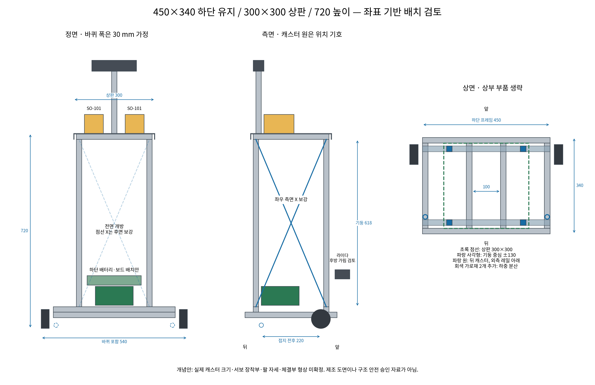

# 책상 높이 양팔 프레임: 경량화와 구조 검토

2026-09-09 / 1차 개념 설계. 실물 제작 승인·FEA·진동 시험 완료 자료가 아니다.

## 1. 결정 범위와 추천

현행 하단 450×340 mm를 유지하고, **2020 기둥 4개 + 좌우·후면 3면 X자 보강 +
절곡 알루미늄 상판**을 우선 제작 검토안으로 선정한다. 약 660 mm를 올리는 구조에서
기둥 두 개만 길게 세우는 방식은 접합부 회전과 비틀림에 불리하다. 2040 네 개는 강성이
높지만 질량이 늘어 기본안으로 바로 채택하지 않는다. 먼저 가새로 하중 경로를 만든다.

- 사용자 확정: [하단 실물 기록](20260909_하단프레임_실물치수_모델링기록.md).
- 검토값: 상판 300×300 mm, 윗면 높이 720 mm. 실제 테이블 높이는 아직 미확인이다.
- 사용자 추가 조건: 무게 최적화, 양팔 모멘트 저항, 주행 중 흔들림 억제, 현 서보 또는
  소폭 업그레이드로 바퀴 주행 가능해야 한다.
- 부품 배치 **제안**: 양팔과 뎁스는 상부, 배터리·Pi·제어보드는 하단, 라이다는 전면
  낮은 위치. 사용자가 나열한 부품 전체를 상판 위에 놓으라는 의미인지 미확정이므로
  배터리·보드 상부 배치 경우도 계산했다. 하단 배치는 확정 요구로 덮어쓰지 않는다.
- 질량은 계량값이 아니라 예산이다. 250 mm 카메라 높이를 사용한 선별 기준은 물·용기 제외 **8.705 kg**, 최초 단순
  질량 비교안 **9.683 kg**에서 약 **0.978 kg(10.1%)** 감소했다.
  이후 선정한 상판 +540 mm 카메라 마스트의 추가 질량은 아직 반영하지 않았으므로
  8.705 kg을 현재 완성품 질량으로 인용하지 않는다.
- **접지 조건 미통과:** 뒤 캐스터 하나가 뜨는 경우의 정적 여유는 약 3~4 mm다.
  캐스터 높이 조정·제한된 접지 순응성 또는 균등화 구조 검토를 제작 전 필수 조건으로 둔다.
  이번 추천은 상부 구조 후보 선정이며 완성차 안정성 승인이 아니다.
- 기존 YAML·URDF는 변경하지 않았다. 새 치수는 이 개념안 파일에만 적용했다.

## 2. 그림과 정확도

### 좌표 기반 배치도



[확대용 SVG](assets/raised_frame_20260909/coordinate_layout.svg).
프로파일과 접지점 좌표로 생성했다. 바퀴 폭 30 mm는 미정 치수를 채우는 가정이며,
캐스터 원·팔·전자장치 사각형은 위치 기호다. 캐스터는 실제 크기를 표현하지 않는다.
프로파일은 외곽 사각형으로 그렸고 슬롯·볼트·체결공·라이다 받침대는 상세화 전이다.

### 실제 축척 부품을 넣은 입체 후보


SO101은 저장소 URDF/STL 원본 축척이며 Astra는 공식 외곽 165×48×40 mm 근사다.
오른손 평행 그리퍼·캐스터 형상, 팔 자세와 접합부는 검증 전이다. 제작 치수는 위 좌표
도면과 아래 표를 사용한다. 상세 비교는 [완성품 디자인 후보 4안](20260909_완성품_디자인후보_4안.md)에 있다.

## 3. 후보 비교와 무게 아이데이션

| 후보 | 강점 | 약점·조건 | 판단 |
|---|---|---|---|
| 2020 기둥 2개, 상판만 연결 | 부품 적음 | 전후/좌우 휨, 상판 비틀림, 접합부 유격 | 이번 높이·양팔 조건의 기본안에서 제외 |
| 2040 기둥 2개 + 보강 | 앞뒤 강축 활용, 전면 접근성 | 약축·비틀림 보강 필요, 긴 상판 캔틸레버 | 공간이 꼭 필요할 때 대안 |
| 2020 기둥 4개, ㄴ자만 체결 | 조립 간단 | 사각 프레임이 평행사변형으로 변형될 수 있음 | 가새 없이 채택하지 않음 |
| **2020 4개 + 3면 X 인장재** | 경량, 하중 분산, 앞쪽 정비 가능 | 인장재 느슨함·볼트 미끄럼 관리 필요 | **우선 검토안** |
| 2040 4개 + 가새 | 높은 부재 강성 | 기둥만 약 0.99 kg 증가 | 처짐 시험 실패 시 필요한 방향/부재만 교체 |
| 절곡 판금 박스 기둥 | 판이 전단을 전달, 강성/무게 잠재력 | 절곡·리벳 접합·좌굴 상세 설계 필요 | 제작 설비 확보 시 2차안 |
| 카본 튜브/샌드위치 판 | 가볍고 강성 잠재력 큼 | 체결 인서트·수분·가격·수리·해석 복잡 | 이번 1차에서 제외 |
| 무게추 추가 | 전도 여유 개선 가능 | 주행 하중 증가, 경량화 목적과 충돌 | 기존 배터리 위치 조정 우선 |

2020 네 기둥의 질량은 약 1.187 kg. 2040 두 기둥은 약 1.088 kg이어서 기둥 수를
절반으로 줄여도 약 0.10 kg 차이다. 여기에 필요한 비틀림 보강·두꺼운 상판을 더하면
절감이 사라질 수 있다. '기둥 두 개' 자체를 경량화 목표로 잡지 않는다.
2×2040/판금형을 포함한 전체 조립품의 강성·질량 최적해를 산출한 것은 아니다.
8.705 kg는 4×2020 선정 후보의 질량 예산이며 전역 최적값이 아니다.

경량화는 상부 판·보강재·카메라 마스트에서 먼저 수행한다. 기존 하부 부재를 삭제하거나
스프링처럼 휘는 기둥으로 만드는 것은 이번 범위가 아니다. 질량을 줄였을 때 전도 여유와
구동륜 수직하중도 재계산해야 한다.

## 4. 치수와 하중 전달 구조

좌표 x=앞, y=왼쪽, z=위. 원점은 하단 프레임 평면 중심의 바닥이다. 단위 mm.

| 부품 | 1차 검토 치수·위치 | 역할 |
|---|---|---|
| 기존 하단 | 450×340, z=40~60, 변경 없음 | 바퀴·캐스터에 하중 전달 |
| 추가 하단 가로재 | 2020, 450 길이 2개, x=±130, z=60~80 | 기존 세로재 4개에 기둥 하중 분산 |
| 기둥 | 2020, **618 길이 4개**, 중심 (x,y)=(±130,±130), z=80~698 | 상판 지지 |
| 상부 외곽 프레임 | 외곽 280×280, 2020, z=698~718; 280 길이 2개 + 240 길이 2개 | 기둥 결속·상판 지지 |
| 팔 아래 보강재 | 2020, 240 길이 2개, y=±75, 앞뒤 방향 | 얇은 상판에 팔 모멘트가 집중되는 것 방지 |
| 상판 | 외곽 300×300, 알루미늄 2 mm + 하향 절곡 약 20, 윗면 z=720 | 작업면·팔 베이스 체결 |
| X 인장재 | 좌·우·후면 각 2개, 총 6개; 알루미늄 평철 20×1.5 후보 | 전단·비틀림 억제 |
| 전면 | 대각재 없음 | 배터리·보드 정비 접근 |
| 팔 베이스 | y=±75, x=0 후보 | 상판 좌우 배치, 최종 홀 패턴 확인 |
| 뎁스 마스트 | 후면 x≈−120, 카메라 중심 z≈1,260 | 상판 +540 mm, 43° 하향 기준안; 380 mm/30°는 비교안 |
| 배터리 | 중심 x≈−40, z≈120 후보 | 무게중심 낮춤; 지나친 후방 배치로 구동륜 하중 감소 금지 |
| Pi·제어보드 | z≈150, 하단 방적 수납 후보 | 냉각·USB·퓨즈 접근성 확보 |
| 라이다 | x≈190, z≈200 후보 | 전방 가림 감소; 후방 기둥 가림 별도 검사 |

기둥 길이 = 720 − 상판 2 − 상부 가로재 20 − 기존 하단 윗면 60 − 추가 하단 가로재 20
= 618. **최종 절단 길이는 연결 브래킷·상판 절곡 공차·실제 테이블 높이 확정 후 결정**한다.
상부 프레임 외곽을 280으로 줄여 300 절곡 상판의 측면 플랜지와 간섭하지 않도록 했다.
20 mm 절곡 플랜지 추가 질량은 약 0.130 kg로 잡았다. 실제 전개도 코너·절곡반경·보강판에
따라 달라지며, 배터리 트레이와의 간섭도 상세 CAD에서 확인한다.

하중 경로: **팔 베이스 → 하부 보강재/상부 링 → 4기둥·가새 → 추가 하단 가로재 →
기존 4세로재 → 바퀴/캐스터**. 팔을 2 mm 판에만 볼트로 고정하지 않는다. 베이스 아래
분산판과 최소 두 체결선이 필요하며 SO-101 실제 구멍에 맞춘다. 기존 ㄴ자 8개는 하단
연결용이지 새 기둥·가새의 체결부 수량을 포함하지 않는다.

가새의 6개는 길이 확정 절단 목록이 아니다. 중심간 대각선은 약 670 mm지만 끝단 겹침·
홀·조절 슬롯이 추가된다. 얇은 평철은 압축재로 계산하지 않고, 힘 방향별로 X 중 인장되는
한 개만 유효하게 계산한다. 교차부·끝단의 날카로운 모서리는 마감하고 손·케이블 간섭을 막는다.

## 5. 구조 1차 계산과 한계

공식 카탈로그의 대표값은 item 2020: **0.48 kg/m, I=0.72 cm⁴**,
MISUMI 2040: **0.88 kg/m, I=1.358/5.13 cm⁴**다. 실제 보유 프로파일과 동등하다고
확인된 것은 아니다. E=69 GPa를 가정했다. [item](https://cdn.item24.com/product-assets/DOK_PROD_37015_%23SEN_%23AIN_%23V1.pdf),
[MISUMI](https://th.misumi-ec.com/en/vona2/detail/110302684350/).

비교 하중은 상단 수평력 F=20 N와 외부 모멘트 M=8 N·m를 동시에 가한 **설계 선별용
가정**이다. 실제 SO-101 동작에서 계측한 값이 아니다. 기둥 L=0.618 m, 이상 고정단과
동일 하중 분배를 가정하고 δ=FL³/(3nEI)+ML²/(2nEI)로 계산했다.

| 보강 전 기둥 구성 | 부재만의 상단 변위 |
|---|---:|
| 2020 ×2 | 3.12 mm |
| 2020 ×4 | 1.56 mm |
| 2040 ×2, 약축/강축 | 1.65 / 0.44 mm |
| 2040 ×4, 약축/강축 | 0.83 / 0.22 mm |

이는 전체 프레임의 FEA 결과도 상한 보증도 아니다. 실제 접합부 회전·볼트 미끄럼은
변위를 늘리고, 상부 프레임/가새의 결속은 줄일 수 있다. 접합부 허용하중을 확인하지 않은
상태에서 항복 안전율을 선언하지 않는다. 약한 모드의 방향에 2040 강축을 맞추어야 한다.

가새는 각 측면의 유효 인장재 하나씩 총 2개로 k=2EA·b²/(b²+L²)^(3/2)를 사용했다.
상단 모멘트는 F+M/L의 등가 전단력으로 선별했으며, 국부 회전·상판 비틀림을 풀지 않았다.
접합 유효 강성을 이상값의 100/10/1%로 바꾸어 결과 민감도를 기록했다. 이는 측정된
감소율이 아니다. 인장재를 넣었다는 이유만으로 이상 트러스의 작은 변위를 실물 성능으로
주장하지 않는다. 체결부 풀림이 있으면 두꺼운 기둥으로 바꾸어도 문제가 남는다.

상판은 보강재·베이스 분산판을 포함해 판 휨, 볼트 주변 국부 변형, 플랜지 좌굴을
다음 CAD/FEA에서 해석해야 한다. 뎁스 마스트도 별도 모드가 있으므로 본체와 함께 시험한다.
기존 작은 ㄴ자 브래킷의 부품명·볼트 수·체결 토크는 미정이다. 제조사 지정 조건의 다른
4홀 브래킷 허용하중을 현재 부품의 허용치로 대입하지 않는다.

## 6. 질량 예산과 배치 효과

| 항목 | 가정 질량 kg |
|---|---:|
| 기존 하단 프로파일 2.1 m | 1.008 |
| 추가 하단 가로재 0.9 m | 0.432 |
| 2020 기둥 4개 | 1.187 |
| 상부 링·팔 보강재 합계 1.52 m | 0.730 |
| 2 mm 절곡 상판 | 0.616 |
| 알루미늄 X 인장재 6개 | 0.326 |
| 양팔·그리퍼·기존 명목 받침 | 1.527 |
| 배터리 / 보드·Pi | 0.800 / 0.350 |
| 구동·캐스터 / 체결·배선 / 하단 트레이 | 0.500 / 0.500 / 0.250 |
| 카메라·마스트 / 라이다·장착부 | 0.400 / 0.080 |
| **합계（물·용기 제외）** | **8.705** |

양팔 질량은 기존 URDF의 명목 관성 합계다. 특히 우측 그리퍼 구성의 중복/누락 여부와
실제 출력품 질량을 계량해야 한다. 그 외 전자장치·체결·배선도 예산이지 실측이 아니다.
컵 운반 선반·방적 커버·외부 허브 지지 베어링 등 상세화로 더해지는 질량은 이 예산에
맞는지 검토하고 넘으면 다시 계산한다. 8.705 kg를 완성품 보증 무게로 쓰지 않는다.

같은 부품을 위에서 아래로 옮긴 비교에서 배터리·보드를 하단에 놓으면 운반 자세의
무게중심 높이가 **497→414 mm**, 약 83 mm 낮아졌다. 정적 평지에서 수평 무게중심이
같으면 전도 여유 자체는 같지만, 감속·경사에서의 여유는 개선된다. 실제 주행은 저속이라도
문턱 충격을 받을 수 있으므로 상부 질량 저감과 하부 부품 배치를 함께 한다.

## 7. 전도와 SO-101 하중은 각각 검사

지지점은 전방 바퀴 x=+110, 뒤 캐스터 x=−110이다. 전체 폭 540을 전후 안정성으로
해석하면 안 된다. 실제 앞뒤 지지 간격은 **220 mm**다. 바퀴 폭 30 가정 시 접점 y=±255,
뒤 캐스터는 외측 레일 중심선 가정 y=±215로 사다리꼴 지지다각형을 만들었다.
캐스터 실제 오프셋·바닥 요철로 접촉이 달라지면 다시 계산한다.

Σmᵢxᵢ/Σmᵢ로 무게중심을 구하고 평지의 전방 여유 d=0.110−x_com를 계산했다.
전방 전도에 불리한 감속/경사 방향의 간이 유효 위치는
x_eff=x_com+z_com·[tanθ+a/(g cosθ)]이다. 경사면 수직 z, 전후 x, 모든 지점이
같은 평면에 접촉한다는 강체 가정이다. [기본 원리: University of Florida](https://web.mae.ufl.edu/designlab/Class%20Projects/Background%20Information/Center%20of%20gravity.htm).

| 최종 경량·하단 배치안의 가정 자세 | 총질량 | 평지 정적 전방 여유 | 3° 경사·0.5 m/s² 불리한 감속 시 |
|---|---:|---:|---:|
| 팔 접음, 물·용기 없음 | 8.71 kg | 115.5 mm | 72.7 mm |
| 팔 접음, 중앙 선반 높이 650에 컵+물 0.30 kg 가정 | 9.01 kg | 115.4 mm | 71.7 mm |
| 양팔 앞으로, 컵 0.30 kg + 물통 0.56 kg | 9.57 kg | 61.2 mm | 15.1 mm |
| 양팔 앞으로, 컵 0.30 kg + 물통 1.10 kg | 10.11 kg | 45.1 mm | **−2.9 mm** |

팔 전체의 명목 질량 중심 x=160 mm, 용기 중심 x=350 mm를 예시로 썼다. 관절 FK로
검증된 자세가 아니다. 마지막 경우는 간이 계산상 지지영역을 벗어난다. 이 조합들은
팔을 편 채 주행하면 안 되는 이유를 보는 실패 시험 조건이며, 정상 운용은 팔 접고 컵을
선반에 고정한 상태다. 정상 운반 예시의 선반 위치는 도달성 검증 전 가정이며, 실제 선반
질량·위치·컵 질량 확정 후 갱신한다. 좌우 비대칭 팔·용기 질량을 포함한 평지 횡가속
0.5 m/s² 사례도 결과 JSON에 넣었다. 대각 경사·선회·한 접점 들림의 동역학은 미검증이다.

전체 로봇 전도 계산에는 팔/물통의 무게를 이미 포함했으므로, 같은 중력 모멘트를
팔 베이스 외력으로 또 더하지 않는다. 구조 부재용 8 N·m 비교와 전체 전도표는 서로 다른
하중 정의다. 실제 급정지 시 관절·물의 동적 반력은 다음 다물체 해석에서 추가한다.

### 접점 하나가 뜨는 경우: 현재 배치의 중요한 한계

| 접촉 조건, 팔 접음·물/용기 없음 | 가장 가까운 지지변까지 정적 여유 |
|---|---:|
| 앞바퀴 2개 + 뒤 왼쪽 캐스터만 접촉 | 약 2.92 mm |
| 앞바퀴 2개 + 뒤 오른쪽 캐스터만 접촉 | 약 3.99 mm |

좌우 부호는 차체 기준이다. JSON은 사다리꼴 꼭짓점 순서(뒤 오른쪽, 앞 오른쪽,
앞 왼쪽, 뒤 왼쪽)에서 제외한 꼭짓점 번호별로 네 경우를 모두 기록한다.
목표 여유 30 mm에 미달하므로 **평탄한 바닥의 네 접점 유지 가정만으로 설계를 통과시키지
않는다**. 뒤쪽 대각 지지선에 무게중심이 가까워지는 문제다. 이때 무조건 완전 전도한다는
뜻은 아니며, 떠 있던 접점으로 다시 내려앉는 흔들림이 발생할 수 있다.

해결 순서: 실제 바닥/부품 공차 확인 → 캐스터 장착 높이 조정과 네 접점 하중 확인 →
필요하면 짧은 유효 변위·기계적 스토퍼를 갖춘 접지 순응성 또는 후방 캐스터 균등화 링크
설계 → 변화한 접지/하중 전달 기구로 재계산. 단순히 부드러운 스프링을 달면 본체 흔들림을
키울 수 있다. 후방 균등화 링크의 추가 질량·수납 높이는 현재 예산 밖이며 실물 캐스터
장착부를 확인한 뒤 포함한다. 접지점 배치 변경은 기존 사용자 치수를 바꾸므로 별도안이다.

팔 자체는 별도 제한이다. **0.56 kg 물통 × 9.80665 × 0.25 m = 1.37 N·m**로,
물통만으로 C018의 0.981 N·m 정격을 넘는다. 팔 자체 무게는 아직 더하지 않은 값이다.
0.30 kg 컵도 같은 거리에서 0.735 N·m다. 이 예시는 작업대가 높고 프레임이 튼튼해도
원하는 물 양을 SO-101로 들 수 있다는 보장은 없다는 뜻이다. 각 관절 변종·자세·온도를
반영해 허용 용기 질량/도달거리부터 결정한다. 큰 물통 유지가 필수면 팔 액추에이터·기구
변경 또는 물 공급 방식 변경을 별도 결정해야 한다.

## 8. 바퀴 구동력과 업그레이드 판단

FEETECH는 제품 제목에 STS3215를 사용하면서 세부 모델을 **ST-3215-C018**로 명시한다.
12V형 공식 수치: 정격 10 kgf·cm=0.981 N·m, 스톨 30 kgf·cm=2.942 N·m,
무부하 0.222 s/60°≈45 rpm, 무게 55 g. STS3215 계열에는 다른 전압 변종도 있으므로
사용자 진술 ‘JDAMR과 동일한 12V’는 유지하고 실제 라벨로 변종만 확인한다.
[FEETECH 제품 페이지](https://www.feetechrc.com/525603.html).

최종 후보 8.705 kg, 바퀴 반지름 35 mm, 구름저항계수 0.05, 가속도 0.20 m/s² 가정:

- 평지 요구 토크: **한쪽 약 0.105 N·m**.
- 5° 오르막 요구 토크: **한쪽 약 0.235 N·m**.
- 45 rpm 무부하 속도: **0.165 m/s**. 실제 부하 속도는 이보다 낮다.
- 이상 정격 토크의 양쪽 합 견인력 56 N보다, 마찰계수 0.5 가정의 평지 구동륜
  접지력 한계 **약 20.3 N**가 먼저 제한할 수 있다. 경사에서는 수직하중도 재계산해야 한다.

따라서 **현재 12V형을 유지해 평탄한 실내 저속 주행을 시험할 근거는 있다.** 하지만 정격
수치만으로 연속 운행을 승인하지 않는다. 감속기 손실·열·배터리 전압·캐스터 저항을
확인하고, 초기 검토 속도 0.08 m/s와 가감속 0.20 m/s²는 시험 후보값으로 둔다.
위 토크는 물·용기 없는 후보 기준이다. 중앙 선반의 컵+물 0.30 kg 예시에서는 질량에
비례하여 약 0.109 N·m(평지), 0.243 N·m(5°)로 증가한다. 선반 자체 질량이 예산을
넘으면 다시 계산한다.

바퀴 축의 **하중 지지 능력**은 토크와 별개다. 약 10 kg 차체와 바깥으로 돌출된 바퀴가
서보 혼/출력축에 주는 방사하중·굽힘을 제조사 수치로 확인하지 못했다. 가능하면 독립
베어링 지지 허브로 하중을 받고 서보는 회전 토크만 전달하도록 상세 검토한다. 그 구조가
현재 45 mm 돌출량에 들어가는지 반드시 확인한다.

모터 업그레이드 순서는 (1) 온도·전류·실속과 미끄럼 구분 → (2) 접지·허브 지지·
캐스터 저항 수정 → (3) 연속 토크가 부족할 때 속도 피드백 있는 12V 감속모터 검토다.
후보 선정 조건은 검토 여유를 포함한 연속 토크, 약 22 rpm 이상 운용 속도, 바퀴 축 지지,
배선·드라이버·질량·장착 치수다. 아직 특정 제품 구매를 확정하지 않는다.

70 mm 바퀴는 문턱에 민감하다. 날카로운 턱에서 축 수평추력/수직하중의 이상 기하비는
sqrt(2Rh−h²)/(R−h)이며, R=35 mm에서 턱 2/5/10 mm일 때 약 0.35/0.60/0.98이다.
가정된 앞바퀴 하중에서 두 바퀴의 필요 축 수평추력 합은 약 14.32/24.36/39.71 N이다.
5/10 mm에서는 앞서 계산한 평지 접지력 약 20.27 N을 넘는다. 접촉 조건이 변하는 턱에서
평지 마찰 한계를 그대로 쓰는 단순 비교이므로 실제 등판 판정은 아니지만, 문턱 통과를
검증 없이 가능하다고 보아서는 안 된다는 신호다.
이는 단독 바퀴의 정역학 참고이며 실제 모터 토크·동적 등판능력이 아니다. 작은 볼캐스터는
더 불리할 수 있다. 지정 실내 동선에서 문턱·이음매를 확인하고 충격이 크면 경사판이나
바퀴/캐스터 변경을 검토한다. 큰 바퀴는 축높이·프레임높이·구동 토크 모두 바꾸므로 별도안이다.

## 9. 장치 배치·조립·검증 기준

- 상판에는 양팔 베이스·카메라 마스트가 먼저 공간을 차지한다. 배터리·Pi·제어보드까지
  300×300 위에 평면 배치하면 간섭/방적/정비 공간이 부족할 수 있어 실치수 배치도를 만든다.
  같은 높이의 얇은 방적 덮개와 절곡 리브를 겸용하는 것이 별도 무거운 덮개보다 유리하다.
- 컵 운반 선반은 양팔 바닥면과 별개의 위치 검토가 필요하다. 아래로 둘 경우 팔 도달성,
  위에 둘 경우 팔 충돌/물 흘림을 확인한다. 아직 임의 위치를 확정하지 않았다.
- LDS-03은 360° 센서지만 전면 장착으로 기둥 뒤가 사라지는 것은 아니다. 기둥/가새/
  케이블의 각도 마스크와 유효 스캔을 비교한다. [ROBOTIS](https://emanual.robotis.com/docs/en/platform/turtlebot3/appendix_lds_03/).
- 뎁스는 현재 Astra S 가정이다. 카메라 실제 크기·최소 거리·컵 가림과 좌우 팔 시야를
  확인한다. 마스트 유격은 비전 외부파라미터를 흔드므로 보드를 고무 위에 얹듯 카메라를
  부드럽게 지지하지 않는다. 강체 체결 후 필요하면 진동 원인을 분리한다.
- 배터리는 트레이와 스트랩으로 고정하고 퓨즈·비상정지·분리 커넥터에 접근 가능하게 한다.
  구동 전원과 보드 전원 분배·방적·열 배출·케이블 굴곡을 상세화한다.
- 네 점 지지는 바닥 불평탄/캐스터 높이 편차로 한 바퀴가 뜰 수 있다. 조절식 캐스터
  장착 높이와 실제 접지 하중을 확인한다. 4점이므로 자동으로 안정적이라고 판단하지 않는다.

아래는 개발 목표값이며 규격 인증치가 아니다. 계측과 결과에 따라 바꾼다.

| 순서 | 시험·증거 | 1차 목표/판단 |
|---|---|---|
| 1 | 부품별 저울 계량, 네 접점 하중, 실제 바퀴 폭·캐스터 높이·서보 라벨 | 계산 입력 갱신, 구동륜 접지 확인 |
| 2 | 전체 CAD + 실제 홀·브래킷·허브 간섭, 접합 포함 정적 해석 | 가정 하중 재정의, 판 국부 휨·볼트/슬롯·좌굴 포함 |
| 3 | 별도 시험대에서 하단을 고정한 프레임 수평 ±20 N 및 모멘트 시험 | 상판 상대변위 ≤0.5 mm, 제거 후 잔류 ≤0.1 mm 후보 |
| 4 | 하단 고정 구조시험과 별개로 전체 차체 접지/전도 해석 | 운용 범위 최악 조건에서 지지변 여유 ≥30 mm 후보 |
| 5 | 카메라/상판 IMU 또는 영상 추적, 임펄스 후 감쇠 | 주요 모드·감쇠비 측정, 정지 후 1초 안에 변위 ±0.5 mm 후보 |
| 6 | 팔 접고 단계적 주행·정지, 컵/물 대신 등가 더미 사용 | 바퀴 뜸·슬립·체결 미끄럼 없음, 온도/전류 제조사 범위 |
| 7 | 운반컵, 실제 이음매·회전·비상정지 조건, 장시간 반복 | 실패 로그와 재시험, 안전 제약 내 실제 운용 범위 결정 |

20 N과 8 N·m를 동시에 자유로운 완성차 상단에 가하는 것은 전도 위험이 있으므로
프레임 강성 시험에서는 하단을 시험대에 고정한다. 실물 구동은 별도 승인·안전 절차를
따르며 이번 작업에서는 수행하지 않았다. 관절 운동·물 출렁임·베어링/캐스터 접촉까지
포함한 Isaac Sim 검증은 아직 하지 않았다.

## 10. 재현 파일과 다음 설계 입력

- 입력·가정: [raised_frame_concept_20260909.yaml](../design/mechanical/raised_frame_concept_20260909.yaml)
- 계산: [calculate_raised_frame_concept.py](../design/mechanical/calculate_raised_frame_concept.py)
- 실행 결과: [calculation.json](assets/raised_frame_20260909/calculation.json)
- 배치도 생성: [render_raised_frame_layout.py](../design/mechanical/render_raised_frame_layout.py)

```bash
cd ~/bimanual-robot
python3 -m doctest design/mechanical/calculate_raised_frame_concept.py
python3 design/mechanical/calculate_raised_frame_concept.py
python3 design/mechanical/render_raised_frame_layout.py
```

다음에 확정할 입력: 실제 테이블 높이, 상부에 반드시 있어야 하는 장치, 배터리/각 부품
실측 질량·외곽, 컵+물·물통+물 최대 질량, 팔 도달거리, 컵 운반 선반 위치, 바닥 문턱,
사용 프로파일·브래킷·볼트·서보 변종·바퀴 지지 형상. 이를 받으면 개념안을 실제 CAD와
URDF로 옮기며, 계산에 사용한 가정값을 실측으로 교체한다.

### 이번 작성·리뷰 검증

계산 재실행과 저장 JSON 일치, doctest 2건, Python 컴파일, 문서 로컬 링크,
좌표 배치도 생성·육안 확인, diff 공백 검사를 수행했다. 질량·배치·자세 20조합에 대해
네 접점 및 각 접점 하나를 제외한 네 삼각 지지를 계산했다.
별도 code-reviewer가 수정 후 **개념 리서치 보고물 기준 APPROVE**로 판정했다.
삼각 접지 여유 30 mm 게이트는 미통과이며, 이 승인은 구조 안전·제작·실물 주행 승인이 아니다.
