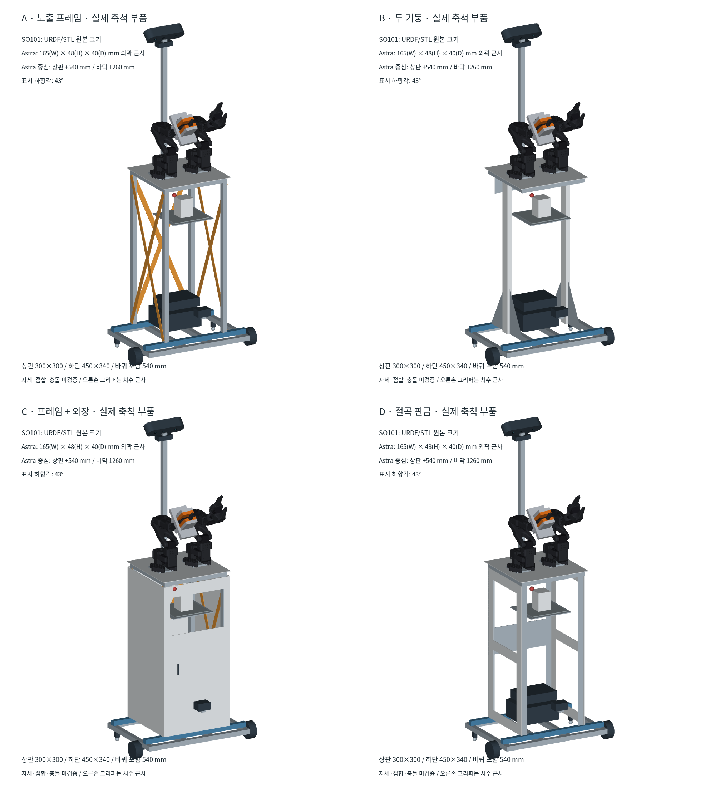
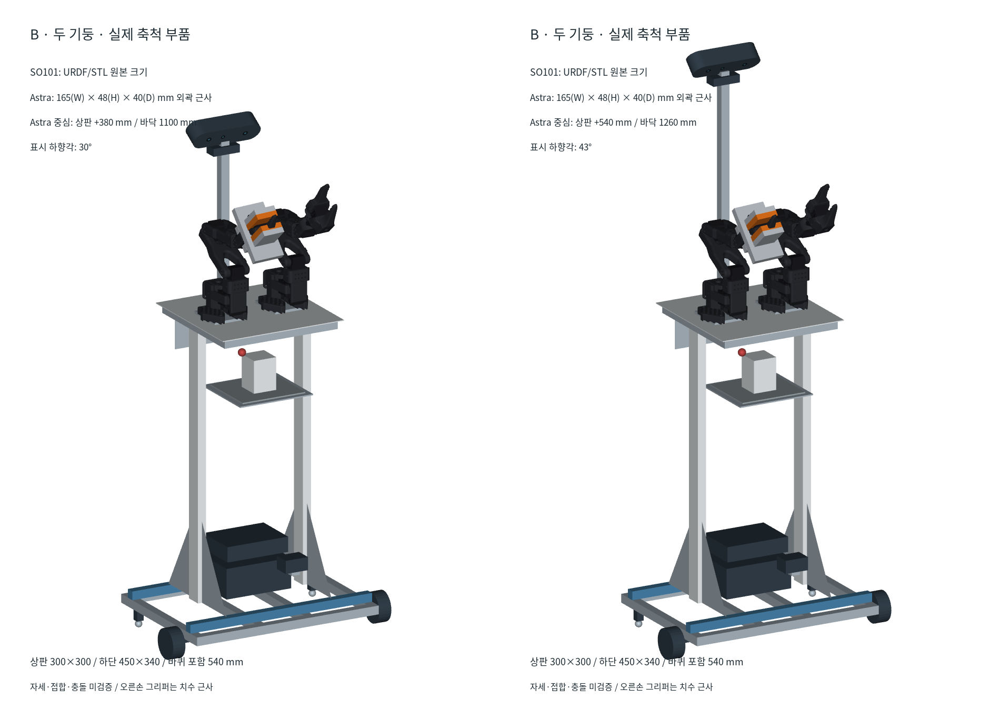
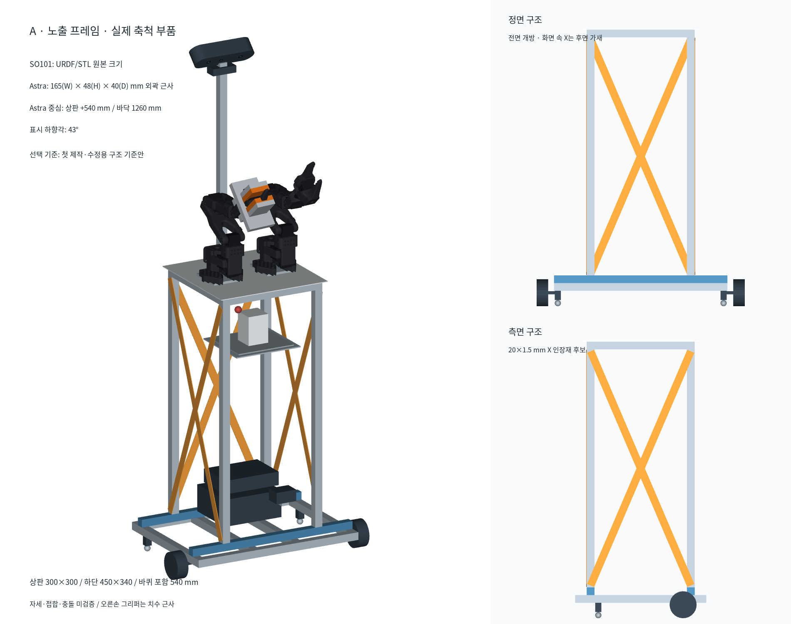

# 물 서빙 로봇 — 치수 고정 디자인 후보 4안

2026-09-09 작성, 2026-09-10 A안 렌더 갱신. 외형·구조 방식 비교용이며 제조 승인 도면이 아니다.

## 1. 이미지 오류 정정과 공통 치수

이전 생성형 제품 이미지에서 하단과 상판의 폭이 비슷하게 표현된 것은 잘못이다. 해당 이미지는 치수·설계 판단 근거로 사용하지 않는다. 아래 비교본은 좌표 기반 렌더이며 네 후보의 하단과 상판을 동일하게 유지한다.

| 항목 | 치수 또는 상태 |
|---|---|
| 기존 하단 프레임 외곽 | 좌우 450 × 앞뒤 340 mm |
| 상판 | 300 × 300 mm 설계안 |
| 중앙 배치 시 하단 돌출 | 상판보다 좌우 각각 75 mm, 앞뒤 각각 20 mm |
| 바퀴 포함 전체 폭 | 540 mm — 프레임 밖으로 양쪽 각각 45 mm |
| 구동 바퀴 | 전방 좌우 2개, 지름 70 mm |
| 볼캐스터 | 뒤쪽 2개만, 외측 프로파일 아래; 바깥으로 돌출시키지 않음 |
| 기존 프레임 상면 | 접지 상태에서 바닥으로부터 60 mm |
| 상판 상면 | 720 mm 제안값; 실제 작업 테이블 높이 확인 전 |
| A/C X 보강 후보 | 알루미늄 평철 20×1.5 mm; 체결·장력 검증 전 |
| Astra 중심 높이 | 상판 +540 mm를 물 서빙 기준안으로 추천; +380 mm는 비교안 |

바퀴 폭 30 mm와 캐스터 크기는 미측정 가정이다. 후방 캐스터 중심 위치, 팔·센서·배터리 형상은 개념 배치이며 실제 부품 CAD가 아니다. 기본 프레임 20×20 mm, 가로재 450 mm 2개와 세로재 300 mm 4개는 유지했다. 파란 하단 가로재 2개는 상승부 하중 분산을 위한 **추가 제안 부재**다.





## 2. 후보별 비교

| 후보 | 구조와 외형 | 장점·선택 이유 | 검증해야 할 단점 |
|---|---|---|---|
| A 노출 프레임 | 2020 기둥 4개 + 좌우·후면 X 보강, 전면 개방 | 체결부와 배선에 접근하기 쉬워 첫 제작·수정에 적합 | 노출 배선·끼임·물 튐 보호, X 보강 체결 및 장력 관리 필요 |
| B 두 기둥 | 양 측면 중앙 2040 기둥 2개 + 하단 삼각 보강판 | 전후 접근성과 시야를 확보하는 대안 | 약축 굽힘·비틀림·상판 접합 모멘트 검토 필요. 기둥 수가 절반이어도 전체 질량이 절반이 되지 않음 |
| C 프레임 + 외장 | A의 내부 구조를 유지하고 얇은 탈착식 비구조 외장 추가 | 구조와 외관을 분리하고 정비 패널·물 튐 차폐를 마련하기 쉬움 | 외장 추가 질량, 통풍, 라이다 가림, 컵 접근 통로 확인 필요 |
| D 절곡 판금 | 창이 있는 양 측판과 절곡 가장자리·후면 연결부 | 형상과 부품 통합을 검토할 수 있는 제작 방식 | 국부 좌굴·절곡부·체결부 강도와 제작 공차 미검증. 판금이 자동으로 더 가볍거나 강한 것은 아님 |

개별 확대: [A](assets/product_candidates_20260909/Real_scale/A_real_scale.png), [B](assets/product_candidates_20260909/Real_scale/B_real_scale.png), [C](assets/product_candidates_20260909/Real_scale/C_real_scale.png), [D](assets/product_candidates_20260909/Real_scale/D_real_scale.png). [B 상부 실제 축척 확대](assets/product_candidates_20260909/Real_scale/B_real_scale_detail.png).

**현재 추천은 A로 구조를 검증한 뒤 C 형태로 마감하는 방식이다.** 이는 제작·정비 경로에 대한 추천이며 강도 최적해 판정이 아니다. 얇은 외장에 팔 하중을 맡기지 않고, 팔 베이스→상부 보강재→기둥·대각 보강→하단 가로재→기존 차체로 하중을 전달한다. D는 판금 제작 조건과 해석 결과를 확보한 뒤 비교한다.

### A안 제작 기준 렌더



갱신한 A안 그림은 한 장에서 세 가지를 확인하도록 구성했다.

- 왼쪽 조립도: SO101·Astra·선반·하단 부품을 포함한 전체 높이와 부품 간 비율
- 오른쪽 위 정면도: X 가새를 두지 않은 전면 정비 개구부와 그 뒤로 투영된 후면 가새
- 오른쪽 아래 측면도: 선이 아니라 실제 후보 단면 20×1.5 mm로 그린 X 인장재

평철의 폭·두께를 실제 값으로 표시한 것은 구조 형상을 읽기 위한 개선이다. 끝단 홀·조절
슬롯·교차부·브래킷은 아직 정하지 않았으며, 그림의 접촉만으로 체결이 성립하거나 압축 하중을
받는다고 판단하지 않는다. 실물 제작 전에는 장력 조절 방법, 끝단 전단·베어링, 교차부 간섭,
날카로운 모서리와 케이블 접촉을 별도로 확정한다.

## 3. 리서치에서 확인한 사실과 적용 판단

- [Stretch 설계 논문, ICRA 2022](https://arxiv.org/abs/2109.10892)은 실내 이동 조작기의 크기·질량·비용과 작업 능력을 함께 설계하며 정적 안정성 모델을 설계 근거로 제시한다. 해당 논문의 대상은 Stretch RE1이다. **우리의 적용 판단:** 외관만 줄이는 대신 팔 자세·물 무게·접지점을 포함해 질량 중심과 작업 영역을 같이 검토한다. 해당 로봇의 성능을 SO101 플랫폼에 전용하지 않는다.
- [Pudu BellaBot 공식 제품 자료](https://www.pudurobotics.com/en/products/bellabot)는 빠르게 분리하는 트레이와 배터리 교체 구조를 소개한다. **우리의 적용 판단:** 컵 받침은 세척 가능한 탈착식으로, 배터리는 서비스 패널에서 접근할 수 있게 설계한다. 대형 상용 로봇의 적재량·주행 안정성을 이 차체의 성능 근거로 쓰지 않는다.

이 근거는 C를 검토할 제품 설계 이유를 제공하지만 C의 구조 안전성이나 최소 질량을 입증하지는 않는다.

## 4. 무게와 주행 안정성 검증 경계

기존 [상승 프레임 구조 검토](20260909_상승프레임_경량화_구조검토.md)의 질량 예산과 안정성 계산을 출발점으로 삼는다. 그 예산은 실측 총중량이 아니며, 이번 후보의 외장·컵 선반·접지 개선 부품까지 포함한 완성품 중량으로 인용하면 안 된다. 후보별 최종 BOM이 없으므로 전체 질량 순위를 확정하지 않는다.

1. 상단 외장을 얇게 하고 배터리 등 무거운 부품은 낮게 배치하는 안을 우선 비교한다. 통풍·방수 구조가 없는 단순 덮개를 보호 구조로 인정하지 않는다.
2. 기둥 감소로 아낀 질량과 추가 보강판·접합부 질량을 함께 계산한다. 판금은 구멍·절곡·접합을 확정한 CAD 부피로 비교한다.
3. 450 mm의 넓은 하단만으로 전도 안전이 보장되지 않는다. 전후 접지 간격, 캐스터 접촉 여부, 팔의 전방 돌출, 가감속과 바닥 단차가 별도 제약이다.
4. 배터리·양팔·물통을 포함한 질량 중심과 바퀴별 접지 하중을 다시 계산하고, 체결부 강성을 포함한 해석과 실물 정적 검증을 거친다. 이 문서에서 실물 이동을 실행하지 않았다.

## 5. 현재 그림에서 확정하지 않은 것

- SO101 본체는 저장소의 URDF FK와 원본 STL 축척을 적용했다. 표시 자세는 비교용이며 충돌 검증 자세가 아니다. 오른손 평행 그리퍼만 라이선스 경계 때문에 프로젝트 URDF의 치수 프록시다.
- 중앙 컵 선반 높이와 개구부는 배치 제안이다. 왼팔 도달·파지·충돌 및 컵 인출 경로를 검증하지 않았다.
- 라이다는 하단 전방 배치 제안이다. C 그림에서는 외장과의 렌더 가림이 있으므로 해당 그림으로 시야 확보를 판정하지 않는다. 실제 스캔 평면과 패널 간섭 검사가 필요하다.
- 표시된 빨간 버튼은 비상정지 장착 위치 제안이며 실제 안전 회로 구현을 뜻하지 않는다.
- 실제 캐스터·모터 브래킷·체결 구멍·배선·충전 단자는 별도 상세 설계 대상이다. 이미지에 생략된 부품을 조립 완료로 간주하지 않는다.

## 6. 물 서빙 전 과정에서 본 카메라 높이

높이는 Astra 본체 중심을 기준으로 한다. 상판이 바닥에서 720 mm이므로 상판 +540 mm는 바닥 1,260 mm, +380 mm는 바닥 1,100 mm다. 현행 작업 좌표의 컵·물통 위치 x=443~492 mm와 카메라 x=-120 mm를 사용하면 카메라에서 물체까지의 수평 거리는 563~612 mm다.

[Orbbec Astra Series 공식 사양](https://www.orbbec.com/products/structured-light-camera/astra-series/)의 시야각 H58.4°×V45.5°와 Astra S 깊이 범위 0.4~2 m를 사용해 단순 핀홀로 계산했다. 렌즈 왜곡, 실제 intrinsic, 브래킷 오차와 팔 가림은 포함하지 않는다.

| 중심 높이 | 작업면 바닥각 | 물체 높이 300 mm를 담기 위한 자세 | 판단 |
|---|---:|---:|---|
| 상판 +380 mm | 31.8~34.0° | 약 30° 하향에서 상한 약 302~308 mm | 계산상 간신히 들어오므로 실측·진동·가림 여유가 작음 |
| 상판 +540 mm | 41.4~43.8° | 약 43° 하향에서 상한 약 314~332 mm | 300 mm 물체와 작업면을 함께 담을 여유가 더 큼 |

따라서 **고정 Astra는 상판 +540 mm, 약 43° 하향 조절식 브래킷을 기준안**으로 둔다. 이때 카메라에서 작업 위치까지 거리는 약 780~816 mm로 Astra S 공식 범위 0.4~2 m 안이다. 수평거리 563~612 mm만으로 보수적으로 단순 환산한 폭도 약 629~684 mm다. 기울어진 실제 영상면의 가시 폭은 intrinsic·extrinsic으로 다시 투영한다. 각도는 실물 intrinsic과 POC 이미지로 확정하며 35~50° 조절 범위를 후보로 둔다. +380 mm는 전체 높이를 줄여야 할 때의 대안이지만, 약 30°로 다시 조정해야 하며 팔의 수직 작업 영역과 카메라가 겹치는지도 먼저 충돌 검사해야 한다.

고정 Astra 하나가 물 서빙 전체를 모두 관측하지는 못한다.

| 과정 | 주 관측 수단 | 고정 Astra의 역할과 공백 |
|---|---|---|
| 충전소 이탈·주행 | LDS-03, 주행 상태 | RGB-D는 전방 보조. SLAM과 저상 장애물 판단을 대체하지 않음 |
| 주방 정렬 | Astra depth + TF | 작업대와 로봇 상대 자세 추정. 깊이 유효 범위·반사면 POC 필요 |
| 컵·물통 인식 | Astra RGB-D | 팔을 투입하기 전 전체 장면과 3D 위치 관측 |
| 파지 | 고정 Astra + 좌우 손목캠 후보 | 손·물체 접촉부는 팔에 가릴 수 있으므로 손목 시점을 이용해 보완 |
| 붓기·물 양 판정 | 높은 Astra RGB 중심 | 컵 테두리·물줄기·액면을 내려다봄. YOLO 결과를 실제 물 양으로 바꾸려면 컵별 보정 필요 |
| 로봇 내부 선반 적재 | 왼쪽 손목캠 또는 별도 선반 시점 | 현재 선반은 상판 아래라 상판이 고정 Astra 시야를 가림 |
| 손님 테이블 배치 | Astra로 정렬 + 왼쪽 손목캠 | 최종 접촉과 내려놓기는 팔 가림 보완 필요 |
| 충전 도킹 | LiDAR·도킹 센서·접촉 신호 | 전방·상부 Astra만으로 후방 저상 충전 단자를 확인할 수 없음 |

즉 +540 mm는 **주방 조작의 전체 장면 카메라**로 선택하는 것이며, 주행·내부 선반·도킹까지 단일 카메라로 해결한다는 뜻은 아니다. 손목카메라 2대는 기존 USB 대역폭 검토에 이미 후보로 포함되어 있다. 실제 고정 Astra 영상에서 가림이 허용치를 넘을 때 사용 여부를 확정한다.

## 7. 재현과 원본

기본 도면: [좌표 기반 정면·측면·상면도](assets/raised_frame_20260909/coordinate_layout.png). 실물 치수 기록: [하단 프레임 기록](20260909_하단프레임_실물치수_모델링기록.md).

렌더 소스: [render_product_candidates.py](../design/mechanical/render_product_candidates.py), [render_product_real_scale.py](../design/mechanical/render_product_real_scale.py), [product_real_parts.py](../design/mechanical/product_real_parts.py). 출력 치수 요약: [geometry_contract.json](assets/product_candidates_20260909/geometry_contract.json), [실축 부품 출처·경계](assets/product_candidates_20260909/real_parts_provenance.json). 치수 요약은 생성 결과 기록이며 실측 원본을 대체하지 않는다.

```bash
cd "$HOME/bimanual-robot"
xvfb-run -a python3 design/mechanical/render_product_real_scale.py
```
