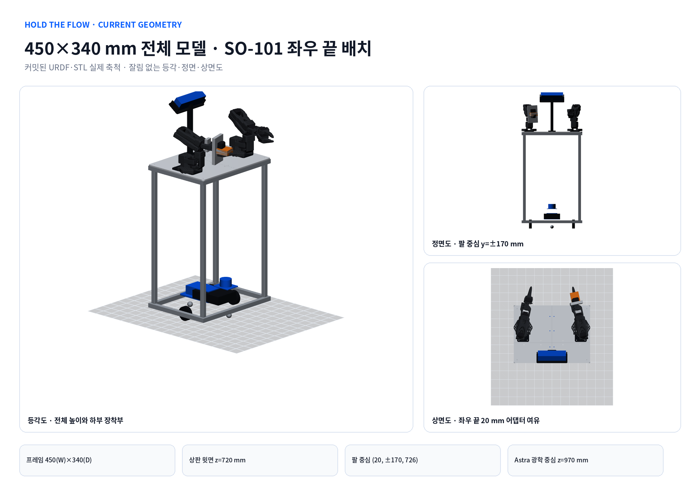

# 450×340 mm 4분할 상판 양팔 로봇 모델과 구동계 재사용

이 문서는 현행 제작·URDF·Isaac Sim 기준이다. 이전 300×300 mm 상판안은 폐기했다.
치수 단일 원본은 `design/mechanical/hold_flow_mechanical_v0_3.yaml`이며, 문서와 이미지보다
YAML·생성기·검증 결과가 우선한다.



## 1. 확정한 배치

좌표는 `x=전방`, `y=좌측`, `z=위`이고 원점은 차체 중심의 바닥이다.

| 항목 | 현행 모델 |
|---|---|
| 하부·상부 외곽 | 340(x)×450(y) mm, 일반 표기는 450(W)×340(D) mm |
| 상판 | PETG 6 mm, 전·후×좌·우 4분할, 윗면 z=720 mm |
| 기둥 | 2020 후보 4개, 길이 634 mm, 중심 `(±150, ±205)` mm |
| 상부 보강 | 둘레 2020 링 + 상판 분할선 아래 x/y 가로재 |
| 왼팔·오른팔 | `(20, +170, 726)`, `(20, -170, 726)` mm. 450 mm 폭의 좌우 끝 배치 |
| 팔의 전면 거리 | 전면 x=170 mm에서 팔 중심까지 150 mm |
| 카메라 | 광학 중심 `(-110, 0, 970)` mm, 상판보다 250 mm 위 |
| 구동륜 | 중심 `(0, ±160, 32.9)` mm, 기하 중심거리 320 mm |
| 볼캐스터 | 전·후 `(±120, 0, 12.5)` mm, 2개 |
| 배터리 장착판 | 180×120×6 mm 출력판, 하단 배치 |
| LDS-03 장착판 | 90×75×3 mm 출력판, 스캔면·홀은 실측 후 확정 |

4분할 상판은 K1 Max의 안전 XY 범위 안에 들어간다. 생성된 STL 경계는 앞판 약
219.7×224.7×6.0 mm, 뒤판 약 119.7×224.7×6.0 mm다. 여섯 출력물(상판 4개,
배터리판, 라이다판)은 원본 방향에서 45도 기준 부유·그림자·브리지 면적이 모두 0으로
분석되어 서포트 없이 평면 출력하는 기준이다. 실제 강도는 벽 수·상하층·인필·체결부
인서트와 프로파일 지지 조건으로 검증한다.

## 2. 대략적인 무게

URDF의 각 링크 관성을 0자세에서 합산한 명목값이다. 실물 계량 전 예산이며 특히 출력물
인필, 알루미늄 프로파일 제품, 체결부, 배터리 선정에 따라 달라진다.

| 기능군 | 명목 질량 |
|---|---:|
| 프레임·상판 | 3.696 kg |
| 양팔·양쪽 그리퍼 | 1.411 kg |
| 배터리·전자부·카메라·라이다 | 1.252 kg |
| 바퀴·캐스터 | 0.340 kg |
| 베이스·어댑터·마스트·거치대·배선/체결 여유 | 0.680 kg |
| **빈 로봇 합계** | **7.379 kg** |

작업 중 순간 총질량은 컵 0.30 kg과 물통 0.56 kg 가정에서 약 8.239 kg, 무거운 물통
1.10 kg 가정에서 약 8.779 kg이다. 이 두 페이로드 값은 선정품 실측값이 아니라 하중 검토
시나리오다. 0자세 명목 무게중심은 `(21.4, -3.2, 496.0) mm`, 정적 지지 다각형까지의
최소 여유는 76.9 mm다. 이동·급정지·팔 전개·물 흔들림을 포함한 동적 전도 검증은 별도다.

CadQuery manifest의 `estimated_material_mass_g`는 출력물을 100% 고체 PETG로 환산하므로
URDF의 목표 인필 질량과 직접 비교하면 안 된다. 최종 BOM에는 부품별 실측 질량을 넣고
URDF 관성을 다시 생성한다.

재계산:

```bash
cd "$HOME/bimanual-robot"
python3 design/mechanical/calculate_full_size_tabletop_design.py
```

## 3. JDAMR 바퀴 서보 두 개 재사용 판정

대상은 `mmporong/jdamr_cube_ros`의 12 V Feetech STS3215-C018 구동륜 두 개와 기존
General Driver 계열 제어 경로다. 확인한 저장소 커밋은
`82fa87a257080bd2298bada2b11d60f686c555f1`이다.

### 결론

두 바퀴 서보와 보드·3S 전원계를 통째로 유지한다면 새 차체에서도 재사용 가능성이 높다.
그러나 모터 선만 꽂은 직후 기존 설정 그대로 바닥 주행하는 것은 기준 동작이 아니다.
펌웨어에는 바퀴 반경·중심거리가 없어서 대개 다시 굽지 않아도 되지만, 장착한 좌우와
서보 ID/방향을 맞추고 ROS 호스트의 차체 파라미터를 바꿔야 한다.

| 확인점 | JDAMR 값 | 새 차체 시작값/조치 |
|---|---:|---|
| 왼쪽 서보 ID | 2 | 실제 왼쪽에 ID 2 장착 |
| 오른쪽 서보 ID | 1 | 실제 오른쪽에 ID 1 장착 |
| 버스 | 1 Mbps TTL | 그대로 유지 |
| 전진 부호 | 왼쪽 반전, 오른쪽 정방향 | 바퀴를 띄운 상태에서 전진 명령 방향 확인 |
| encoder | 4096 count/rev | 그대로 유지 |
| 유효 바퀴 반경 | 0.0329 m | 같은 바퀴면 시작값으로 유지 |
| 기존 유효 중심거리 | 0.1836 m | **재사용 금지** |
| 새 기하 중심거리 | 0.320 m | 첫 시작값, 직진·제자리 회전으로 유효값 보정 |
| 차체 footprint | 기존 JDAMR 외곽 | 450×340 mm와 바퀴 돌출·안전 여유로 갱신 |

STS3215-C018 공식 12 V 제원은 정격 토크 10 kg·cm(약 0.981 N·m), 정지 토크
30 kg·cm, 무부하 45 rpm, 잠김 전류 2.7 A다. 반경 32.9 mm에서 두 모터의 이상적인
정격 접선력 합은 약 59.6 N이다. 명목 7.379 kg 차체가 평지에서 구름저항계수 0.02~0.10,
5도 경사, 0.5 m/s² 가속을 동시에 요구한다고 단순 가정하면 약 11.5~17.2 N이다. 따라서
토크만 보면 저속 평지 주행 여유가 있지만, 감속기 효율·열·바닥 미끄럼·캐스터 preload·높은
무게중심을 제외한 1차 선별 계산이다.

두 모터 잠김 전류 합 5.4 A는 General Driver의 서보 전원 장기 5 A를 넘는다. 스톨을
구동 전략으로 사용하면 안 되며, 퓨즈·배선·커넥터·배터리 전압 강하와 watchdog을 유지해야
한다. 45 rpm과 반경 32.9 mm의 이론 무부하 선속도는 약 0.155 m/s다. 초기 통합은
0.08 m/s 이하, 낮은 가속도로 제한한다.

### 연결 후 최소 통합 순서

1. 같은 12 V C018 모델, 3S 전원, TTL 핀 배열을 라벨과 보드 문서로 확인한다.
2. ID 2를 왼쪽, ID 1을 오른쪽에 장착한다. 전원선 위치를 바꿔 방향을 바꾸지 않는다.
3. ROS bringup의 `wheel_radius=0.0329`, `wheel_separation=0.320`으로 시작한다.
4. Nav2 footprint와 속도·가속 제한을 새 외곽과 높은 무게중심에 맞춘다.
5. 바퀴를 바닥에서 띄운 상태에서 저속 전진·후진 명령과 양쪽 회전 방향, odom 부호를 본다.
6. 바닥에서 짧은 직진·제자리 회전으로 유효 중심거리와 반경을 보정한다.
7. 7.4 kg, 8.24 kg, 8.78 kg 조건에서 전류·전압 강하·온도·정지거리·캐스터 떨림을 기록한다.

기존 JDAMR 워크스페이스에서 첫 파라미터를 넘기는 형식은 다음과 같다. 이는 실행 예시이며
이번 시뮬레이션 작업에서는 실행하지 않는다.

```bash
cd "$HOME/jdamr_cube_ros"
ros2 launch jdamr_cube_bringup real_bringup.launch.py \
  wheel_radius:=0.0329 wheel_separation:=0.320
```

현재 작업 범위에서는 5~7단계 실물 구동을 실행하지 않는다. URDF와 정적 계약만 준비한다.

## 4. Raspberry Pi 5 후순위 전환

Pi 5는 후순위다. 현재 구동을 Pi 5 도입에 종속시키지 않는다. 도입 시 책임 분리는 다음을
기준으로 한다.

- Pi 5: 서보 I/O와 watchdog, LDS-03, SLAM/AMCL, Nav2, base driver, 미션 상태기계,
  안전 정지, 핵심 로그
- 무선 노트북 GPU: ACT 추론·학습, RGB-D 고부하 인식, 시각화·개발 도구
- 연결: ROS 2 유선 또는 Wi-Fi. 통신이 끊겨도 Pi 5가 로컬에서 속도 0과 안전 상태를 유지
- 전환 게이트: CPU·메모리·온도·지연·패킷 손실을 실제 센서율과 Nav2 부하에서 측정

따라서 Pi 5가 없어도 기존 JDAMR 제어 컴퓨터와 노트북으로 바퀴 통합을 먼저 할 수 있다.
나중에 Pi 5를 넣을 때는 모터 펌웨어보다 ROS 노드 배치와 device path, 부팅 서비스,
네트워크 QoS를 이전한다.

## 5. CAD·URDF·Isaac Sim 자산

CAD 재생성:

```bash
cd "$HOME/bimanual-robot"
"$HOME/.cache/bimanual-cad-venv/bin/python" design/cad/generate_hold_flow_cad.py
```

생성물은 `design/cad/exports/step`, `design/cad/exports/stl`에 있고 URDF용 메시 복사본은
`src/hold_flow_description/meshes/cad`에 있다. 프레임 레일은 URDF에서 단순 box collision,
상판·장착판은 CAD visual과 box collision을 사용한다. 이 구조는 접촉 안정성과 계산량을
우선한 시뮬레이션 모델이며 볼트·브래킷 나사산까지 재현한 제조 해석 모델은 아니다.

정적 검증:

```bash
cd "$HOME/bimanual-robot"
source /opt/ros/jazzy/setup.bash
python3 src/hold_flow_description/scripts/validate_description.py
python3 src/hold_flow_description/scripts/audit_urdf_quality.py --strict
python3 src/hold_flow_description/scripts/validate_isaac_contract.py
python3 src/hold_flow_description/scripts/import_isaac_sim.py --check-only
python3 -m unittest discover -s tests -v
```

Isaac Sim 6.0 설치 장비에서는 다음으로 USD를 만든다.

```bash
cd "$HOME/bimanual-robot"
/path/to/isaac-sim/python.sh \
  src/hold_flow_description/scripts/import_isaac_sim.py \
  --usd-dir "$HOME/bimanual-robot/build/isaac/hold_flow"
```

이 호스트에는 Isaac Sim 런타임이 없어 실제 USD 생성·물리 재생은 미검증이다. 설치 장비에서
4점 접촉, 캐스터 저마찰 재질, 바퀴 velocity gain, 60초 정지 안정성, 직진·제자리 회전,
급정지와 팔 전개 시 전도를 확인해야 한다.

## 6. 제작 전에 남은 실측

- 실제 2020 프로파일 제품의 선형 질량과 ㄴ 브래킷·볼트 질량
- 네 상판의 출력 조건별 실측 질량·처짐·상판 이음부 평탄도
- SO-101 베이스 체결공과 어댑터 인서트 위치
- STS3215 C018 라벨, 각 ID, 휠 허브·외부 베어링 조합
- 유효 바퀴 반경·중심거리, 캐스터 접촉 높이와 preload
- 배터리 외곽·질량·커넥터·퓨즈·최대 전류
- LDS-03 체결공·스캔면과 프레임 가림
- Astra S 실제 optical center·intrinsic·extrinsic과 물 서빙 전 과정의 가림
- 팔 운반·파지·붓기 자세의 자가충돌·전도·정지거리

공식 제원 근거:

- Feetech STS3215-C018: <https://www.feetechrc.com/525603.html>
- Waveshare ST3215 12 V: <https://www.waveshare.com/product/st3215-servo.htm>
- Waveshare General Driver: <https://www.waveshare.com/wiki/General_Driver_for_Robots>
